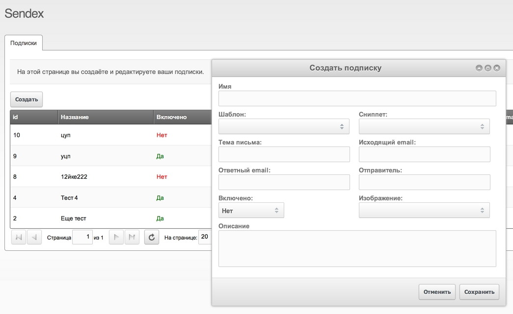
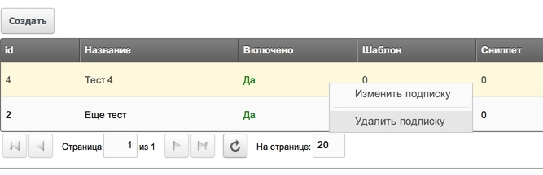
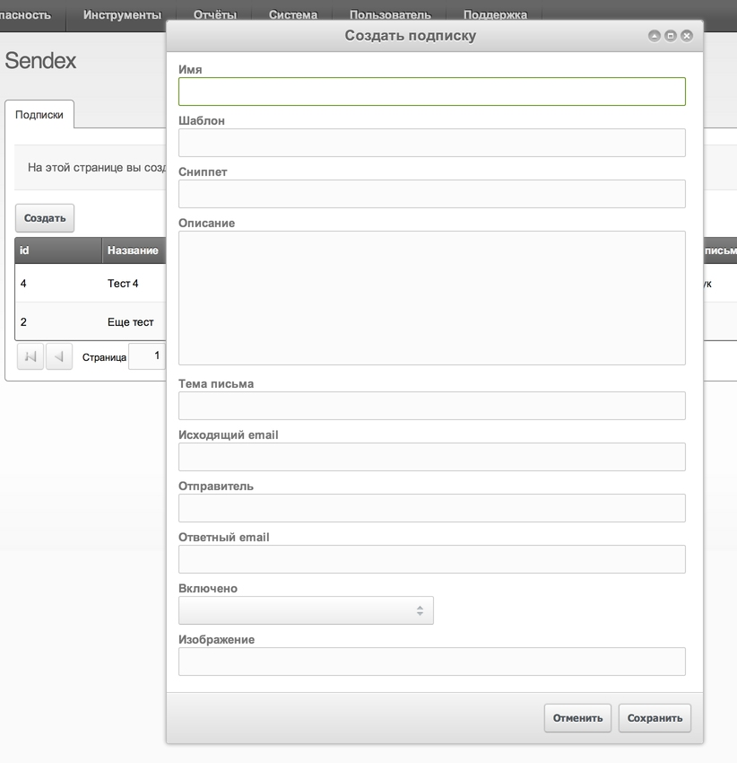
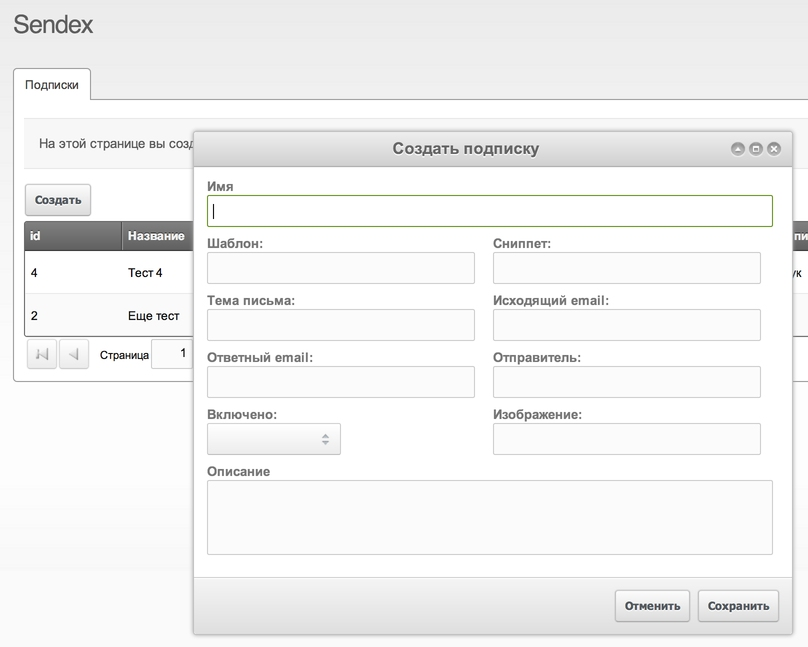
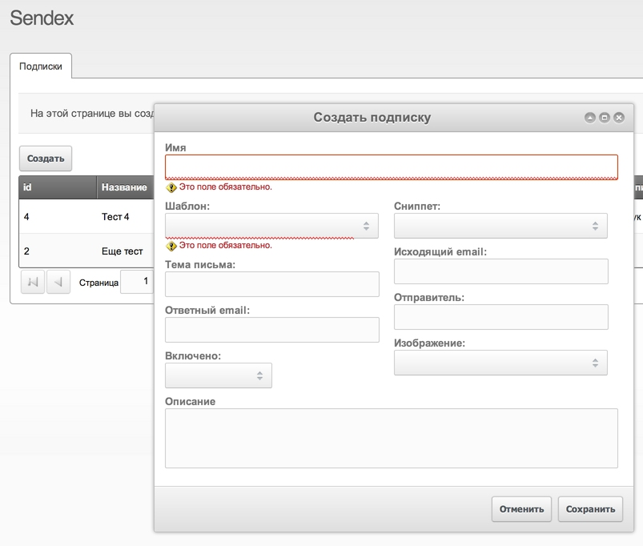

В принципе, всё необходимое для написания приличного дополнения к MODX я уже рассказал.

Мы знаем структуру компонента, умеем собирать его в пакет, управляем контроллерами и меняем интерфейс. Даже немного научились работать с GitHub. Дело за малым — собственно написать функционал.

Этот урок очень объёмный, здесь много листингов кода, с пояснениями. Если что-то непонятно — не нужно переживать и расстраиваться, просто помните, что всегда можно посмотреть исходный код уже готовых дополнений и самого MODX — там есть примеры на все случаи жизни.

Итак, сегодня нам нужно улучшить в админке таблицу и всплывающее окно для создния подписки. Вот, что у нас получится в итоге



## Таблица

Таблица ExtJS с подписками у нас находится в файле `/assets/components/sendex/js/mgr/widgets/newsletters.grid.js`.
Для работы с виджетом (компонентом) ExtJS его нужно объявить и зарегистрировать.

Коротенькое объявление

``` javascript
// Задаем переменную в объекте Sendex, которая содержит функцию
Sendex.grid.Newsletters = function(config) {
    // Вызов конструктора виджета, с переданными параметрами
    Sendex.grid.Newsletters.superclass.constructor.call(this,config);
};
// Наш виджет расширяет объект MODx.grid.Grid
Ext.extend(Sendex.grid.Newsletters,MODx.grid.Grid, {/* Здесь можно добавить или переписать методы расширяемого объекта*/});
```

Это просто пример для понимания приципа. При реальной работе нужно еще задать разных параметров таблице.

А теперь регистрируем наш виджет:

``` javascript
Ext.reg('sendex-grid-newsletters',Sendex.grid.Newsletters);
```

И вот теперь можно указывать `xtype: 'sendex-grid-newsletters'` где угодно — и там выведется наша таблица.

Правда, при реальной эксплуатации нам нужно еще:

1. Добавить параметров в конфигурацию при инициализации объекта
2. Добавить свои функции в таблицу, при расширении родительского объекта MODx.grid.Grid

## Параметры таблицы

Основные параметры таблицы ExtJS:

* **id** — идентификатор элемента. К нему потом можно обращаться как Ext.getCmp('идентификатор');
* **url** — адрес для запроса данных с сервера, это почт ивсегда наш connector.php в assets
* **baseParams** — параметры, передаваемые при запросе данных от сервера
* **fields** — JSON массив полей, которые могут быть в ответе от сервера.
* **paging** — включить пагинацию результатов
* **pageLimit** — количество результатов на одной странице
* **remoteSort** — сортировать результаты на сервере
* **columns** — JSON массив со столбцами таблицы, и их свойствами
* **tbar** — верхняя панель таблицы, обычно там поиск и кнопочки
* **listeners** — JSON массив с функциями, которые будут выполняться при разных действиях с таблицей

Некоторые параметры не существуют в обычных таблицах ExtJS и добавлены только в `MODX.grid` — вот документация.

Нам нужно обязательно указать ключи нашего объекта `sxNewsletter`:

``` javascript
,fields: ['id','name','description','active','template','snippet','image','email_subject','email_from','email_from_name','email_reply']И колонки таблицы
,columns: [
    {header: _('sendex_newsletter_id'),dataIndex: 'id',width: 50}
    ,{header: _('sendex_newsletter_name'),dataIndex: 'name',width: 100}
    //,{header: _('sendex_newsletter_description'),dataIndex: 'description',width: 250}
    ,{header: _('sendex_newsletter_active'),dataIndex: 'active',width: 75,renderer: this.renderBoolean}
    ,{header: _('sendex_newsletter_template'),dataIndex: 'template',width: 75}
    ,{header: _('sendex_newsletter_snippet'),dataIndex: 'snippet',width: 75}
    ,{header: _('sendex_newsletter_email_subject'),dataIndex: 'description',width: 100}
    ,{header: _('sendex_newsletter_email_from'),dataIndex: 'email_from',width: 100}
    //,{header: _('sendex_newsletter_email_from_name'),dataIndex: 'email_from_name',width: 100}
    //,{header: _('sendex_newsletter_email_reply'),dataIndex: 'email_reply',width: 100}
    ,{header: _('sendex_newsletter_image'),dataIndex: 'image',width: 75,renderer: this.renderImage}
]
```

Я прописал все колонки, но некоторые сразу закомментировал — чтобы место не занимали.

Свойства колонки:

* **header** — Заголовок, обычно используется запись из лексикона
* **dataIndex** — Ключ массива field. То есть из какого места брать данные для вывода?
* **width** — ширина
* **editor** — можно указать массив для редактирования колонки прямо в таблице, но мы это пока не трогаем
* **renderer** — Метод отображения колонки.

Очень интересен параметр renderer, в нём мы можем указать любую javascript функцию, которая будет готовить внешний вид данных перед отображением. Я использую его для двух столбцов: active и image.

Сами функции нужно указывать при расширении объекта:

``` javascript
Ext.extend(Sendex.grid.Newsletters,MODx.grid.Grid,{
    windows: {}
    // ...
    ,renderBoolean: function(val,cell,row) {
        return val == '' || val == 0
            ? '<span style="color:red">' + _('no') + '<span>'
            : '<span style="color:green">' + _('yes') + '<span>';
    }

    ,renderImage: function(val,cell,row) {
        return val != ''
            ? ''
            : '';
    }Там же рядом, кстати, есть встроенная функция для вывод контекстного меню:
,getMenu: function() {
    var m = [];
    m.push({
        text: _('sendex_newsletter_update')
        ,handler: this.updateItem
    });
    m.push('-');
    m.push({
        text: _('sendex_newsletter_remove')
        ,handler: this.removeItem
    });
    this.addContextMenuItem(m);
}
```



Она просто добавляет элементы в массив и передаёт его в метод родительского объекта `addContextMenuItem()`. Если мы захотим изменить контекстное меню строки таблицы — редактировать нужно тут.

Добавляем новые записи в лексиконы, синхронизируем, чистим кэш и обновляем страницу в админке:


Наша таблица готова для работы, [вот коммит](https://github.com/bezumkin/Sendex/commit/c7e5e4f88b9e1897c40e6a3ff7b15d5258b0242b) со всеми изменениями.

## Окошки

Не знаю, какие окошки у родного ExtJS, но вот у расширенного MODx.Window они просто замечательные. Это выражается в том, что они сразу соединены с формой и умеют работать через ajax.

То есть, при вызове окошка вы сразу получаете форму с кнопочками, и указываете параметрами, куда отправлять данные при сохранении, и что делать при ответе с сервера — [вот документация](http://rtfm.modx.com/revolution/2.x/developing-in-modx/advanced-development/custom-manager-pages/modext/modx.window).

Основные параметры окон:

* **title** — заголовок окошка, обычно используется запись из лексикона
* **id** — идентификатор виджета
* **height** — высота
* **width** — ширина
* **url** — адрес для запросов на сервер, обычно это connector.php в assets
* **action** — имя действия, обычно там указывается конкретный процессор
* **fields** — массив с полями формы

Выходит, заполнить нужно всего один параметр **fields**:

``` javascript
,fields: [
    {xtype: 'textfield',fieldLabel: _('name'),name: 'name',id: 'sendex-'+this.ident+'-name',anchor: '99%'}
    ,{xtype: 'textarea',fieldLabel: _('description'),name: 'description',id: 'sendex-'+this.ident+'-description',height: 150,anchor: '99%'}
]
```

У нас два окошка: создание и обновление записи. Это переменные `Sendex.window.CreateItem` и `Sendex.window.UpadteItem`. Чтобы не было путанницы, предлагаю сразу все эти **Item** переименовать в `Newletter`.

Окошки у нас работаю еще с прошлого занятия, но нужно бы добавить в них полей для редактирования:

``` javascript
,fields: [
    {xtype: 'textfield',fieldLabel: _('name'),name: 'name',id: 'sendex-'+this.ident+'-name',anchor: '99%'}
    ,{xtype: 'numberfield',fieldLabel: _('sendex_newsletter_template'),name: 'template',id: 'sendex-'+this.ident+'-template',anchor: '99%'}
    ,{xtype: 'numberfield',fieldLabel: _('sendex_newsletter_snippet'),name: 'snippet',id: 'sendex-'+this.ident+'-snippet',anchor: '99%'}
    ,{xtype: 'textarea',fieldLabel: _('description'),name: 'description',id: 'sendex-'+this.ident+'-description',height: 150,anchor: '99%'}

    ,{xtype: 'textfield',fieldLabel: _('sendex_newsletter_email_subject'),name: 'email_subject',id: 'sendex-'+this.ident+'-email_subject',anchor: '99%'}
    ,{xtype: 'textfield',fieldLabel: _('sendex_newsletter_email_from'),name: 'email_from',id: 'sendex-'+this.ident+'-email_from',anchor: '99%'}
    ,{xtype: 'textfield',fieldLabel: _('sendex_newsletter_email_from_name'),name: 'email_from_name',id: 'sendex-'+this.ident+'-email_from_name',anchor: '99%'}
    ,{xtype: 'textfield',fieldLabel: _('sendex_newsletter_email_reply'),name: 'email_reply',id: 'sendex-'+this.ident+'-email_reply',anchor: '99%'}

    ,{xtype: 'combo-boolean',fieldLabel: _('sendex_newsletter_active'),name: 'active',hiddenName: 'active',id: 'sendex-'+this.ident+'-active',anchor: '50%'}
    ,{xtype: 'textfield',fieldLabel: _('sendex_newsletter_image'),name: 'image',id: 'sendex-'+this.ident+'-image',anchor: '99%'}
]
```

Основные параметры полей формы:

* **xtype** — фиджет поля. Может быть встроенный: `textfield, numberfield, textarea, checkbox` или любой кастомный
* **fieldLabel** — заголовок поля, обычно используется запись из лексикона
* **name** — имя поля, именно оно будет ключом в массиве `$_POST` при отправке на сервер
* **id** — идентификатор элемента
* **anchor** — ширина относительно окна
* **style** — можно добавить особое оформление полю ввода, например `stye:'border:1px solid red;'`

Синхронизируем изменения с сервером, чистим кэш, обновляем страницу и у нас все прекрасно работает! Только окошко с трудом влезает в экран.



Нужно разбивать форму на 2 столбца. Делается это вложенными массивами в fields:

``` javascript
,fields: [
    {xtype: 'textfield',fieldLabel: _('name'),name: 'name',id: 'sendex-'+this.ident+'-name',anchor: '99%'}
    ,{
        layout:'column'
        ,border: false
        ,anchor: '100%'
        ,items: [{
            columnWidth: .5
            ,layout: 'form'
            ,defaults: { msgTarget: 'under' }
            ,border:false
            ,items: [
                {xtype: 'modx-combo-template',fieldLabel: _('sendex_newsletter_template'),name: 'template',id: 'sendex-'+this.ident+'-template',anchor: '99%'}
                ,{xtype: 'textfield',fieldLabel: _('sendex_newsletter_email_subject'),name: 'email_subject',id: 'sendex-'+this.ident+'-email_subject',anchor: '99%'}
                ,{xtype: 'textfield',fieldLabel: _('sendex_newsletter_email_reply'),name: 'email_reply',id: 'sendex-'+this.ident+'-email_reply',anchor: '99%'}
                ,{xtype: 'combo-boolean',fieldLabel: _('sendex_newsletter_active'),name: 'active',hiddenName: 'active',id: 'sendex-'+this.ident+'-active',anchor: '50%'}
            ]
        },{
            columnWidth: .5
            ,layout: 'form'
            ,defaults: { msgTarget: 'under' }
            ,border:false
            ,items: [
                {xtype: 'sendex-combo-snippet',fieldLabel: _('sendex_newsletter_snippet'),name: 'snippet',id: 'sendex-'+this.ident+'-snippet',anchor: '99%'}
                ,{xtype: 'textfield',fieldLabel: _('sendex_newsletter_email_from'),name: 'email_from',id: 'sendex-'+this.ident+'-email_from',anchor: '99%'}
                ,{xtype: 'textfield',fieldLabel: _('sendex_newsletter_email_from_name'),name: 'email_from_name',id: 'sendex-'+this.ident+'-email_from_name',anchor: '99%'}
                ,{xtype: 'modx-combo-browser',fieldLabel: _('sendex_newsletter_image'),name: 'image',id: 'sendex-'+this.ident+'-image',anchor: '99%'}
            ]
        }]
    }
    ,{xtype: 'textarea',fieldLabel: _('description'),name: 'description',id: 'sendex-'+this.ident+'-description',height: 75,anchor: '99%'}
]
```

Как видите, вместо второго поля у нас массив, в котором элемент с указанием разметки **layout: columns** — это специальная магия ExtJS. А у этого элемента 2 подмассива с разметкой **layout: form** и с указанием ширины колонки **columnWidth: .5**.



Вот так непросто делаются колонки в форме. Это нужно просто запомнить и копипастить при необходимости.

## Собственные поля формы

Форма готова, только пользоваться ей не очень удобно: нужно вводить циферками сниппет и шаблон, нет выбора изображения, нет проверки правильности заполнения.

Для выбора картинки указываем готовый `xtype: 'modx-combo-browser'`, для шаблона `xtype: 'modx-combo-template'`, а вот для сниппета ничего готового нет.
Откуда я знаю, что можно использовать? Очень просто — я смотрю в [исходники MODX](https://github.com/modxcms/revolution/blob/develop/manager/assets/modext/widgets/core/modx.combo.js).


Нужно написать свой xtype для вывода сниппетов. Для этого лучше создать `/assets/components/sendex/js/mgr/misc/sendex.combo.js` и сразу подключить его в контроллере `home.

``` javascript
$this->addJavascript($this->Sendex->config['jsUrl'] . 'mgr/misc/sendex.combo.js');
```

Регистрируем новый xtype **sendex-combo-snippet** в файле `misc/sendex.combo.js`:

``` javascript
Sendex.combo.Snippet = function(config) {
    config = config || {};
    Ext.applyIf(config,{
        name: 'snippet'
        ,hiddenName: 'snippet'
        ,displayField: 'name'
        ,valueField: 'id'
        ,fields: ['id','name']
        ,pageSize: 10
        ,hideMode: 'offsets'
        ,url: MODx.config.connectors_url + 'element/snippet.php'
        ,baseParams: {
            action: 'getlist'
        }
    });
    Sendex.combo.Snippet.superclass.constructor.call(this,config);
};
Ext.extend(Sendex.combo.Snippet,MODx.combo.ComboBox);
Ext.reg('sendex-combo-snippet',Sendex.combo.Snippet);
```

Очень похоже на регистрацию таблицы, не так ли? Конечно так, но есть несколько отличий в параметрах:

* Я использую родной процессор MODX для получения имеющихся сниппетов, поэтому такой необычный путь к процессору
* Параметры `displayField` и `valueField` указывают, какой ключ из `fields` нужно отображать, а какой считать значением и отправлять в `$_POST`
* Параметр `name` и `hiddenName` имя поля, и имя комбобокса. Обычно они должны совпадать, чтобы все правильно работало.

Теперь указываем новый xtype в поле формы и проверяем:


## Обработка формы в процессоре

Согласно параметру url формы, все запросы у нас уходят на основной коннектор `Sendex` в директории assets. А вот действие мы передаём `mgr/newsletter/create` — этот процессор нам и нужен.

Редактируем `/core/components/sendex/processors/mgr/newsletter/create.class.php`

``` php
public function beforeSet() {

    $required = array('name', 'template');
    foreach ($required as $tmp) {
        if (!$this->getProperty($tmp)) {
            $this->addFieldError($tmp, $this->modx->lexicon('field_required'));
        }
    }

    if ($this->hasErrors()) {
        return false;
    }

    $unique = array('name');
    foreach ($unique as $tmp) {
        if ($this->modx->getCount($this->classKey, array('name' => $this->getProperty($tmp)))) {
            $this->addFieldError($tmp, $this->modx->lexicon('sendex_newsletter_err_ae'));
        }
    }

    $active = $this->getProperty('active');
    $this->setProperty('active', !empty($active));

    return !$this->hasErrors();
}
```

Как видите, я добавил проверку на заполнение полей `name` и `template`. Если они не пусты, то проверяю на уникальность имени. Если есть ошибки — мы увидим вот такой ответ:



А если ошибок нет, то форма сохранится и в таблице появится новая строка.

Также в конце метода есть приведение типа поля `active`, потому что форма шлёт или строку `'true'` или пустоту. Поэтому превращаем его в булево, чтобы подходило к нашей модели.

## Вызов окошек из таблицы

Ну и напоследок нужно понять, а как же именно вызываются окошки при работе с таблицей?

Окошко — это перемнная с функцией, например **Sendex.window.CreateNewsletter**. Чтобы показать его, мы должны сделать кнопку и повесить на неё обработчик, что и сделано в параметре **tbar** таблицы:

``` javascript
,tbar: [{
    text: _('sendex_btn_create')
    ,handler: this.createNewsletter
    ,scope: this
]}
```

Обработчик вызывает метод **createNewsletter** из таблицы, смотрим на него:

``` javascript
,createNewsletter: function(btn,e) {
    if (!this.windows.createNewsletter) {
        this.windows.createNewsletter = MODx.load({
            xtype: 'sendex-window-newsletter-create'
            ,listeners: {
                'success': {fn:function() { this.refresh(); },scope:this}
            }
        });
    }
    this.windows.createNewsletter.fp.getForm().reset();
    this.windows.createNewsletter.show(e.target);
}
```

* Окно создаётся один раз при помощи метода `MODx.load()` в котором указывается, что именно грузить. В данном случае `xtype` окошка создания.
* При загрузке `xtype` передаётся массив `listeners` с указанием функций для событий. В частности, при `success`, то есть положительном ответе от сервера будет обновление таблицы.
* Все поля формы очищаются — это сделано для повторных вызовов, когда окно уже загружено и может хранить значения в форме.
* Окно показывается на экран.

* [Вот коммит](https://github.com/bezumkin/Sendex/commit/1812bc0bc99f3a764f1cb7aebc9bd75f4ac3ab78) со всеми изменения по окошку новой подписки.

## Заключение

Скорее всего, сегодняшний урок покажется большинству читателей довольно сложным, но это не так. Запомните главное правило разработчика:

>Если чего-то не понимаешь — смотри как делают другие

То есть, если что-т онепонятно — смотрите исходный код моих дополнений и самого MODX. Там очень много примеров, хотя бы вот [файл с комбобоксами от miniShop2](https://github.com/bezumkin/miniShop2/blob/master/assets/components/minishop2/js/mgr/misc/ms2.combo.js) — практически готовая библиотека для выбора чанков, ресурсов, юзеров и т.д.

Ну и конечно не помешает документация по [Ext.grid.GridPanel](http://docs.sencha.com/extjs/3.4.0/#!/api/Ext.grid.GridPanel), по [Ext.Window](http://docs.sencha.com/extjs/3.4.0/#!/api/Ext.Window) и по [Ext.form.Combo](http://docs.sencha.com/extjs/3.4.0/#!/api/Ext.form.ComboBox). Правда, нужно дойти до определённого уровня понимания предмета, чтобы она начала приносить пользу. Лично у меня это произошло далеко не сразу.

На следующем занятии мы будем делать окошко с редактированием подписки и назначать ей юзеров.

## Узнать больше

* [Настройка рабочего места: MODXCloud + PhpStorm](extending-modx/creating-components/customize-the-workplace)
* [Разбор структуры компонента, зачем нужны assets, core и остальные?](extending-modx/creating-components/component-structure)
* [Основы Git и первый коммит заготовки компонента на Github](extending-modx/creating-components/git-basics/)
* [Логика работы, схему и модель таблицы в БД](extending-modx/creating-components/work-logic)
* [Сборка и установка первой версии пакета](extending-modx/creating-components/package-build)
* [Пишем интерфейс: виджеты ExtJS и процессоры](extending-modx/creating-components/extjs-widgets)
* [Пишем интерфейс: таблица подписок и окошко создания](extending-modx/creating-components/letter-queue-table)
* [Пишем интерфейс: окно редактирования подписки](extending-modx/creating-components/subscription-edit-window)
* [Сниппет Sendex и формы подписки\отписки](extending-modx/creating-components/snippet-sendex)
* [Рассылка по расписанию](extending-modx/creating-components/scheduled-newsletter)
