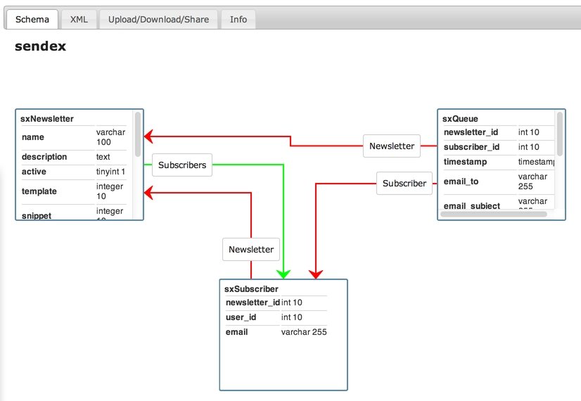
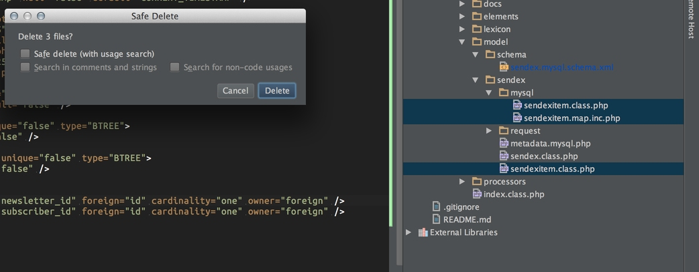
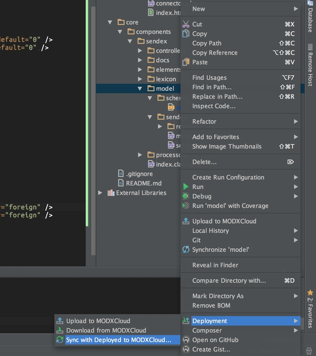
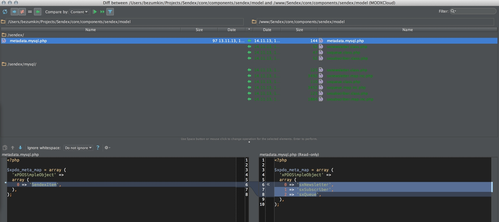
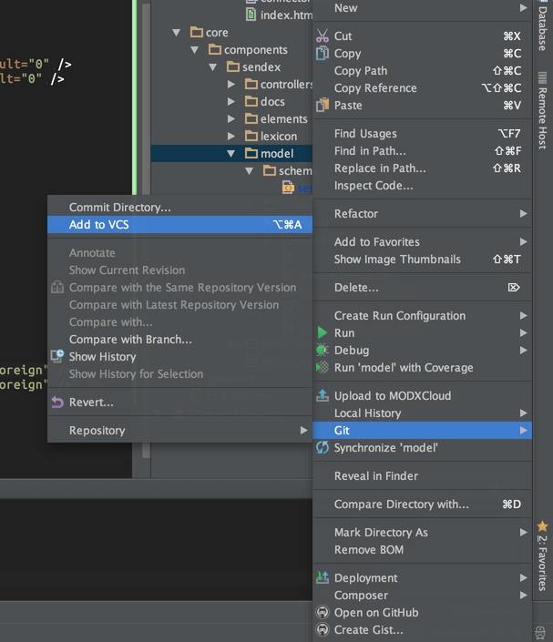
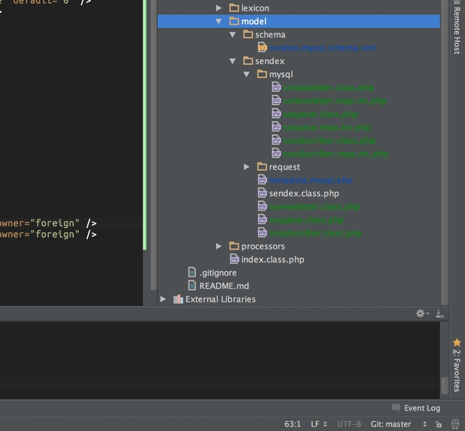
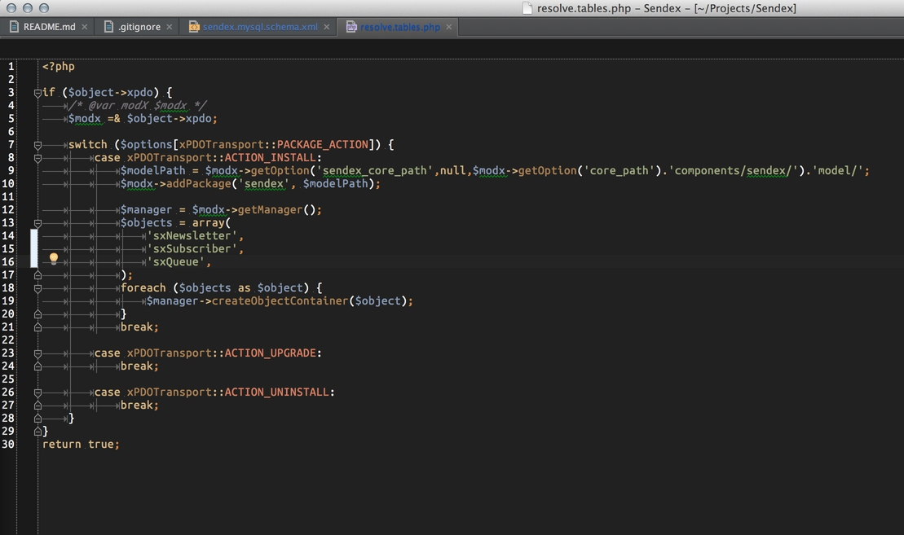
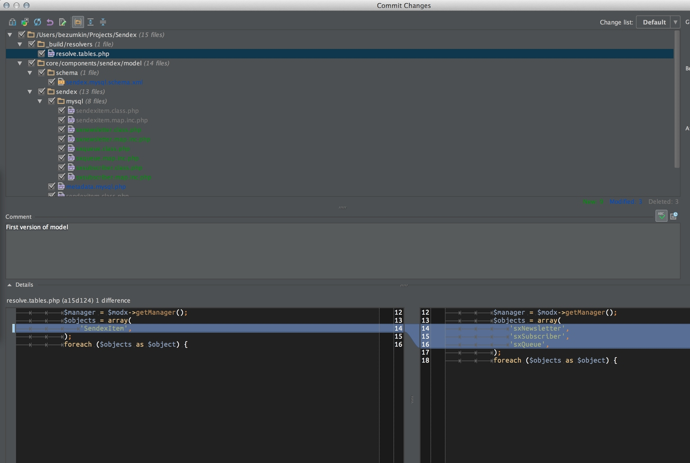

Подготовительные работы закончены, и сегодня мы приступаем непосредственно к разработке компонента.

Мы пишем компонент рассылок, поэтому нужно продумать основную логику работы. Обращаю ваше внимание на то, что наша цель — **научиться писать компоненты** для MODX, а не написать лучшую рассылку в мире. Поэтому прошу вас сразу поумерить амбиции и не предлагать добавить мега-функционал.

Логика работы мне видится такой:

* У нас есть объект **Рассылка** — в нём всё, что нужно для формирования писем: тема, шаблон, отправитель и т.д.
* Объект **Подписчик** подписывается на рассылку. Пока будем считать, что это должен быть авторизованный юзер, но в голове держим, что можно добавить и гостей.
* При наступлении каких-то событий, вызывается объект Подписка и выполняет определённый код, который генерирует письма и сохраняет их как объект **Очередь**. Для большей универсальности, можно выносить этот код в отдельный сниппет.
* Сервер выполняет скрипт рассылки и отправляет письма из Очереди по расписанию, хоть каждые 5 минут. Если очередь пуста, значит все уже отправлено.

Соответственно, в админке у нас будет страница управления подписками, добавление к ним подписчиков, и просмотр очереди сообщений, с возможность что-то удалить или отправить «прямо сейчас». Возможно, еще добавим страницу проверки отправки сообщений, чтобы слать себе тестовые письма для отладки.

С функционалом примерно определились, теперь нужно написать схему БД, чтобы хранить наши данные.

## Схема таблиц БД

Схема в MODX — это файл формата XML, в котором описаны все объекты и их связи. Он не участвует в работе компонента, он нигде не используется, он нужен только для генерации модели.

Схема может изменяться, по мере развития дополнения. Вы можете добавлять или удалять объекты, индексы и связи. Не нужно пытаться предусмотреть сразу все колонки в таблицах — вы сможете добавить их в любое время.

Основные принципы схемы xPDO можно [прочитать в официальной документации](extending-modx/xpdo/custom-models/defining-a-schema), а я просто покажу вам уже готовый файл и объясню, что там и как.

Открываем [схему в моем репозитории на GitHub](https://github.com/bezumkin/Sendex/blob/b3a2eb0fb56ae8151b4686840e21bad18afd4fb5/core/components/sendex/model/schema/sendex.mysql.schema.xml) и смотрим.

Каждый объект описывается в теге **object**. В атрибутах объекта вы указываете его имя и таблицу БД, в которой он будет храниться. Таблица указывается **без префикса сайта** — он будет добавлен автоматически самим MODX, когда понадобится.

``` xml
<object class="sxNewsletter" table="sendex_newsletters" extends="xPDOSimpleObject">
```

Наш объект обязан расширять уже существующий объект MODX, обычно используется `xPDOSimpleObject`. От него мы унаследуем колонку id, как первичный ключ — поэтому нигде в схеме не указано id у объектов.

А вот если бы мы наследовали `xPDOObject`, тогда пришлось бы самостоятельно это прописывать. Если не хотите заморочек, просто всегда используйте `xPDOSimpleObject`.

Дальше в объекте описываются его поля:

``` xml
<field key="name" dbtype="varchar" precision="100" phptype="string" null="false" default="" />
<field key="description" dbtype="text" phptype="text" null="true" default="" />
<field key="active" dbtype="tinyint" precision="1" phptype="boolean" attributes="unsigned" null="true" default="1" />
```

* **key** — имя поля
* **dbtype** — тип поля в базе данных: `int, varchar, text и т.д`.
* **precision** — точность, или размер поля. Требуется для типов с фиксированной длиной, как например `int` и `varchar`. У полей `text` не указывается.
* **phptype** — тип переменной в php, xPDO будет менять значение согласно ему: `integer, string, float, json, array`. Обратите внимание, что `json` и `array` — это изобретение MODX.
* **Array** — это для сериализованных данных, с сохранением типа, а `json` — обычный json. При сохранении такого поля его значение будет прогоняться через `serialize()` или `json_encode()`, a при получении — через `unserialize()` и `json_decode`.
Таким образом, можно удобно хранить массивы в базе данных.
* **null** — может ли поле быть пустым? Если вы укажите здесь `false`, а при работе с объектом не пришлете значение — будет ошибка в логе.
* **default** — значение по умолчанию, будет использовано, если поле может быть `null`, и для него нет данных при сохранении
* **attributes** — дополнительные свойства для передачи в БД. Они точно такие же, как в mySql

Это только основные свойста, MODX хранит много недокументированных возможностей, поэтому рекомендую внимательно смотреть на его собственную схему, и просто копировать, что нужно.

После описания колонок таблицы, нужно указать индексы, чтобы наша таблица быстра работала. В большинстве случаем достаточно добавить в индекс те поля, по которым будет проводиться выборка:

``` xml
<index alias="name" name="name" primary="false" unique="false" type="BTREE">
    <column key="name" length="" collation="A" null="false" />
</index>
<index alias="active" name="active" primary="false" unique="false" type="BTREE">
    <column key="active" length="" collation="A" null="false" />
</index>
```

Из важных атрибутов здесь:

* **primary** — является ли индекс первичным? Обычно — нет, первичный индекс у нас по полю `id` от `xPDOSimpleObject`.
* **unique** — является ли индекс уникальным? То есть, может ли быть в таблице 2 и более одинаковых значения у этого поля? Уникальный индекс у нас снова по колонке id.
Ну и последнее — отношение объектов друг к другу:

``` xml
<composite alias="Subscribers" class="sxSubscriber" local="id" foreign="newsletter_id" cardinality="many" owner="local" />
<aggregate alias="Template" class="modTemplate" local="template" foreign="id" cardinality="one" owner="foreign" />
<aggregate alias="Snippet" class="modSnippet" local="snippet" foreign="id" cardinality="one" owner="foreign" />
```

* **Composite** — объект является главным, по отношению к другому. При удалении такого объекта будут удалены все дочерние объекты, связанные с ним здесь.
* **Aggregate** — объект подчинён другому объекту. При его удалении главному ничего не будет.
  * **alias** — псевдоним связи. Используется в `$object->getMany('Subscribers');` или `$object->addOne('Template');`
  * **class** — настоящее имя класса, с которым связывается текущий объект.
  * **local** — поле текущего объекта, по которому идёт связь
  * **foreign** — поля объекта, с которым связываемся
  * **cardinality** — тип связи. Один к одному, или один к нескольким. Обычно у связи aggregate это one, а у composite — many, то есть, у родителя много потомков, а у потомков только один родитель. Но бывают и исключения.
    Если связь many, то использует `addMany()` и `getMany()`, если one — то `addOne()` и `getOne()`.

Для наглядного представления схемы я советую использовать сервис от [Jeroen Kenters](http://schemaviewer.dev.kenters.com/52845fee82d721.76762690)



По ходу разработки схема будет неоднократно меняться, так что дальше должно стать понятнее.

## Генерация модели

Как я уже говорил, сама схема нам ничего не даёт, нам нужна рабочая модель. А что такое **модель БД** в MODX? Это набор файлов php, который состоит из основных объектов и расширения для конкретной БД.

Давайте сгенериуем модель и посмотрим, что там получится:

1 Копипастим [текущую схему](https://github.com/bezumkin/Sendex/blob/b3a2eb0fb56ae8151b4686840e21bad18afd4fb5/core/components/sendex/model/schema/sendex.mysql.schema.xml) в свой проект и сохраняем. Изменения должны синхронизироваться с сервером.
2 Удаляем старые ненужные файлы модели modExtra



3 Выполняем файл `build.model.php` на сервере. У меня это `c2263.paas2.ams.modxcloud.com/Sendex/_build/build.model.php` — при первой генерации будет только **done**, а при последующих — сообщения, что имеющиеся объекты не будут перезаписаны.
4 На сервере были созданы новые файлы — нужно синхронизировать директорию **model** (жмём две зеленые стрелочки вверху).





5 Модель загружена к нам в проект. Файлы пока коричневые, так как они еще не добавлены в Git. Добавляем их через контекстное меню и видим зелёненькие (новые) файлы:





6 Добавляем создание новых объектов при установке компонента в `/_build/resolvers/resolve.tables.php`



Видите белую полосу слева от номеров строк? Это система контролей версий показывает нам, где были изменены строки. Файл сразу становится синим — он содержит ихменения, которые не были сохранены в Git.

7 Отправляем изменения в репозиторий



В левом нижнем окне видим старый файл, в правом нижнем — новый. Можно проверить все изменения перед отправкой.

Вот мой [сегодняшний коммит](https://github.com/bezumkin/Sendex/commit/b3a2eb0fb56ae8151b4686840e21bad18afd4fb5) со всей работой. А вот [список всех коммитов](https://github.com/bezumkin/Sendex/commits/master), для отслеживания прогресса.

Ну а теперь давайте посмотрим внимательнее, что это за модель такая на примере объекта **sxNewsletter**?

Итак, у нас появились новые файлы:

* `/model/sendex/metadata.mysql.php` — общая информация о том, какие объекты есть в компоненте..
* `/model/sendex/sxnewsletter.class.php` — объект 1sxNewsletter1, здесь все его основные методы
* `/model/sendex/mysql/sxnewsletter.class.php` — расширение объекта 1sxNewsletter1 для БД MySql. Здесь методы, которые нужны для обеспечения его работы именно с этой базой данных.
* `/model/sendex/mysql/sxnewsletter.map.inc.php` — карта объекта, 1sxNewsletter1, которая используется только для MySql. В ней прописаны все поля, индексы и связи, которые мы задали в схеме XML.

Как нетрудно догадаться, если бы мы создали еще одну схему для БД MsSQL, и сгенерировали модель по ней, то `/model/sendex/metadata.mysql.php` остался бы прежнем, а в `/model/sendex/` добавилась бы директория mssql, с файлами `sxnewsletter.class.php` и `sxnewsletter.map.inc.php`.

Именно так MODX поддерживает любые БД при помощи xPDO — создаёт один общий объект, который расширяется при работе в определённой системе.

Файлы, которые лежат в `/model/sendex/mysql/` нам не понадобятся, более того, они будут перезаписываться при каждой генерации модели по новой схеме (такой уж у меня скрипт генерации), а вот в `/model/sendex/sxnewsletter.class.php` мы потом будем писать разные методы, чтобы вызывать их вот так:

``` php
if ($newsletter = $modx->getObject('sxNewsletter', 1)) {
    echo $newsletter->имяМетода('параметры');
}
```

Откройте, к примеру, [объект **modUser**](https://github.com/modxcms/revolution/blob/develop/core/model/modx/moduser.class.php) и поглядите на знакомые методы `isAuthenticated()` и `joinGroup()` — вот так MODX и работает =)
Теперь вы знаете, как просто выяснить, что умеет какой-то объект в движке или его дополнениях.

Два других наших объекта **sxSubscriber** и **sxQueue** работают точно так же.

## Заключение

Итак, сегодня мы определились с основной логикой работы, которую будем программировать в дальнейшем, и набросали первый вариант нашей модели xPDO для БД MySql.

На следующем уроке собираем компонент в транспортный пакет, устанавливаем его на сайт и настраиваем для удобной дальнейшей разработки.
А потом разбираемся с контроллерами custom manager pages админки и готовимся рисовать интерфейс на ExtJs.
