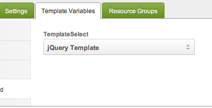

Это руководство предназначено для MODX Revolution 2.2 или выше.

## Что такое настраиваемые TV переменные шаблона?

MODX Revolution позволяет вам создавать собственные пользовательские типы ввода для [TV](getting-started/glossary#shablonnye-peremennye-ili-tv-parametry-ili-tv) (аналогичные уже доступным типам, таким как `textbox`, `radio`, `textarea`, `richtext` и т.д.) для ваших [TV](building-sites/elements/template-variables) . Это руководство покажет очень простой пример, загрузив для нас простой раскрывающийся список шаблонов в Менеджере, а затем во внешнем интерфейсе отобразит наш идентификатор шаблона, заключенный в специальный блок `<div>`. Назовем его `TemplateSelect`. Мы также создадим Дополнение под названием `OurTVs`, что означает, что у нас будут файлы вне обычного каталога рендеринга входных TV, и мы поместим их в наш собственный каталог Дополнения в `core/components/ourtvs/`. 

## Создаем пространство имен

Если вы еще этого не сделали, создайте пространство имен под названием `ourtvs` с путем `{core\_path}components/ourtvs/`. Это поможет нам в дальнейшем. 

## Создаем плагин

Нам понадобится плагин, чтобы сообщить MODX, где находятся наши пользовательские каталоги TV. Сделайте плагин под названием `OurTvsPlugin` и назначьте его следующим событиям:

- _OnTVInputRenderList_ - для отображения фактического ввода TV в бэкэнде
- _OnTVOutputRenderList_ - для отображения TV-вывода в веб-интерфейсе
- _OnTVInputPropertiesList_ - Для загрузки любых настраиваемых свойств для входного рендера в Менеджере
- _OnTVOutputRenderPropertiesList_ - для загрузки любых настраиваемых свойств для выходного TV рендера (интерфейс)
- _OnDocFormPrerender_ - Для загрузки любого пользовательского JS/CSS для нашего TV

Теперь введите код плагина: 

``` php
$corePath = $modx->getOption('core_path',null,MODX_CORE_PATH).'components/ourtvs/';
switch ($modx->event->name) {
    case 'OnTVInputRenderList':
        $modx->event->output($corePath.'tv/input/');
        break;
    case 'OnTVOutputRenderList':
        $modx->event->output($corePath.'tv/output/');
        break;
    case 'OnTVInputPropertiesList':
        $modx->event->output($corePath.'tv/inputoptions/');
        break;
    case 'OnTVOutputRenderPropertiesList':
        $modx->event->output($corePath.'tv/properties/');
        break;
    case 'OnManagerPageBeforeRender':
        break;
}
```

Эти обработчики событий говорят MODX проверять эти каталоги на наличие наших TV файлов при выполнении всех операций рендеринга и обработки. Думайте об этом как о добавлении библиотеки или включении путей.

Плагин для определения пути не потребуется в MODX 2.3. Пространство имен будет обрабатывать все пути. Вот почему мы ранее говорили вам создать пространство имен. :) 

## Создание Контроллера ввода

Контроллер ввода - это то, что фактически загружает разметку для пользовательского входа TV. Создайте здесь файл контроллера ввода: 

> core/components/ourtvs/tv/input/templateselect.class.php

Внутрь поместите следующий код:

``` php
<?php
if(!class_exists('TemplateSelectInputRender')) {
    class TemplateSelectInputRender extends modTemplateVarInputRender {
        public function getTemplate() {
            return $this->modx->getOption('core_path').'components/ourtvs/tv/input/tpl/templateselect.tpl';
        }
        public function process($value,array $params = array()) {
        }
    }
}
return 'TemplateSelectInputRender';
```

Здесь мы сообщаем ему, где найти наш smarty шаблон для отображения TV, а также о наличии метода `process()` для выполнения любой бизнес-логики, которую мы хотим выполнить перед отображением TV.

Теперь вы можете видеть, что здесь мы указываем файл `tpl` для отображения нашего TV. Продолжим и добавим сюда: 

> core/components/ourtvs/tv/input/tpl/templateselect.tpl

И добавим содержимое: 

``` javascript
<select id="tv{$tv->id}" name="tv{$tv->id}" class="combobox"></select>
<script type="text/javascript">
// <![CDATA[
{literal}
MODx.load({
{/literal}
    xtype: 'modx-combo-template'
    ,name: 'tv{$tv->id}'
    ,hiddenName: 'tv{$tv->id}'
    ,transform: 'tv{$tv->id}'
    ,id: 'tv{$tv->id}'
    ,width: 300
    ,value: '{$tv->value}'
{literal}
    ,listeners: { 'select': { fn:MODx.fireResourceFormChange, scope:this}}
});
{/literal}
// ]]>
</script>
```

Вам не нужно использовать код ExtJS, как показано здесь, чтобы иметь собственный тип ввода. Это может быть даже простой ввод HTML. Это действительно зависит от вас. Наиболее важно, чтобы ваш тип ввода имел имя `tv{$tv->id}`.

И это должно дать нам красивый раскрывающийся список шаблонов в бэкэнде: 



## Создание Контроллера вывода

Итак, теперь мы хотим создать контроллер вывода, давайте создадим файл по адресу: 

> core/components/ourtvs/tv/output/templateselect.class.php

И теперь контент:

``` php
if(!class_exists('TemplateSelectOutputRender')) {
    class TemplateSelectOutputRender extends modTemplateVarOutputRender {
        public function process($value,array $params = array()) {
            return '<div class="template">'.$value.'</div>';
        }
    }
}
return 'TemplateSelectOutputRender';
```

Итак, теперь, когда мы визуализируем это во фронтенде, он будет отображать идентификатор нашего выбранного шаблона, заключенного в `div`. 

## Смотрите также

1. [Создание TV переменной](building-sites/elements/template-variables/step-by-step)
2. [Привязки](building-sites/elements/template-variables/bindings)
3. [Привязка Чанка](building-sites/elements/template-variables/bindings/chunk-binding)
4. [Привязка Каталога](building-sites/elements/template-variables/bindings/directory-binding)
5. [EVAL Привязка](building-sites/elements/template-variables/bindings/eval-binding)
6. [Привязка файла](building-sites/elements/template-variables/bindings/file-binding)
7. [INHERIT Привязка](building-sites/elements/template-variables/bindings/inherit-binding)
8. [Привязка Ресурса](building-sites/elements/template-variables/bindings/resource-binding)
9. [SELECT Привязка](building-sites/elements/template-variables/bindings/select-binding)
10. [TV типы ввода](building-sites/elements/template-variables/input-types)
11. [TV типы вывода](building-sites/elements/template-variables/output-types)
12. [TV тип вывода - дата](building-sites/elements/template-variables/output-types/date)
13. [TV тип вывода TV - разделитель](building-sites/elements/template-variables/output-types/delimiter)
14. [TV тип вывода - HTML тег](building-sites/elements/template-variables/output-types/html)
15. [TV тип вывода - изображение](building-sites/elements/template-variables/output-types/image)
16. [TV тип вывода - ссылка](building-sites/elements/template-variables/output-types/url)
17. [Добавление произвольного TV - MODX 2.2](extending-modx/custom-tvs)
18. [Создание поля множественного выбора для страниц в вашем шаблоне](building-sites/tutorials/multiselect-related-pages)
19. [Доступ к значениям TV переменных шаблона через API](extending-modx/snippets/accessing-tvs)
