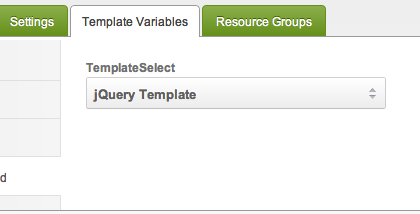

Это руководство для MODX Revolution 2.2 и 3.x.

## Что такое настраиваемые типы ввода TV?

MODX Revolution позволяет добавлять свои типы ввода для [TV](building-sites/elements/template-variables) рядом с `textbox`, `radio`, `textarea`, `richtext` и остальными. Этот пример показывает выпадающий список шаблонов в менеджере, а на фронтенде печатает ID выбранного шаблона в `div`. Тип называется `templateselect`. Файлы лежат в Extra по пути `core/components/ourtvs/`.

Если кастомный рендерер не найден, MODX рисует **обычное текстовое поле**. Это запасной вариант в `modTemplateVar::getRender()`, а не сломанный combo. Чаще всего забыли плагин путей ниже.

## Создайте пространство имён

Создайте Namespace с именем `ourtvs` и путём `{core_path}components/ourtvs/`.

В 3.x MODX ещё смотрит `{namespace_path}/tv/input/`, когда **перечисляет** типы ввода в редакторе TV. Список типов и **отрисовка** TV на ресурсе это разные шаги. Для отрисовки нужен плагин из следующего шага.

## Создайте плагин путей

Плагин нужен и в 2.3, и в 3.x. Namespace его для формы ресурса не заменяет.

Создайте плагин `OurTvsPlugin` и повесьте **только** эти события:

- `OnTVInputRenderList` — рендер ввода в менеджере
- `OnTVOutputRenderList` — рендер вывода на фронтенде
- `OnTVInputPropertiesList` — свойства ввода в менеджере
- `OnTVOutputRenderPropertiesList` — свойства вывода

Код плагина:

``` php
$corePath = $modx->getOption('core_path').'components/ourtvs/';
switch ($modx->event->name) {
    case 'OnTVInputRenderList':
        $modx->event->output($corePath.'tv/input/');
        break;
    case 'OnTVOutputRenderList':
        $modx->event->output($corePath.'tv/output/');
        break;
    case 'OnTVInputPropertiesList':
        $modx->event->output($corePath.'tv/inputoptions/');
        break;
    case 'OnTVOutputRenderPropertiesList':
        $modx->event->output($corePath.'tv/properties/');
        break;
}
```

Обработчики добавляют пути для include. Слеш в конце пути нужен. После сохранения плагина очистите кеш менеджера.

Без плагина тип может появиться в списке Input Type (в 3.x его подхватывает Namespace), но на форме ресурса останется текстовое поле.

## Создайте контроллер ввода

Контроллер ввода грузит разметку. Создайте файл:

> `core/components/ourtvs/tv/input/templateselect.class.php`

Имя файла без `.class.php` это ключ типа: `templateselect`.

``` php
<?php
if (!class_exists('TemplateSelectInputRender')) {
    class TemplateSelectInputRender extends modTemplateVarInputRender {
        public function getTemplate() {
            return $this->modx->getOption('core_path').'components/ourtvs/tv/input/tpl/templateselect.tpl';
        }
        public function process($value, array $params = array()) {
        }
    }
}
return 'TemplateSelectInputRender';
```

В 3.x класс называется `MODX\Revolution\modTemplateVarInputRender`. Глобальное имя работает, пока включены deprecated class aliases (так по умолчанию). Можно написать `use MODX\Revolution\modTemplateVarInputRender;` в начале файла, если хотите namespaced-класс.

`getTemplate()` указывает на Smarty-файл. Положите его сюда:

> `core/components/ourtvs/tv/input/tpl/templateselect.tpl`

``` javascript
<select id="tv{$tv->id}" name="tv{$tv->id}" class="combobox"></select>
<script type="text/javascript">
// <![CDATA[
{literal}
MODx.load({
{/literal}
    xtype: 'modx-combo-template'
    ,name: 'tv{$tv->id}'
    ,hiddenName: 'tv{$tv->id}'
    ,transform: 'tv{$tv->id}'
    ,id: 'tv{$tv->id}'
    ,width: 300
    ,value: '{$tv->value}'
{literal}
    ,listeners: { 'select': { fn:MODx.fireResourceFormChange, scope:this}}
});
{/literal}
// ]]>
</script>
```

ExtJS не обязателен. Подойдёт обычный HTML. У контрола должно быть имя `tv{$tv->id}`.

Создайте TV, в Input Type выберите `templateselect`, назначьте TV шаблону, откройте ресурс. Должен появиться список шаблонов:



Если снова текстовое поле: плагин включён на `OnTVInputRenderList`, путь к class-файлу совпадает с `event->output`, ключ типа `templateselect`.

## Создайте контроллер вывода

Создайте файл:

> `core/components/ourtvs/tv/output/templateselect.class.php`

``` php
<?php
if (!class_exists('TemplateSelectOutputRender')) {
    class TemplateSelectOutputRender extends modTemplateVarOutputRender {
        public function process($value, array $params = array()) {
            return '<div class="template">'.$value.'</div>';
        }
    }
}
return 'TemplateSelectOutputRender';
```

На фронтенде это выведет ID выбранного шаблона внутри `div`.

## Смотрите также

1. [Создание TV переменной](building-sites/elements/template-variables/step-by-step)
2. [Привязки](building-sites/elements/template-variables/bindings)
3. [Привязка Чанка](building-sites/elements/template-variables/bindings/chunk-binding)
4. [Привязка Каталога](building-sites/elements/template-variables/bindings/directory-binding)
5. [Привязка файла](building-sites/elements/template-variables/bindings/file-binding)
6. [INHERIT Привязка](building-sites/elements/template-variables/bindings/inherit-binding)
7. [Привязка Ресурса](building-sites/elements/template-variables/bindings/resource-binding)
8. [SELECT Привязка](building-sites/elements/template-variables/bindings/select-binding)
9. [TV типы ввода](building-sites/elements/template-variables/input-types)
10. [TV типы вывода](building-sites/elements/template-variables/output-types)
11. [TV тип вывода - дата](building-sites/elements/template-variables/output-types/date)
12. [TV тип вывода TV - разделитель](building-sites/elements/template-variables/output-types/delimiter)
13. [TV тип вывода - HTML тег](building-sites/elements/template-variables/output-types/html)
14. [TV тип вывода - изображение](building-sites/elements/template-variables/output-types/image)
15. [TV тип вывода - ссылка](building-sites/elements/template-variables/output-types/url)
16. [Добавление произвольного TV - MODX 2.2](extending-modx/custom-tvs)
17. [Создание поля множественного выбора для страниц в вашем шаблоне](building-sites/tutorials/multiselect-related-pages)
18. [Доступ к значениям TV переменных шаблона через API](extending-modx/snippets/accessing-tvs)
