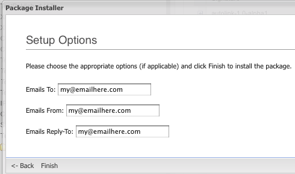

Пользователи, использующие `Revolution 2.0.0-beta-4` или более раннюю версию, должны учитывать, что определения различаются в `beta5` и последующих версиях. Пример: `xPDOTransport::UNIQUE_KEYS` в `beta5+` эквивалентна `XPDO_TRANSPORT_UNIQUE_KEYS` в `beta4` и ранее. MODX рекомендует просто обновиться до `beta5/SVN`.

## Скрипт сборки - что это?

Это суть процесса упаковки; вот где ваш Компонент фактически помещается в красивый, изящный транспортный пакет `.zip`, который вы найдете на `modx.com` или в разделе управления пакетами Revolution.

В этом руководстве вы узнаете, как создать один из этих сценариев. Мы будем использовать образец компонента под названием `Quip`, который содержит `modAction`, несколько пунктов меню, несколько Чанков и Сниппет, Лексиконы, Параметры установки, лицензию, файл `readme` и Cистемные настройки. По сути, это быстрый и простой просмотр всех основ создания базового скрипта сборки. 

## Структура каталогов

Прежде всего, давайте кратко рассмотрим нашу структуру каталогов. Это не всегда то, как вы должны это делать - это специально построено для `SVN`; но это определенно рекомендуется, особенно со структурами `assets/components/quip/` и `core/components/quip/`, поскольку это значительно упрощает создание транспортного пакета. 


## Создание нового скрипта

Создайте новый файл. Обычно это `build.transport.php` в каталоге `_build`. Давайте сначала начнем с некоторых комментариев для `phpdoc`, а затем запустим таймер. 

``` php
<?php
/**
 * Quip скрипт сборки
 *
 * @package quip
 * @subpackage build
 */
$mtime = microtime();
$mtime = explode(" ", $mtime);
$mtime = $mtime[1] + $mtime[0];
$tstart = $mtime;
set_time_limit(0); /* гарантирует, что наш скрипт не завершится  */
```

Теперь давайте определим несколько основных путей. Мы можем определить их наверху в массив `sources`, чтобы облегчить доступ к ним позже в сценарии сборки. Обратите внимание, что в каталогах `source_core` и `source_assets` не содержится завершающая косая черта. Это обязательно. 

``` php
$root = dirname(dirname(__FILE__)).'/';
$sources= array (
    'root' => $root,
    'build' => $root .'_build/',
    'resolvers' => $root . '_build/resolvers/',
    'data' => $root . '_build/data/',
    'source_core' => $root.'core/components/quip',
    'lexicon' => $root . 'core/components/quip/lexicon/',
    'source_assets' => $root.'assets/components/quip',
    'docs' => $root.'core/components/quip/docs/',
);
unset($root); /* бережем память */
```

Следующим этапом нам нужно включить несколько файлов, чтобы получить необходимые библиотеки в сборку. Во-первых, давайте добавим созданный нами файл под названием `build.config.php` в наш каталог сборки. 

``` php
require_once dirname(__FILE__) . '/build.config.php';
```
В этом файле мы хотим определить местоположение нашей установки MODX Revolution, чтобы сценарий сборки мог знать, где взять класс `modX`, а также куда поместить пакет по завершении. Наш файл будет выглядеть примерно так: 

``` php
<?php
/**
 * Определите константы пути MODX, необходимые для установки ядра 
 *
 * @package quip
 * @subpackage build
 */
define('MODX_CORE_PATH', '/absolute/path/to/modx/core/');
define('MODX_CONFIG_KEY','config');
```

Убедитесь, что вы изменили значение `MODX_CORE_PATH` на абсолютный путь, по которому установлено ваше ядро MODX Revolution. `MODX_CONFIG_KEY` может оставаться неизменным, если вы не выполняете установку с несколькими доменами.

Теперь вам нужно включить класс `modX` и создать его экземпляр. Мы также инициализируем его в контексте 'mgr' и установим вывод журнала в `HTML`, чтобы сделать наши ошибки и информационные сообщения красивыми и отформатированными - если мы не делаем это из командной строки, где нам нужно просто стандартное сообщение. 

``` php
require_once MODX_CORE_PATH . 'model/modx/modx.class.php';

$modx= new modX();
$modx->initialize('mgr');
$modx->setLogLevel(modX::LOG_LEVEL_INFO);
$modx->setLogTarget(XPDO_CLI_MODE ? 'ECHO' : 'HTML');
```

Дальше - больше! Давайте сначала воспользуемся `$modx->loadClass` для загрузки класса `modPackageBuilder`. Затем мы создадим его экземпляр и создадим пакет. 

``` php
$modx->loadClass('transport.modPackageBuilder','',false, true);
$builder = new modPackageBuilder($modx);
$builder->createPackage('quip','0.1','alpha7');
$builder->registerNamespace('quip',false,true,'{core_path}components/quip/');
```

Функция `modPackageBuilder::createPackage` имеет 3 параметра: `name`, `version` и `release`. У нас это будет `quip-0.1-alpha7`, продолжаем.

Затем мы зарегистрируем [Пространство имен](extending-modx/namespaces) в этом пакете. Не всем пакетам требуются [Пространства имен](extending-modx/namespaces); но все сторонние компоненты делают. По сути, пространство имен - это инструмент организации для MODX, чтобы MODX мог знать, какие объекты привязаны к какому пакету. Это пригодится позже, если мы захотим удалить наш пакет; мы бы хотели, чтобы он удалил объекты, которые мы устанавливаем.

Кроме того, если мы захотим добавить какие-либо [Записи лексиконов](extending-modx/internationalization#zapisi-leksikonov) в этот пакет (что мы и сделаем), MODX сделает это, связав его с пространством имен. Наш конструктор пакетов назначит наши лексиконы пространству имен, чтобы мы могли легко управлять только нашими лексиконами; не другими. 

## Упаковка объектов

Объекты упакованы в [Контейнеры](getting-started/glossary#transportnyy-konteyner); в основном думайте о транспортном Контейнере как о некой системе хранения, которая переносит данные и/или файлы в zip-архиве. [Транспортные пакеты](getting-started/glossary#transportnyy-paket) могут содержать много транспортных контейнеров. Контейнеры могут содержать множество объектов или файлов, однако контейнеры, содержащие объект, должны иметь только один ссылочный объект (или родительский объект, в зависимости от того, что вы предпочитаете), на котором основан Контейнер.

Давайте рассмотрим несколько примеров создания Транспортного контейнера, прежде чем углубляться в наш скрипт сборки. Этот первый пример упаковывается в простой объект с некоторыми параметрами: 

``` php
$snippet = $modx->newObject('modSnippet');
$snippet->set('id',1);
$snippet->set('name','Test');
$vehicle = $builder->createVehicle($snippet,array(
    xPDOTransport::UNIQUE_KEY => 'name',
    xPDOTransport::UPDATE_OBJECT => true,
    xPDOTransport::PRESERVE_KEYS => false,
));
```

Во-первых, мы создали объект [Сниппета](getting-started/glossary#snippet). Обратите внимание, что вам нужно будет указать для него произвольный идентификатор, даже если мы не будем хранить его позже. Это обязательно. Затем мы использовали функцию `createVehicle` в `modPackageBuilder` для создания объекта Контейнера. Давайте посмотрим на эти параметры атрибутов более внимательно: 

- **xPDOTransport::UNIQUE\_KEY** _(string/array)_ - Здесь вы разместите уникальный ключ, который идентифицирует создаваемый вами объект. Это укажет MODX искать `modSnippet` с именем `name`, равным имени пакета (здесь "Тест") при обновлении или удалении объекта. Для большинства объектов это будет `name`; другие требуют других настроек. Некоторым даже может потребоваться массив из двух или более полей.
- **xPDOTransport::UPDATE\_OBJECT** _(boolean)_ - варианты: true, либо false. Это говорит MODX, следует ли обновлять объект, если он обнаружен в базе данных при установке (или обновлении). Иногда, если объект уже существует, вы можете не захотеть его обновлять - обновление может стереть текущие настройки пользователя для этого объекта.
- **xPDOTransport::PRESERVE\_KEYS** _(boolean)_ - варианты: true, либо false. Это сообщает MODX, следует ли перезаписывать первичные ключи(ПК) при обнаружении объекта. Это может быть полезно, если вы хотите, чтобы ПК оставались неизменными при обновлении - некоторые ПК являются автоикнрементными `auto_increment`, и если вы хотите, чтобы они оставались неизменными, вы должны установить это значение в `true`. **Примечание:** Если объект уже существует, эта функция работает, только если `xPDOTransport::UPDATE_OBJECT` также имеет значение `true`. Если объект не найден, он все равно будет работать.

Достаточно просто, не так ли? Итак, наш пример предлагает искать Сниппет с именем "Test" и, если он его находит, обновлять его содержимое. Если не находит - нужно создать. Однако, если он его обнаружит - мы сообщили MODX не обновлять его ПK - в этой ситуации нет необходимости корректировать это.

А что насчет связанных объектов? Что, если я хочу упаковать свой `modMenu` вместе с его действием, связанным с `modMenu`? Вот немного более сложный сценарий: 

``` php
$action= $modx->newObject('modAction');
$action->fromArray(array(
    'id' => 1,
    'namespace' => 'quip',
    'parent' => '0',
    'controller' => 'index',
    'haslayout' => '1',
    'lang_topics' => 'quip:default,file',
    'assets' => '',
),'',true,true);
$menu= $modx->newObject('modMenu');
$menu->fromArray(array(
    'text' => 'quip',
    'parent' => 'components',
    'description' => 'quip_desc',
    'icon' => 'images/icons/plugin.gif',
    'menuindex' => '0',
    'params' => '',
    'handler' => '',
),'',true,true);
$menu->addOne($action);
$vehicle= $builder->createVehicle($menu,array (
    xPDOTransport::PRESERVE_KEYS => true,
    xPDOTransport::UPDATE_OBJECT => true,
    xPDOTransport::UNIQUE_KEY => 'text',
    xPDOTransport::RELATED_OBJECTS => true,
    xPDOTransport::RELATED_OBJECT_ATTRIBUTES => array (
        'Action' => array (
            xPDOTransport::PRESERVE_KEYS => false,
            xPDOTransport::UPDATE_OBJECT => true,
            xPDOTransport::UNIQUE_KEY => array ('namespace','controller'),
        ),
    ),
));
```

Мы вводим 2 новых параметра: 

- **xPDOTransport::RELATED\_OBJECTS** _(boolean)_ - Либо true, либо false, это сообщант MODX, что мы хотим искать объекты, связанные с этим объектом. Это должно быть установлено для работы следующего параметра. 
- **xPDOTransport::RELATED\_OBJECT\_ATTRIBUTES** _(array)_ - Это определяет типы и подробности связанных объектов, которые мы хотим захватить. Если вы заметили, формат представляет собой просто ассоциативный массив атрибутов, аналогичный атрибутам родительского объекта, где ключ является "псевдонимом"(`alias`) связанного объекта, который мы хотим захватить. Псевдонимы можно найти в Cхеме, расположенной в `core/model/schema/modx.mysql.schema.xml`.

Наш пример выше говорит нам о `modAction` (найденном при поиске `modAction` с Пространством имен `quip` и Контроллером `index`), чтобы включить связанный объект `modAction`, который мы упаковываем. Мы упаковали их вручную, используя `addOne` функцию xPDO в `modAction`.

Кроме того, если бы мы хотели упаковать объекты, связанные с объектами `modAction`, нам просто нужно было бы определить это в атрибутах `Action` и `addMany` (или `addOne`) для этого действия. Вы можете сколько угодно углубляться во вложенность.

Итак, вернемся к нашему сценарию. Напомним, что на данный момент у нас есть: 

``` php
<?php
/**
 * Quip скрипт сборки
 *
 * @package quip
 * @subpackage build
 */
$mtime = microtime();
$mtime = explode(" ", $mtime);
$mtime = $mtime[1] + $mtime[0];
$tstart = $mtime;
set_time_limit(0);

$root = dirname(dirname(__FILE__)).'/';
$sources= array (
    'root' => $root,
    'build' => $root .'_build/',
    'lexicon' => $root . '_build/lexicon/',
    'resolvers' => $root . '_build/resolvers/',
    'data' => $root . '_build/data/',
    'source_core' => $root.'core/components/quip',
    'source_assets' => $root.'assets/components/quip',
    'docs' => $root.'core/components/quip/docs/',
);
unset($root);

/* переопределите своими собственными определениями здесь (смотрите build.config.sample.php) */
require_once dirname(__FILE__) . '/build.config.php';
require_once MODX_CORE_PATH . 'model/modx/modx.class.php';

$modx= new modX();
$modx->initialize('mgr');
$modx->setLogLevel(modX::LOG_LEVEL_INFO);
$modx->setLogTarget(XPDO_CLI_MODE ? 'ECHO' : 'HTML');

$modx->loadClass('transport.modPackageBuilder','',false, true);
$builder = new modPackageBuilder($modx);
$builder->createPackage('quip','0.1','alpha5');
$builder->registerNamespace('quip',false,true,'{core_path}components/quip/');
```

Итак, давайте сначала упакуем наши `modActions` и `modMenus` для нашего бэкэнда: 

``` php
/* загружаем action/menu */
$menu = include $sources['data'].'transport.menu.php';

$vehicle= $builder->createVehicle($menu,array (
    xPDOTransport::PRESERVE_KEYS => true,
    xPDOTransport::UPDATE_OBJECT => true,
    xPDOTransport::UNIQUE_KEY => 'text',
    xPDOTransport::RELATED_OBJECTS => true,
    xPDOTransport::RELATED_OBJECT_ATTRIBUTES => array (
        'Action' => array (
            xPDOTransport::PRESERVE_KEYS => false,
            xPDOTransport::UPDATE_OBJECT => true,
            xPDOTransport::UNIQUE_KEY => array ('namespace','controller'),
        ),
    ),
));
$builder->putVehicle($vehicle);
unset($vehicle,$action); /* бережем память */
```

Минутку! Обратите внимание, как мы помещаем данные `action` в другой файл? Вам не обязательно этого делать - это полностью личное предпочтение, но это сохраняет наш скрипт сборки в порядке и изолирует наши `actions`/`menus` в отдельный файл для упрощения управления.

Сделаем то же самое с настройками нашей системы: 

``` php
/* загружаем системные переменные */
$settings = include $sources['data'].'transport.settings.php';

$attributes= array(
    xPDOTransport::UNIQUE_KEY => 'key',
    xPDOTransport::PRESERVE_KEYS => true,
    xPDOTransport::UPDATE_OBJECT => false,
);
foreach ($settings as $setting) {
    $vehicle = $builder->createVehicle($setting,$attributes);
    $builder->putVehicle($vehicle);
}
unset($settings,$setting,$attributes);
```

Отлично! У нас упакованы действия, меню и настройки. Теперь, используя наши новые знания о связанных объектах, давайте создадим категорию под названием `Quip` и поместим наш Сниппет и Чанки в эту категорию. Мы пройдем через это немного медленнее, чтобы мы могли легко увидеть, как это работает: 

``` php
/* создаем категорию */
$category= $modx->newObject('modCategory');
$category->set('id',1);
$category->set('category','Quip');
```

Шаг первый сделан: категория создана. Теперь о Сниппете: 

``` php
/* создаем сниппет */
$snippet= $modx->newObject('modSnippet');
$snippet->set('id',0);
$snippet->set('name', 'Quip');
$snippet->set('description', 'Простой компонент для комментариев');
$snippet->set('snippet',file_get_contents($sources['source_core'].'/snippet.quip.php');
```

Чудесно! Обратите внимание, как здесь мы используем функцию `file_get_contents()`, чтобы получить содержимое Сниппета из нашей среды разработки и разместить его здесь. Это упрощает запуск сборки в будущих итерациях; нет необходимости постоянно обновлять этот вызов - просто обновите этот файл.

Итак, у нас есть некоторые свойства в этом Сниппете ... как их добавить? 

``` php
$properties = include $sources['data'].'properties.inc.php';
$snippet->setProperties($properties);
$category->addMany($snippet);
```

Здесь мы используем метод `addMany`, а не `addOne`. То, что вам нужно использовать, зависит не столько от количества объектов, которые вы связываете (в данном случае только один Сниппет), сколько от "мощности"(cardinality) отношения. Это может показаться сложным, но количество элементов просто означает, является ли это отношением "один к одному" или "один ко многим". В нашем случае категория имеет отношение "один ко многим" со Сниппетами (в одной категории может быть много Сниппетов), и это означает, что вам придется использовать метод `addMany`. Вы можете передать этому методу массив объектов или только один объект, но какой из них вы используете, зависит от количества элементов. Узнайте больше об [отношениях](extending-modx/xpdo/custom-models/defining-a-schema/Relations "Определение отношений"), [addOne](extending-modx/xpdo/class-reference/xpdoobject/related-object-accessors/addone "addOne") и [addMany](extending-modx/xpdo/class-reference/xpdoobject/related-object-accessors/addmany "addMany").

Вы будете использовать функцию `setProperties` из `modSnippet` для передачи в массив множества свойств. Итак, давайте взглянем на этот файл `properties.inc.php`: 

``` php
<?php
/**
 * Свойства сниппета по умолчанию 
 *
 * @package quip
 * @subpackage build
 */
$properties = array(
    array(
        'name' => 'closed',
        'desc' => 'Если установлено значение true, ветка не будет принимать новые комментарии. ',
        'type' => 'combo-boolean',
        'options' => '',
        'value' => false,
    ),
    array(
        'name' => 'dateFormat',
        'desc' => 'Формат дат, отображаемых для комментария.',
        'type' => 'textfield',
        'options' => '',
        'value' => '%b %d, %Y at %I:%M %p',
    ),
    /* ...другое удалено для краткости ... */
);
return $properties;
```

Достаточно просто. А теперь перейдем к Чанкам: 

``` php
/* добавим чанки */
$chunks = include $sources['data'].'transport.chunks.php';
if (is_array($chunks)) {
    $category->addMany($chunks);
} else { $modx->log(modX::LOG_LEVEL_FATAL,'Ошибка добавления чанков'); }
```

Хорошо. Мы вернули массив Чанков и использовали функцию `addMany()` из `modCategory`, чтобы добавить их. Мы также добавили проверку работоспособности на случай, если мы допустили опечатку или что-то в этом роде. Теперь давайте упакуем все это в Контейнер: 

``` php
/* создаем контейнер категории */
$attr = array(
    xPDOTransport::UNIQUE_KEY => 'category',
    xPDOTransport::PRESERVE_KEYS => false,
    xPDOTransport::UPDATE_OBJECT => true,
    xPDOTransport::RELATED_OBJECTS => true,
    xPDOTransport::RELATED_OBJECT_ATTRIBUTES => array (
        'Snippets' => array(
            xPDOTransport::PRESERVE_KEYS => false,
            xPDOTransport::UPDATE_OBJECT => true,
            xPDOTransport::UNIQUE_KEY => 'name',
        ),
        'Chunks' => array (
            xPDOTransport::PRESERVE_KEYS => false,
            xPDOTransport::UPDATE_OBJECT => true,
            xPDOTransport::UNIQUE_KEY => 'name',
        ),
    )
);
$vehicle = $builder->createVehicle($category,$attr);
```

Прекрасно! Теперь у нас есть наш контейнер категории со всеми связанными Чанками и Сниппетами. Они будут установлены в нужную категорию, когда наши пользователи установят наш пакет, так что он будет выглядеть красиво и четко! 

## Валидаторы и Резольверы

[Валидаторы](getting-started/glossary#validator-transportnyy-paket) и [Резольверы](getting-started/glossary#rezolvery-v-transportnom-pakete) - это обычно скрипты, которые запускаются в процессе установки. Валидаторы запускаются перед установкой; это означает, что они запускаются до того, как произойдет установка основного пакета. Если они возвращают false, установка не продолжается.

В свою очередь Резольверы выполняются после установки основного пакета. Они могут быть файловыми или PHP-скриптами. Резольвер файлов просто копирует файлы в определенное целевое местоположение. После установки PHP Резольвер выполняет сценарий.

С учетом сказанного, мы собираемся присоединить к нашему скрипту 2 файловых Резольвера и один PHP Резольвер: 

``` php
$vehicle->resolve('file',array(
    'source' => $sources['source_core'],
    'target' => "return MODX_CORE_PATH . 'components/';",
));
$vehicle->resolve('file',array(
    'source' => $sources['source_assets'],
    'target' => "return MODX_ASSETS_PATH . 'components/';",
));
$vehicle->resolve('php',array(
    'source' => $sources['resolvers'] . 'setupoptions.resolver.php',
));
$builder->putVehicle($vehicle);
```

Хорошо, обо всем по порядку. У файловых Резольверов есть два варианта: 

- **source** - Это целевой каталог или сценарий. Если это файловый Резольвер, он не должен заканчиваться косой чертой и должен быть допустимым каталогом. Если это PHP Резольвер, это должен быть действительный и доступный файл. 
- **target** - Применимо только к файловым Резольверам, это сообщает MODX, где установить исходные файлы. Здесь используется оператор `eval()`, поэтому его необходимо использовать, как в примере. Вам доступны стандартные определения MODX; используйте их, чтобы захватить базовые пути к цели. 

В наших примерах мы просто перемещаем все исходные файлы из нашего каталога `core` в `modx/core/components/quip/` (поскольку наш каталог, который мы перемещаем, называется `quip`), а все файлы из каталога `assets` - в `modx/assets/components/quip/`.

Вы можете спросить, почему мы перемещаем их в два каталога. Что ж, на практике лучше всего хранить файлы, не доступные извне, такие как PHP скрипты, файлы `tpl`, документы и т.д., в ядре (которое может быть размещено вне корневой директории веб-сайта), чтобы они были защищены от прямого доступа. При этом в доступной через web части вашего сайта сохраняются только те файлы, к которым ваш Компонент должен получить доступ через Интернет.

Затем мы добавляем Резольвер PHP, называемый `setupoptions.resolver.php`. Мы вернемся к этому более подробно, потому что на самом деле он касается процесса настройки параметров.

И, наконец, упаковываем Контейнер в Транспортный пакет с помощью функции `putVehicle`. 

## Лексиконы

Итак, теперь у нас есть пакет с Системными настройками, действиями, меню, Сниппетами, Чанками, категорией и несколькими настроенными Резольверами. Поговорим теперь о [Лексиконах](getting-started/glossary#leksikon).

У нас есть хорошо структурированный лексикон в каталоге \\ core / components / quip / lexicon: 


Как видите, у нас есть подкаталог `en`, IANA код для английского языка. Затем у нас есть `default.inc.php` - это файл темы лексикона по умолчанию. Если бы мы хотели создать отдельные темы лексикона, мы назвали бы их `topicname.inc.php`.

Начиная с MODX Revolution RC-2, MODX автоматически найдет словари в вашем каталоге `lexicon`, предполагая, что вы поместите их в эту структуру в следующее место: `{namespace_path}/lexicon/`, где путь к пространству имен `{namespace_path}`- это путь, который вы задали для вашего пространства имен ранее. Вам вообще не нужно напрямую встраивать лексиконы; MODX проанализирует это за вас.

Это связано с тем, что лексиконы сначала кэшируются из ваших файлов, а затем любые переопределения из БД объединяются и кэшируются. Это позволяет людям "переопределить" ваши лексиконы с помощью Управления лексиконами в Менеджере, если они захотят, не нарушая их путь обновления для вашего Компонента. 

## Атрибуты пакета: license, readme and опции установки

Каждый пакет имеет так называемые "атрибуты пакета", которые можно передать любому Резольверу или Валидатору. Вы можете передать почти все, что хотите, в функцию `modPackageBuilder::setPackageAttributes()` в формате массива. Однако есть три специальных ключа, с которыми мы будем иметь дело. 

- **license** (string) - Это ваше лицензионное соглашение. Если MODX обнаружит во время установки, что этот файл не пуст, он предложит пользователю согласиться с этим, прежде чем он сможет продолжить установку пакета.
- **readme** (string) - Это содержит файл `readme`. Перед установкой, если файл не пуст, пользователь сможет просмотреть файл. Это может быть полезно, чтобы убедиться, что люди видят какие-либо требования перед установкой. 
- **setup-options** (string) - И вот что самое интересное - это может быть HTML-форма (без тегов `form`), которая будет передавать любые введенные пользователем параметры в Резольверы или Валидаторы. Это означает, что вы можете принимать вводимые пользователем данные перед установкой и обрабатывать их во время установки! 

Итак, давайте использовать их в нашем скрипте сборки:

``` php
/* теперь запакуем файл лицензии, файл readme и параметры настройки  */
$builder->setPackageAttributes(array(
    'license' => file_get_contents($sources['docs'] . 'license.txt'),
    'readme' => file_get_contents($sources['docs'] . 'readme.txt'),
    'setup-options' => array(
        'source' => $sources['build'] . 'setup.options.php'
    ),
));
```

Очевидно, что в наши значения `license` и `readme` передаётся содержимое наших файлов лицензии и readme. Мы выполняем их через `file_get_contents()`, чтобы мы могли сохранить фактические файлы в каталоге `modx/core/components/quip/docs` после установки, если пользователь захочет просмотреть их позже.

Но параметры настройки выглядят немного иначе. Мы могли бы просто передать вызов `file_get_contents()`, который вставляет строку, но тогда наша форма параметров настройки не будет динамической! Могут быть случаи, когда вы этого не захотите, но мы хотим. Мы хотим, чтобы эта форма опций хорошо обновлялась. Обратите внимание, что вы должны передать местоположение файла в качестве параметра `source` - помните Резольверы? Знакомо, да? Здесь та же самая идея.

Наш файл `setup.options.php` выглядит так: 

``` php
<?php
/**
 * Создадим форму параметров настройки.
 *
 * @package quip
 * @subpackage build
 */
/* установим некоторые значения по умолчанию */
$values = array(
    'emailsTo' => 'my@emailhere.com',
    'emailsFrom' => 'my@emailhere.com',
    'emailsReplyTo' => 'my@emailhere.com',
);
switch ($options[xPDOTransport::PACKAGE_ACTION]) {
    case xPDOTransport::ACTION_INSTALL:
    case xPDOTransport::ACTION_UPGRADE:
        $setting = $modx->getObject('modSystemSetting',array('key' => 'quip.emailsTo'));
        if ($setting != null) { $values['emailsTo'] = $setting->get('value'); }
        unset($setting);

        $setting = $modx->getObject('modSystemSetting',array('key' => 'quip.emailsFrom'));
        if ($setting != null) { $values['emailsFrom'] = $setting->get('value'); }
        unset($setting);

        $setting = $modx->getObject('modSystemSetting',array('key' => 'quip.emailsReplyTo'));
        if ($setting != null) { $values['emailsReplyTo'] = $setting->get('value'); }
        unset($setting);
    break;
    case xPDOTransport::ACTION_UNINSTALL: break;
}

$output = '<label for="quip-emailsTo">Письмо к:</label>
<input type="text" name="emailsTo" id="quip-emailsTo" width="300" value="'.$values['emailsTo'].'" />
<br /><br />

<label for="quip-emailsFrom">Письмо от:</label>
<input type="text" name="emailsFrom" id="quip-emailsFrom" width="300" value="'.$values['emailsFrom'].'" />
<br /><br />

<label for="quip-emailsReplyTo">Письмо Reply-To:</label>
<input type="text" name="emailsReplyTo" id="quip-emailsReplyTo" width="300" value="'.$values['emailsReplyTo'].'" />';

return $output;
```

Как видите, здесь несколько новых констант. Они доступны для всех форм параметров настройки и Резольверов:

- **xPDOTransport::PACKAGE\_ACTION** - Это сообщает нам, какое действие выполняется над пакетом; это одно из трех значений:
    -   **xPDOTransport::ACTION\_INSTALL** - Устанавливается, когда пакет инсталлируется.
    -   **xPDOTransport::ACTION\_UPGRADE** - устанавливается при обновлении пакета.
    -   **xPDOTransport::ACTION\_UNINSTALL** - Устанавливается при удалении пакета. Очевидно, это не относится к параметрам настройки, поскольку ничего не настраивается. В будущих выпусках Revolution это позволит вам делать определенные опции для удаления; но не сейчас.

По сути, мы представляем им форму перед установкой, которая выглядит так: 



Как следствие они могут установить или обновить значения системных параметров `emailsTo`, `emailsFrom` и `emailsReplyTo` перед установкой пакета. Теперь скрипт сначала проверит, существуют ли эти настройки; и если да, мы заполним их этими значениями. Это позволяет плавно выполнять обновления, сохраняя пользовательские настройки для этих значений. Довольно круто, да?

Очевидно, вы можете многое с этим сделать. Вы можете установить целевые каталоги для местоположений фотографий, настроить базовые учетные записи электронной почты, установить информацию для авторизации/передачи информации для интеграции сторонних веб-сервисов и многое другое. Мы оставим ваше воображение, чтобы продолжить работу.

Вернемся к нашему преобразователю сценариев PHP, который обрабатывает эту информацию: 

``` php
<?php
/**
 * Разрешаем настройки путем настройки параметров электронной почты. 
 *
 * @package quip
 * @subpackage build
 */
$success= false;
switch ($options[xPDOTransport::PACKAGE_ACTION]) {
    case xPDOTransport::ACTION_INSTALL:
    case xPDOTransport::ACTION_UPGRADE:
        /* emailsTo */
        $setting = $object->xpdo->getObject('modSystemSetting',array('key' => 'quip.emailsTo'));
        if ($setting != null) {
            $setting->set('value',$options['emailsTo']);
            $setting->save();
        } else {
            $object->xpdo->log(xPDO::LOG_LEVEL_ERROR,'[Quip] emailsTo параметр не может быть найден, поэтому параметр не может быть изменен.');
        }

        /* emailsFrom */
        $setting = $object->xpdo->getObject('modSystemSetting',array('key' => 'quip.emailsFrom'));
        if ($setting != null) {
            $setting->set('value',$options['emailsFrom']);
            $setting->save();
        } else {
            $object->xpdo->log(xPDO::LOG_LEVEL_ERROR,'[Quip] Параметр emailsFrom не может быть найден, поэтому параметр не может быть изменен. ');
        }

        /* emailsReplyTo */
        $setting = $object->xpdo->getObject('modSystemSetting',array('key' => 'quip.emailsReplyTo'));
        if ($setting != null) {
            $setting->set('value',$options['emailsReplyTo']);
            $setting->save();
        } else {
            $object->xpdo->log(xPDO::LOG_LEVEL_ERROR,'[Quip] Параметр emailsReplyTo не может быть найден, поэтому параметр не может быть изменен.');
        }

        $success= true;
        break;
    case xPDOTransport::ACTION_UNINSTALL:
        $success= true;
        break;
}
return $success;
```

Обратите внимание, что `$modx` здесь недоступен - вы фактически запускаете эти сценарии из транспортного объекта. Однако объект `$modx` доступен под другим именем: `$object->xpdo`. `$object` - это объект, к которому прикреплен Резольвер; здесь это будет `modCategory`.

Таким образом, наш скрипт устанавливает значения, заданные в параметрах настройки, для вновь установленных системных параметров.

И теперь, когда у нас все упаковано и готово к работе, давайте упакуем пакет в zip-файл и дадим нам время, необходимое для сборки пакета: 

``` php
$builder->pack();

$mtime= microtime();
$mtime= explode(" ", $mtime);
$mtime= $mtime[1] + $mtime[0];
$tend= $mtime;
$totalTime= ($tend - $tstart);
$totalTime= sprintf("%2.4f s", $totalTime);

$modx->log(modX::LOG_LEVEL_INFO,"\nСоздание пакета.\nВремя выполнения: {$totalTime}\n");

session_write_close();
exit();
```

Great, we're done! You'll only need to run this script now, and viola! A fully zipped transport package file will appear in your core/packages directory.

Отлично, мы закончили! Вам нужно только запустить этот скрипт, и вуаля! Полностью заархивированный файл транспортного пакета появится в вашем каталоге `core/packages`.

## Смотрите еще

- [Менеджер пакетов](building-sites/extras "Менеджер пакетов")
- [Транспортные пакеты](extending-modx/transport-packages "Транспортные пакеты")
- [Транспортные провайдеры](building-sites/extras/providers "Транспортные провайдеры")
