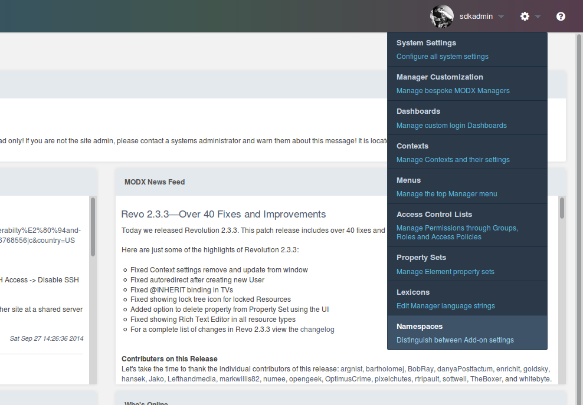
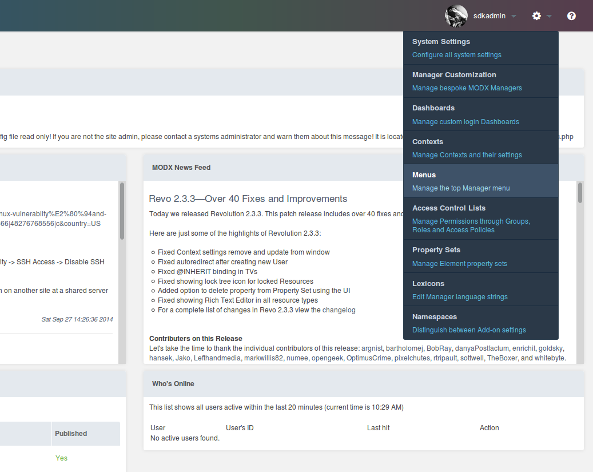
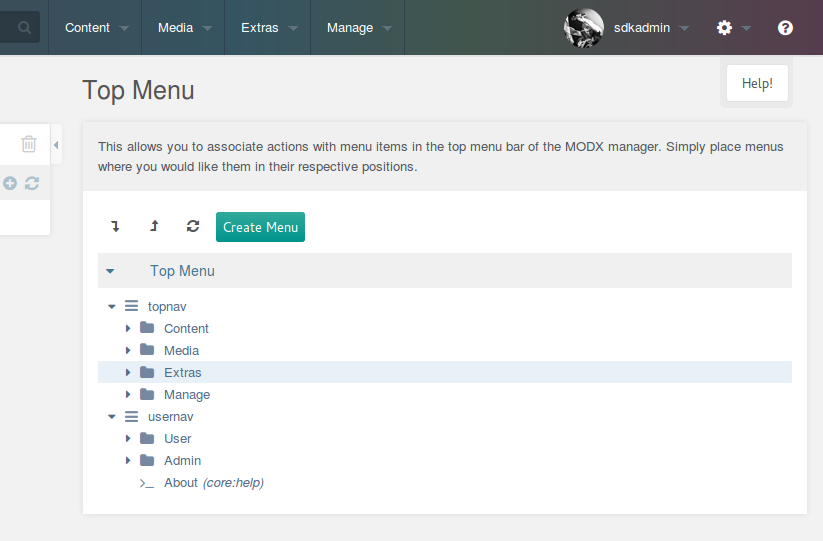
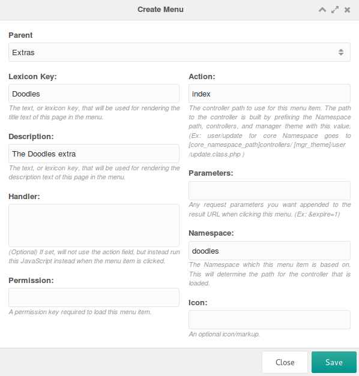
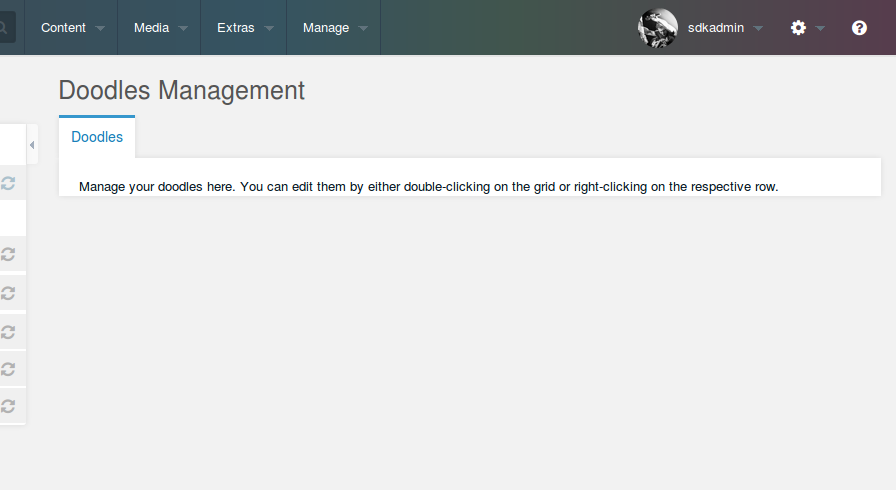
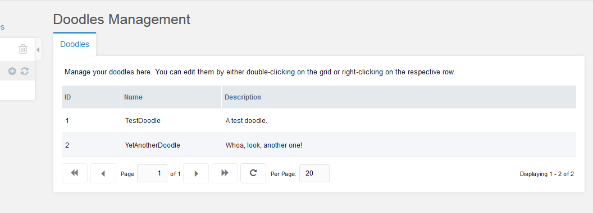
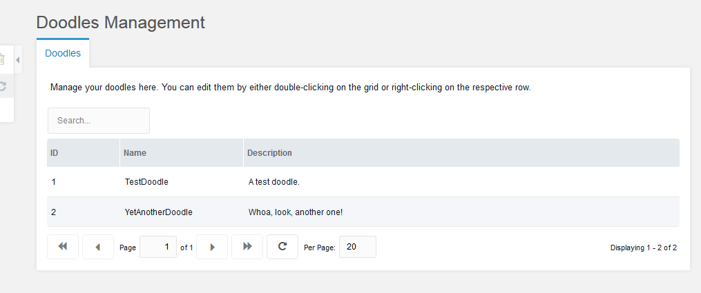
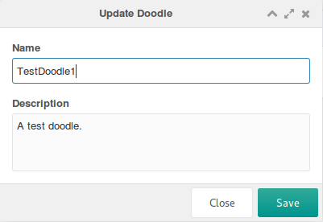
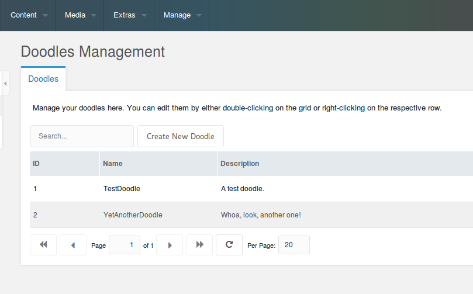
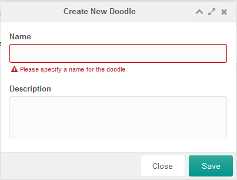

This tutorial is part of a Series:

-   [Part I: Getting Started and Creating the Doodles Snippet](extending-modx/tutorials/developing-an-extra "Developing an Extra in MODX Revolution")
-   Part II: Creating our Custom Manager Page
-   [Part III: Packaging Our Extra](extending-modx/tutorials/developing-an-extra/part-3 "Developing an Extra in MODX Revolution, Part III")

В этом разделе вы создадите Custom Manager Page (CMP) для Extra Doodles из [шага 1](extending-modx/tutorials/developing-an-extra "Developing an Extra in MODX Revolution"). Мы разберём controllers, connectors и processors, настроим Namespace, Action и пункт меню, а также соберём интерфейс на ExtJS.

## First Setup Steps

Сниппет и базовая структура каталогов уже готовы. Перед разработкой Custom Manager Page нужно выполнить несколько подготовительных шагов. Первый из них: Namespace.

### Namespaces

[Namespaces](extending-modx/namespaces "Namespaces") в MODX Revolution: это изолированные области разработки в системе. Они задают базовый путь для CMP и сообщают MODX, откуда загружать файлы CMP и Lexicon (i18n). Благодаря им вы разрабатываете и запускаете Extras без правок core MODX и без конфликтов с Git/SVN-деплоями MODX.

Создайте свой Namespace. Откройте подменю Namespaces в меню System (иконка «шестерёнки»):



Нажмите кнопку «Create New» над таблицей, чтобы открыть окно Create Namespace. Заполните форму так:

-   **Name** - doodles
-   **Core Path** - полный абсолютный путь к каталогу `core/components/doodles/`. Если файлы лежат в корне MODX, можно использовать сокращение `{core_path}components/doodles/`.
-   **Assets Path** - полный абсолютный путь к каталогу `assets/components/doodles/` или `{assets_path}components/doodles/`, если каталог внутри корня MODX.

Поясним. Вы получаете ключ Namespace `doodles`, по которому можно ссылаться на Namespace. Во-вторых, путь указывает на core-каталог doodles, в котором вы ведёте разработку. MODX будет загружать controller-файлы CMP (подробнее ниже) из этого каталога. Именно туда Transport Package установит файлы. **Абсолютный путь** в вашем окружении позволяет разрабатывать Extra вне webroot MODX.

Core path сообщает MODX, где искать lexicon и controller-файлы. Assets _path_ ядро MODX сейчас не использует.

Откройте System Settings и отредактируйте две настройки `doodles.core_path` и `doodles.assets_url`. Укажите для них Namespace `doodles`.

### Actions and Menus

Дальше создайте пункт меню для CMP. Для этого понадобится «Action». Action в MODX: абстрактное представление страницы менеджера. У каждой страницы менеджера есть Action в таблице modx_actions, на который можно ссылаться. Так вы создаёте сколько угодно Actions для CMP в менеджере.

До MODX 2.3 actions отличались только целым числом, и для загрузки CMP пункт меню должен был передавать этот номер. Сейчас CMP загружается по Namespace и имени PHP controller-файла без поиска номера action в базе.

Если controller называется `index.class.php`, action вызывают как index. Если `home.class.php`: как home.

У нас уже есть namespace `doodles`, а controller мы назовём `index.class.php`. В MODX 2.3 CMP открывается так:

<http://your-web-root/manager/> **?a=index&namespace=doodles**

До MODX 2.3, если CMP имел Action с номером 2, URL выглядел так:

<http://your-web-root/manager/> **?a=2**

Подробнее о новом способе создания CMP в 2.3:

<http://rtfm.modx.com/revolution/2.x/developing-in-modx/advanced-development/custom-manager-pages/custom-manager-pages-in-2.3>

Теперь создайте пункт меню, который формирует URL для загрузки CMP.

Вернитесь в меню System и выберите пункт Menus.



Откроется экран ниже. Нажмите Create Menu над деревом меню.



В окне Create Menu заполните поля.

-   **Parent** - Extras
-   **Lexicon Key** - Doodles
-   **Description** - The Doodles Extra
-   **Handler** -
-   **Permission** -
-   **Action** - index
-   **Parameters** -
-   **Namespace** - doodles
-   **Icon** -

Разберём каждое поле:

**Parent**: родительский пункт меню, под которым Extra появится в дереве. Обычно это «Extras».

**Lexicon Key**: ключ lexicon для пункта меню. MODX поддерживает несколько языков менеджера, поэтому можно подставить строку Lexicon (в topic, который мы указали для action ранее, _doodles:default_). Пока зададим имя напрямую. Позже можно заменить на ключ Lexicon.

**Description**: как и в первом поле, сюда можно вписать описание или ключ lexicon для перевода.

**Handler**: запуск JavaScript вместо загрузки страницы при клике по пункту меню. Полезно для действий без страницы, например «Clear Cache» в меню Site. Мы это пропустим.

**Permissions**: MODX Permission, которую система проверит перед показом пункта. Без права пункт не отобразится. CMP мы не ограничиваем, поле оставляем пустым.

**Action**: какой action загрузить при клике. Это имя controller-файла. Укажите `index`.

**Parameters**: GET-параметры, которые добавятся к URL пункта меню. Нам не нужны, пропускаем.

**Namespace**: namespace `doodles`, который мы настроили ранее.

**Icon**: при желании можно задать иконку пункта меню.



Нажмите Save. Пункт меню появится в дереве под «Extras».

### Lexicons

[Lexicons](extending-modx/internationalization "Internationalization") в MODX Revolution дают переводы для Extra (и не только) на любой язык. Extra должен поддерживать i18n, поэтому используем эту возможность. У каждой строки (Entry) свой ключ, например `doodles.desc`. Для Extras ключи Lexicon обычно начинают с пути Namespace и точки. Так исключают коллизии с другими Extras.

Строки Lexicon собирают в файлы «Lexicon Topics». Строки изолируются по области (как в _core/lexicon/_), и не нужно загружать _все_ строки Extra, когда достаточно нескольких.

В сниппете Lexicon подключают так: `$modx->lexicon->load('doodles:default')`. Загрузится topic `default` из namespace `doodles`. Для CMP иначе: topic задают в controller-классе через метод getLanguageTopics. Метод возвращает массив Lexicon Topics для загрузки.

Файл Lexicon Topic мы ещё не создали. Сделаем это сейчас. На файловой системе lexicon устроены так:

> {namespace_path}/lexicon/{language}/{topic}.inc.php

Создайте файл _/www/doodles/core/components/doodles/lexicon/en/default.inc.php_ и вставьте содержимое:

```php
<?php
$_lang['doodle'] = 'Doodle';
$_lang['doodles'] = 'Doodles';
$_lang['doodles.desc'] = 'Manage your doodles here.';
$_lang['doodles.description'] = 'Description';
$_lang['doodles.doodle_err_ae'] = 'A doodle with that name already exists.';
$_lang['doodles.doodle_err_nf'] = 'Doodle not found.';
$_lang['doodles.doodle_err_ns'] = 'Doodle not specified.';
$_lang['doodles.doodle_err_ns_name'] = 'Please specify a name for the doodle.';
$_lang['doodles.doodle_err_remove'] = 'An error occurred while trying to remove the doodle.';
$_lang['doodles.doodle_err_save'] = 'An error occurred while trying to save the doodle.';
$_lang['doodles.doodle_create'] = 'Create New Doodle';
$_lang['doodles.doodle_remove'] = 'Remove Doodle';
$_lang['doodles.doodle_remove_confirm'] = 'Are you sure you want to remove this doodle?';
$_lang['doodles.doodle_update'] = 'Update Doodle';
$_lang['doodles.downloads'] = 'Downloads';
$_lang['doodles.location'] = 'Location';
$_lang['doodles.management'] = 'Doodles Management';
$_lang['doodles.management_desc'] = 'Manage your doodles here. You can edit them by either double-clicking on the grid or right-clicking on the respective row.';
$_lang['doodles.name'] = 'Name';
$_lang['doodles.search...'] = 'Search...';
$_lang['doodles.top_downloaded'] = 'Top Downloaded Doodles';
```

Строк много. Мы их используем. По сути вы заполняете PHP-массив `$_lang`. MODX сделает остальное.

Здесь же строки `doodles` и `doodles.desc`, на которые мы ссылались раньше.

Готово. Можно переходить к разработке CMP.

## Setting up the Controller with MODExt

CMP в MODX строят на [ExtJS](http://sencha.com/): JavaScript-фреймворке Sencha для быстрой и мощной UI-разработки. MODX расширяет часть инструментов ExtJS (MODExt). В CMP мы используем MODExt. Этот tutorial не учит ExtJS: материалов много на [сайте Sencha](http://sencha.com/) и в сети. Мы покажем, как собрать grid с CRUD.

Сначала настроим базовый controller.

### The Base Controller

Создайте controller по пути _/www/doodles/core/components/doodles/controllers/index.class.php_ и вставьте код:

```php
<?php
require_once dirname(dirname(__FILE__)) . '/model/doodles/doodles.class.php';
class DoodlesIndexManagerController extends modExtraManagerController {
    /** @var Doodles $doodles */
    public $doodles;
    public function initialize() {
        $this->doodles = new Doodles($this->modx);
        $this->addCss($this->doodles->config['cssUrl'].'mgr.css');
            $this->addJavascript($this->doodles->config['jsUrl'].'mgr/doodles.js');
            $this->addHtml('<script type="text/javascript">
            Ext.onReady(function() {
                Doodles.config = '.$this->modx->toJSON($this->doodles->config).';
            });
            </script>');
            return parent::initialize();
    }
    public function getLanguageTopics() {
            return array('doodles:default');
    }
    public function checkPermissions() { return true;}
    public function process(array $scriptProperties = array()) {}
    public function getPageTitle() { return $this->modx->lexicon('doodles'); }
    public function loadCustomCssJs() {
        //$this->addJavascript($this->doodles->config['jsUrl'].'mgr/widgets/doodles.grid.js');
        $this->addJavascript($this->doodles->config['jsUrl'].'mgr/widgets/home.panel.js');
        $this->addLastJavascript($this->doodles->config['jsUrl'].'mgr/sections/index.js');
    }
    public function getTemplateFile() {
        return $this->doodles->config['templatesPath'].'home.tpl';
    }
}
```

Кратко о том, что происходит. Мы создаём controller-класс (`DoodlesIndexManagerController`) для Extra на базе `modExtraManagerController`: специального класса для Extras. MODX 2.3 маршрутизирует запросы через controller-классы. В controller Extra мы подключаем CSS/JS (как header.php в MODX 2.1 и раньше) и даём controller доступ к объекту класса Doodles.

Метод `initialize()` вызывается при загрузке controller. Метод `getLanguageTopics()` сообщает MODX, какой lexicon загрузить для менеджера. `checkPermissions()`: если не вернёт true, доступ к странице controller закрыт.

Метод `process()` обязателен для каждого manager controller. Мы его не используем и оставляем пустым. `getPageTitle()` задаёт заголовок страницы. Поставим перевод «Doodles».

`loadCustomCssJs()` регистрирует CSS/JS для конкретной страницы. Мы подключаем несколько «widgets», затем «section». Термины условные, но совпадают с MODExt в интерфейсе менеджера. «Widget»: grid объектов (например Doodles), дерево или специализированная panel. Отдельные файлы позволяют переиспользовать widget на разных страницах. «Section»: JS, который _монтирует_ widgets на страницу. Подключение widget само по себе не рендерит его. Рендерит section.

Сначала загрузим doodles.grid.js: widget с grid Doodles. Затем panel `home`: главная panel, в которой будет grid. В конце section `index`, который рисует UI.

Grid пока закомментирован. Вернёмся к нему.

Внизу указано, где лежит Smarty-шаблон для controller.

Создайте шаблон `/www/doodles/core/components/doodles/templates/home.tpl`:

```html
<div id="doodles-panel-home-div"></div>
```

В `initialize()` controller также подключается общий JS _mgr/doodles.js_. После загрузки ExtJS метод записывает `$doodles->config` в объект `Doodles.config` (пути и прочее). Файл `/www/doodles/assets/components/doodles/js/mgr/doodles.js` содержит:

```javascript
var Doodles = function (config) {
    config = config || {};
    Doodles.superclass.constructor.call(this, config);
};
Ext.extend(Doodles, Ext.Component, {
    page: {},
    window: {},
    grid: {},
    tree: {},
    panel: {},
    combo: {},
    config: {},
});
Ext.reg("doodles", Doodles);
Doodles = new Doodles();
```

Мы загружаем объект Doodles на базе Ext.Component и получаем JavaScript-namespace `Doodles`.

## Our Doodles CMP Page

### The Section JS File

Создайте index.js по пути /www/doodles/assets/components/doodles/js/mgr/sections/index.js:

```javascript
Ext.onReady(function () {
    MODx.load({ xtype: "doodles-page-home" });
});
Doodles.page.Home = function (config) {
    config = config || {};
    Ext.applyIf(config, {
        components: [
            {
                xtype: "doodles-panel-home",
                renderTo: "doodles-panel-home-div"
            }
        ]
    });
    Doodles.page.Home.superclass.constructor.call(this, config);
};
Ext.extend(Doodles.page.Home, MODx.Component);
Ext.reg("doodles-page-home", Doodles.page.Home);
```

Разберём по шагам. Когда страница загружена, ExtJS «поднимает» компонент с xtype _doodles-page-home_. В ExtJS у компонентов есть xtype: уникальный идентификатор panel, tree и т. п., по сути ID класса. `MODx.load` создаёт экземпляр объекта.

Ниже определён объект `doodles-page-home` на базе MODx.Component. MODx.Component: абстракция для страницы менеджера MODX с helper-методами. Достаточно передать список components. Сейчас это `doodles-panel-home` (файл home.panel.js, о котором говорили выше). Рендер идёт в DOM-элемент `doodles-panel-home-div`: тот div из `controllers/index.class.php`.

В конце страница регистрируется под xtype `doodles-page-home`, который вызывается в `MODx.load`.

Дальше panel.

### The Panel JS File

Страница есть, нужна panel. Создайте файл `www/doodles/assets/components/doodles/js/mgr/widgets/home.panel.js`:

```javascript
Doodles.panel.Home = function (config) {
    config = config || {};
    Ext.apply(config, {
        border: false,
        baseCls: "modx-formpanel",
        cls: "container",
        items: [
            {
                html: "<h2>" + _("doodles.management") + "</h2>",
                border: false,
                cls: "modx-page-header",
            },
            {
                xtype: "modx-tabs",
                defaults: { border: false, autoHeight: true },
                border: true,
                items: [
                    {
                        title: _("doodles"),
                        defaults: { autoHeight: true },
                        items: [
                            {
                                html:
                                    "<p>" +
                                    _("doodles.management_desc") +
                                    "</p>",
                                border: false,
                                bodyCssClass: "panel-desc",
                            } /*,{
                                xtype: 'doodles-grid-doodles'
                                ,cls: 'main-wrapper'
                                ,preventRender: true
                            }*/,
                        ],
                    },
                ],
                // only to redo the grid layout after the content is rendered
                // to fix overflow components' panels, especially when scroll bar is shown up
                listeners: {
                    afterrender: function (tabPanel) {
                        tabPanel.doLayout();
                    },
                },
            },
        ],
    });
    Doodles.panel.Home.superclass.constructor.call(this, config);
};
Ext.extend(Doodles.panel.Home, MODx.Panel);
Ext.reg("doodles-panel-home", Doodles.panel.Home);
```

Внизу panel регистрируется как `doodles-panel-home`, на который ссылается section. Panel наследует MODx.Panel, а не Ext.Panel напрямую. MODx.Panel добавляет CSS-класс оформления менеджера MODX.

baseCls `modx-formpanel` даёт прозрачный фон верхней части. Класс `container` задаёт отступы. border отключён.

Дальше `items` panel. Сначала заголовок:

```javascript
{
    html: '<h2>'+_('doodles.management')+'</h2>'
    ,border: false
    ,cls: 'modx-page-header'
}
```

HTML вверху panel с классом `modx-page-header` и тегом h2. Метод `_()`: i18n (Lexicon) в JS менеджера MODX. Ключ `doodles.management` мы задали как «Doodles Management». В h2 попадёт перевод.

Добавим TabPanel. Можно обойтись без вкладок, но запас на будущее полезен:

```javascript
,{
   xtype: 'modx-tabs'
   ,defaults: { border: false ,autoHeight: true }
   ,border: true
   ,items: /* ... */
}
```

xtype `modx-tabs`: tabpanel MODX с дополнительными опциями. Задаём padding, border и defaults для вкладок без border с autoHeight. Затем сама вкладка:

```javascript
{
   title: _('doodles')
   ,defaults: { autoHeight: true }
   ,items: [{
      html: '<p>'+_('doodles.management_desc')+'</p>'
      ,border: false
      ,bodyCssClass: 'panel-desc'
   }]
}
```

Первая вкладка с заголовком «Doodles». Внутри (Ext.Panel): описание со строкой lexicon `doodles.management_desc`.

Откройте страницу в менеджере. Возможно, понадобится обновить менеджер, чтобы Doodles появился в меню Components.



Panel в стиле MODX готова. Пока она мало что делает. Добавим grid для управления Doodles.

## The Doodles Grid

Раскомментируйте строку в controller index.class.php:

```php
$this->addJavascript($doodles->config['jsUrl'].'mgr/widgets/doodles.grid.js');
```

MODX загрузит widget grid. Создайте файл _/www/doodles/assets/components/doodles/js/mgr/widgets/doodles.grid.js_:

```javascript
Doodles.grid.Doodles = function (config) {
    config = config || {};
    Ext.applyIf(config, {
        id: "doodles-grid-doodles",
        url: Doodles.config.connectorUrl,
        baseParams: { action: "mgr/doodle/getList" },
        fields: ["id", "name", "description", "menu"],
        paging: true,
        remoteSort: true,
        anchor: "97%",
        autoExpandColumn: "name",
        columns: [
            {
                header: _("id"),
                dataIndex: "id",
                sortable: true,
                width: 60,
            },
            {
                header: _("doodles.name"),
                dataIndex: "name",
                sortable: true,
                width: 100,
                editor: { xtype: "textfield" },
            },
            {
                header: _("doodles.description"),
                dataIndex: "description",
                sortable: false,
                width: 350,
                editor: { xtype: "textfield" },
            },
        ],
    });
    Doodles.grid.Doodles.superclass.constructor.call(this, config);
};
Ext.extend(Doodles.grid.Doodles, MODx.grid.Grid);
Ext.reg("doodles-grid-doodles", Doodles.grid.Doodles);
```

Разберём параметры конфигурации.

-   **id**: ID panel: `doodles-grid-doodles`.
-   **url**: connector по адресу Doodles.config.connectorUrl (о connectors ниже).
-   **baseParams**: базовые параметры REQUEST при загрузке записей grid. Ключ `action`, значение `mgr/doodle/getList`. Подробнее ниже.
-   **fields**: поля из AJAX-ответа для grid. Это поля Doodle.
-   **paging**: пагинация через MODExt при `paging: true`.
-   **remoteSort**: при true колонки grid сортируются на сервере.
-   **anchor**: grid растягивается на 97% ширины panel (3% на padding).
-   **autoExpandColumn**: колонка `name` динамически занимает оставшееся место.

Задаём колонки. `name` и `description` редактируются через editor. `dataIndex` совпадает с полем Doodle.

Добавьте grid в panel. Снимите комментарии в home.panel.js на строках 22 и 26:

```javascript
[
    {
        html: "<p>" + _("doodles.management_desc") + "</p>",
        border: false,
    },
    {
        xtype: "doodles-grid-doodles",
        cls: "main-wrapper",
        preventRender: true,
    }
,
];
```

Grid появится под текстом описания. Класс задаёт отступы. `preventRender` откладывает рендер grid до загрузки panel.

Сейчас grid отобразится без данных. Connector ещё не создан, некуда ходить за данными. Создадим его.

### Hooking Up via Connectors

Connector в MODX: файл, который «связывает» запросы с model layer MODX или Processors. Processors: файлы уровня форм: запросы к БД и другие изменения model и базы.

Processors меняют базу данных. Connectors: «шлюз» к processors. Они ограничивают доступ, проверяют права и маршрутизируют запрос к нужному processor. Connectors сужают точки доступа к model. Model: крепость, БД: дворец в центре, processors: дороги, connectors: ворота в стенах. Ворот должно быть мало, и они должны быть защищены.

Grid ExtJS загружает строки через AJAX и connector. Сначала **создайте** connector: `/www/doodles/assets/components/doodles/connector.php`

```php
<?php
require_once dirname(dirname(dirname(dirname(__FILE__)))).'/config.core.php';
require_once MODX_CORE_PATH.'config/'.MODX_CONFIG_KEY.'.inc.php';
require_once MODX_CONNECTORS_PATH.'index.php';
$corePath = $modx->getOption('doodles.core_path',null,$modx->getOption('core_path').'components/doodles/');
require_once $corePath.'model/doodles/doodles.class.php';
$modx->doodles = new Doodles($modx);
$modx->lexicon->load('doodles:default');
/* handle request */
$path = $modx->getOption('processorsPath',$modx->doodles->config,$corePath.'processors/');
$modx->request->handleRequest(array(
    'processors_path' => $path,
    'location' => '',
));
```

Сначала подключается config.core.php. В dev-окружении добавьте его сами. В обычной установке MODX он уже есть.

При другой структуре каталогов создайте `/www/doodles/config.core.php`:

```php
<?php
define('MODX_CORE_PATH', '/www/modx/core/');
define('MODX_CONFIG_KEY', 'config');
```

Подставьте пути своей установки MODX. Для Extra в SVN или Git добавьте файл в ignore (.gitignore). В репозиторий исходников его не кладут.

Дальше connector подключает config, `connectors/index.php`, класс Doodles (с system settings), xPDO-модель Doodles и topic lexicon `doodles:default`. Затем `handleRequest` с путём processors из класса Doodles.

При прямом открытии файл сам по себе ничего не делает. Ответ будет таким:

```json
{
    "success": false,
    "message": "Access denied.",
    "total": 0,
    "data": [],
    "object": []
}
```

Причин несколько. Connectors закрыты для запросов без сессии менеджера MODX. Каждый запрос **обязан** передавать уникальный для сайта ключ авторизации против CSRF. Его можно передать в заголовке HTTP `modAuth` или в REQUEST как HTTP_MODAUTH. Значение: `$modx->siteId`, задаётся при установке и загружается с MODX.

Не публикуйте `$modx->siteId` и ключ HTTP_MODAUTH. Они защищают сайт.

MODExt уже передаёт этот ключ в заголовках HTTP для запросов ExtJS в MODX.

Вторая причина: не указан маршрут. В grid в baseParams параметр `action` равен `mgr/doodle/getList`. Connector загрузит файл:

> _/www/doodles/core/components/doodles/processors/mgr/doodle/getlist.class.php_

Создайте его, чтобы grid получил данные:

```php
<?php
class DoodleGetListProcessor extends modObjectGetListProcessor {
    public $classKey = 'Doodle';
    public $languageTopics = array('doodles:default');
    public $defaultSortField = 'name';
    public $defaultSortDirection = 'ASC';
    public $objectType = 'doodles.doodle';
}
return 'DoodleGetListProcessor';
```

Снова класс. В MODX 2.2 processors: классы, в том числе helper `modObjectGetListProcessor`, который мы расширяем. Он закрывает базовую логику CRUD для таких действий. Мы задаём свойства класса:

-   `$classKey`: какой MODX Class загружать. Нам нужны объекты Doodle.
-   `$languageTopics`: массив language topics для processor.
-   `$defaultSortField`: поле сортировки по умолчанию.
-   `$defaultSortDirection`: направление сортировки по умолчанию.
-   `$objectType`: префикс для error lexicon при загрузке данных. В lexicon строки вида `$_lang['doodles.doodle_blahblah']`, префикс `doodles.doodle`. MODX добавит его к стандартным сообщениям об ошибках.

Helper делает остальное. В конце `return` с именем класса processor.

Grid готов:



Grid работает. Добавим функции: сейчас он только выводит список Doodles.

### Adding Search

Добавьте код в grid panel в _widgets/doodles.grid.js_ сразу после определения columns на строке 29:

```javascript
,tbar:[{
    xtype: 'textfield'
    ,id: 'doodles-search-filter'
    ,emptyText: _('doodles.search...')
    ,listeners: {
        'change': {fn:this.search,scope:this}
        ,'render': {fn: function(cmp) {
            new Ext.KeyMap(cmp.getEl(), {
                key: Ext.EventObject.ENTER
                ,fn: function() {
                    this.fireEvent('change',this);
                    this.blur();
                    return true;
                }
                ,scope: cmp
            });
        },scope:this}
    }
}]
```

В верхнюю панель grid добавлен textfield с `emptyText` при пустом поле. DOM ID: `doodles-search-filter`. При изменении вызывается `this.search`. Блок `render` срабатывает по Enter во время редактирования.

Определите `this.search` в объекте grid. Найдите код на строке 52:

```javascript
Ext.extend(Doodles.grid.Doodles, MODx.grid.Grid);
```

Замените на:

```javascript
Ext.extend(Doodles.grid.Doodles, MODx.grid.Grid, {
    search: function (tf, nv, ov) {
        var s = this.getStore();
        s.baseParams.query = tf.getValue();
        this.getBottomToolbar().changePage(1);
        this.refresh();
    },
});
```

Мы расширяем MODx.grid.Grid методом `search`. Берём Store grid, добавляем `query` в baseParams, сбрасываем страницу на 1 и обновляем grid.

Параметр `query` уйдёт в getList processor в getlist.class.php. Обработки пока нет. Добавьте метод в класс после строки 7:

```php
    public function prepareQueryBeforeCount(xPDOQuery $c) {
        $query = $this->getProperty('query');
        if (!empty($query)) {
            $c->where(array(
                'name:LIKE' => '%'.$query.'%',
                'OR:description:LIKE' => '%'.$query.'%',
            ));
        }
        return $c;
    }
```

Helper `modObjectGetListProcessor` позволяет переопределить `prepareQueryBeforeCount()` и изменить [xPDOQuery](extending-modx/xpdo/class-reference/xpdoquery "xPDOQuery") до `getCount()`. Верните изменённый query. Здесь добавляется поиск по параметру `query`. Значение параметра: через `->getProperty()`.

Обновите grid:



Grid с поиском готов. Перейдём к обновлению записей.

### Adding an Update Window

У grid MODX обычно есть контекстное меню по правому клику. У нас его нет, потому что метод не определён. Добавьте `getMenu` в Doodles.grid.Grid под методом search на строке 48:

```javascript
,getMenu: function() {
    return [{
        text: _('doodles.doodle_update')
        ,handler: this.updateDoodle
    },'-',{
        text: _('doodles.doodle_remove')
        ,handler: this.removeDoodle
    }];
}
```

MODx.grid.Grid ищет getMenu и строит пункты меню из возвращённого массива. Два пункта: `this.updateDoodle` и `this.removeDoodle`. К removeDoodle вернёмся позже. Под getMenu на строке 58 добавьте updateDoodle:

```php
,updateDoodle: function(btn,e) {
    e.preventDefault();
    if (!this.updateDoodleWindow) {
        this.updateDoodleWindow = MODx.load({
            xtype: 'doodles-window-doodle-update'
            ,record: this.menu.record
            ,listeners: {
                'success': {fn:this.refresh,scope:this}
            }
        });
    }
    this.updateDoodleWindow.setValues(this.menu.record);
    this.updateDoodleWindow.show(e.target);
}
```

Код проверяет переменную `updateDoodleWindow`. Если окна нет, создаёт его. Так не создают новое окно ExtJS при каждом открытии и избегают конфликтов DOM ID. Параметры:

-   **xtype**: `doodles-window-doodle-update`. Определим ниже.
-   **record**: MODx.Window заполняет поля из `record`. MODx.grid.Grid хранит строку в `this.menu.record`. Передаём её в окно.
-   **listeners**: на успешную отправку формы (`success`) вызываем `this.refresh` grid.

После создания вызываем `show()`. `e.target` задаёт анимацию от курсора. Если окно уже есть, перед show вызываем `setValues` для повторного использования.

Определите окно в конце файла:

```javascript
Doodles.window.UpdateDoodle = function (config) {
    config = config || {};
    Ext.applyIf(config, {
        title: _("doodles.doodle_update"),
        url: Doodles.config.connectorUrl,
        baseParams: {
            action: "mgr/doodle/update",
        },
        fields: [
            {
                xtype: "hidden",
                name: "id",
            },
            {
                xtype: "textfield",
                fieldLabel: _("doodles.name"),
                name: "name",
                anchor: "100%",
            },
            {
                xtype: "textarea",
                fieldLabel: _("doodles.description"),
                name: "description",
                anchor: "100%",
            },
        ],
    });
    Doodles.window.UpdateDoodle.superclass.constructor.call(this, config);
};
Ext.extend(Doodles.window.UpdateDoodle, MODx.Window);
Ext.reg("doodles-window-doodle-update", Doodles.window.UpdateDoodle);
```

Как у grid, но `fields`: поля формы окна. Для update нужен ID Doodle в hidden-поле.

MODx.Window оборачивает Ext.Window с формой, которая шлёт данные на `url` с `baseParams` и значениями полей. Кнопки OK/Cancel уже есть. Правый клик по строке grid откроет окно:



Окно обновления готово. В baseParams указан processor `mgr/doodle/update`. Создайте _/www/doodles/core/components/doodles/processors/mgr/doodle/update.class.php_:

```php
<?php
class DoodleUpdateProcessor extends modObjectUpdateProcessor {
    public $classKey = 'Doodle';
    public $languageTopics = array('doodles:default');
    public $objectType = 'doodles.doodle';
}
return 'DoodleUpdateProcessor';
```

Processor на базе `modObjectUpdateProcessor` сохраняет объект. Задаём classKey и остальные параметры. Сохранение и ответ: на стороне helper. Форма update работает.

### Adding a Remove Context Menu Option

Завершим удаление в UI. Контекстное меню уже есть, нужны JS-метод и processor. После updateDoodle в grid на строке 70:

```javascript
,removeDoodle: function() {
    MODx.msg.confirm({
        title: _('doodles.doodle_remove')
        ,text: _('doodles.doodle_remove_confirm')
        ,url: this.config.url
        ,params: {
            action: 'mgr/doodle/remove'
            ,id: this.menu.record.id
        }
        ,listeners: {
            'success': {fn:this.refresh,scope:this}
        }
    });
}
```

MODx.msg.confirm показывает диалог подтверждения и при согласии вызывает processor через connector. Параметры:

-   **title**: заголовок диалога.
-   **text**: текст вопроса об удалении Doodle.
-   **url**: URL connector.
-   **params**: REQUEST-параметры: путь processor и ID Doodle.
-   **listeners**: при успехе обновляем grid.

Processor remove: `/www/doodles/core/components/doodles/processors/mgr/doodle/remove.class.php`

```php
<?php
class DoodleRemoveProcessor extends modObjectRemoveProcessor {
    public $classKey = 'Doodle';
    public $languageTopics = array('doodles:default');
    public $objectType = 'doodles.doodle';
}
return 'DoodleRemoveProcessor';
```

Как update, но базовый класс `modObjectRemoveProcessor` удаляет запись из БД. Doodles можно удалять.

### Creating the Create Form

R, U и D в CRUD есть. Осталось C. Добавьте кнопку на верхнюю панель grid для окна создания. В tbar grid в doodles.grid.js сразу после поля поиска на строке 48. Вставьте между закрывающей `}` textfield и закрывающей `]` tbar:

```javascript
,{
   text: _('doodles.doodle_create')
   ,handler: { xtype: 'doodles-window-doodle-create' ,blankValues: true }
}
```



MODExt принимает JSON в handler toolbar. Загружается окно с xtype `doodles-window-doodle-create`, поля очищаются (`blankValues: true`), при успешной отправке срабатывает success (короче, чем вручную). Определите окно в конце файла:

```javascript
Doodles.window.CreateDoodle = function (config) {
    config = config || {};
    Ext.applyIf(config, {
        title: _("doodles.doodle_create"),
        url: Doodles.config.connectorUrl,
        baseParams: {
            action: "mgr/doodle/create",
        },
        fields: [
            {
                xtype: "textfield",
                fieldLabel: _("doodles.name"),
                name: "name",
                anchor: "100%",
            },
            {
                xtype: "textarea",
                fieldLabel: _("doodles.description"),
                name: "description",
                anchor: "100%",
            },
        ],
    });
    Doodles.window.CreateDoodle.superclass.constructor.call(this, config);
};
Ext.extend(Doodles.window.CreateDoodle, MODx.Window);
Ext.reg("doodles-window-doodle-create", Doodles.window.CreateDoodle);
```

Почти как окно update, но без поля ID и processor `create`. Файл processor: `/www/doodles/core/components/doodles/processors/mgr/doodle/create.class.php`

```php
<?php
class DoodleCreateProcessor extends modObjectCreateProcessor {
    public $classKey = 'Doodle';
    public $languageTopics = array('doodles:default');
    public $objectType = 'doodles.doodle';
    public function beforeSave() {
        $name = $this->getProperty('name');
        if (empty($name)) {
            $this->addFieldError('name',$this->modx->lexicon('doodles.doodle_err_ns_name'));
        } else if ($this->doesAlreadyExist(array('name' => $name))) {
            $this->addFieldError('name',$this->modx->lexicon('doodles.doodle_err_ae'));
        }
        return parent::beforeSave();
    }
}
return 'DoodleCreateProcessor';
```

Как update и remove, но создаём объект через `modObjectCreateProcessor`. Перед сохранением проверяем имя: пустое: ошибка на поле `name`. Иначе `doesAlreadyExist` по массиву критериев. Логику добавили в `beforeSave()` с вызовом родителя. Два шага:

1. Пустое имя: field-specific ошибка на «name»
2. Doodle с таким именем уже есть: field-specific ошибка на «name»



Валидация по полям встроена в processor. Форма создания работает.

### Adding Inline-Editing

MODExt поддерживает inline-редактирование в grid. Добавьте в конфиг Doodles.grid.Grid под свойством `autoExpandColumn`:

```php
,save_action: 'mgr/doodle/updateFromGrid'
,autosave: true
```

Grid включает inline save и шлёт изменения в processor _mgr/doodle/updateFromGrid_. Создайте _/www/doodles/core/components/doodles/processors/mgr/doodle/updatefromgrid.class.php_:

```php
require_once (dirname(__FILE__).'/update.class.php');
class DoodleUpdateFromGridProcessor extends DoodleUpdateProcessor {
    public function initialize() {
        $data = $this->getProperty('data');
        if (empty($data)) return $this->modx->lexicon('invalid_data');
        $data = $this->modx->fromJSON($data);
        if (empty($data)) return $this->modx->lexicon('invalid_data');
        $this->setProperties($data);
        $this->unsetProperty('data');
        return parent::initialize();
    }
}
return 'DoodleUpdateFromGridProcessor';
```

Класс наследует Update processor (после include). В `initialize()` парсит JSON из свойства `data` (grid отправляет обновлённую запись), задаёт properties processor и делегирует Update processor.

## Summary

CRUD-интерфейс готов: создание, обновление, удаление, поиск, пагинация и сортировка. И собрано относительно быстро.

В Part III мы соберём [Transport Package](extending-modx/tutorials/developing-an-extra/part-3 "Developing an Extra in MODX Revolution, Part III") для Doodles, чтобы распространять Extra на modxcms.com и через Package Management в Revolution.

This tutorial is part of a Series:

-   [Part I: Getting Started and Creating the Doodles Snippet](extending-modx/tutorials/developing-an-extra "Developing an Extra in MODX Revolution")
-   Part II: Creating our Custom Manager Page
-   [Part III: Packaging Our Extra](extending-modx/tutorials/developing-an-extra/part-3 "Developing an Extra in MODX Revolution, Part III")

`$objectType` во всех processors необязателен.

Я делал несколько кастомных компонентов и настраивал afterSaveEvent, afterRemoveEvent и т. п. В плагин тогда не приходит имя вроде `object` с вашим объектом. Имя берётся из значения `$objectType`. Для Doodles в плагин попадёт `doodles.doodle`. При десяти компонентах и десяти разных типах это неудобно.

`$objectType` не нужен, чтобы processors работали. Если его не задавать, MODX использует `object`, и в плагине будет `$scriptProperties['object']` вместо множества разных имён типов.

## Note

Экономия около 30 байт на диске на каждый processor :-)
