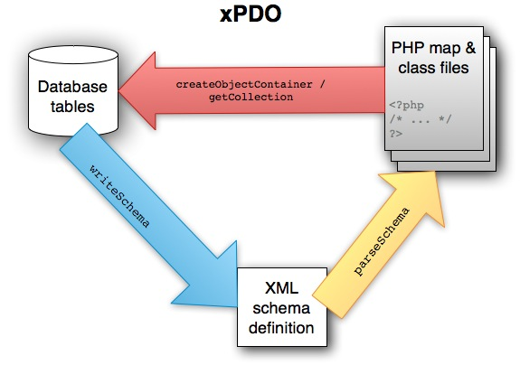

## Введение

Объектно-реляционный мост xPDO (ORB) полагается на серию классов PHP для обеспечения интерфейса для таблиц базы данных. Эти классы PHP могут быть сгенерированы автоматически путем анализа специально отформатированного XML-файла, путем обратного проектирования существующих таблиц базы данных или даже могут быть написаны вручную (только мазохисты). Самый простой подход при работе с настраиваемой таблицей базы данных - это реконструировать существующие таблицы базы данных MySQL: MySQL существует уже давно, и существует множество учебных пособий и книг, которые помогут вам научиться его использовать.

Если вы хотите расширить существующие классы MODX, например создав [Пользовательские классы ресурсов](development-in-modx/advanced-development/custom-resource-classes), то обычно начинают этот процесс с XML-файла.

Наш процесс будет таким:

1. Создайте таблицу (или таблицы) базы данных с помощью MySQL (это можно сделать с помощью командной строки mysql или используя такие инструменты MySQL GUI, как например, `phpMyAdmin` или `SQL-Yog`).
2. Скопируйте сценарий "обратного проектирования" (приведенный ниже) на свой веб-сервер. Поместите его в корень установки MODX (это важно, чтобы сценарий мог найти xPDO). Этот скрипт использует классы xPDO, чтобы найти определение только что созданной таблицы.
3. При необходимости измените сгенерированный файл определения XML, чтобы определить отношения внешнего ключа, затем повторно запустите сценарий, чтобы повторно сгенерировать файлы классов.
4. Подключите вновь созданные файлы классов и схем к фрагменту или настраиваемой странице Компонента.

Даже если вы планируете развернуть свой код и связанные с ним модели данных на нескольких других платформах, обычно считается **гораздо** проще создать его с единой базой данных. Как только вы это сделаете, вы сможете сосредоточиться на абстракции. Конечно, вы можете сразу перейти к определениям и классам xPDO, которые будут определять классы и схемы, не зависящие от базы данных, но для новичка это сложнее именно потому, что оно имеет дело с абстракциями. Чем дальше вы уходите от конкретных примеров, тем сложнее становится разработка. 

### Точки доступа

xPDO - это движок, стоящий за этой абстракцией базы данных - в конечном итоге ему нужны классы PHP, описывающие модель данных. Вы можете предоставить схему XML, которая будет генерировать файлы PHP, которые, в свою очередь, будут генерировать необходимые таблицы - именно так распространяются сторонние компоненты, потому что это обеспечивает предсказуемый и унифицированный способ создания новых таблиц базы данных. Но в этом примере мы собираемся начать с таблицы базы данных и использовать ее для создания схемы XML, которая, в свою очередь, сгенерирует необходимые классы PHP.

Посмотрите на изображение ниже - важно понимать, что вы можете начать с любого одного компонента, а два других могут быть созданы автоматически. 



Возможно, самая простая "точка входа" к технологии xPDO - начать с некоторых существующих таблиц базы данных и использовать их для генерации файла схемы XML и классов PHP, и это то, что демонстрирует данная страница.

## Создание таблицы MySQL

Один из самых простых способов создать таблицу MySQL - использовать один из множества доступных GUI редакторов. `SQL-Yog` - отличное десктопное приложение для управления MySQL в `Windows`, `Macs` предлагает `Sequel Pro`. Если вы предпочитаете веб-приложение, `phpMyAdmin` используется почти повсеместно.

##  Создать сценарий обратного проектирования

Нам нужен скрипт для сканирования таблиц вашей базы данных и генерации XML-схемы и файлов PHP. В общем, это "одноразовый" сценарий, который может потребоваться запустить только один раз. Возможно, вам потребуется внести изменения и запустить его более одного раза, но по идее и по функциям этот скрипт представляет собой просто заготовку.

Вы можете скачать версию этого сценария и просмотреть справочник, описывающий использование этого метода с простой настраиваемой таблицей БД, в [Bob's Guides](http://bobsguides.com/custom-db-tables.html).

Суть этого скрипта - это 2 метода xPDO (обратите внимание, однако, что эти методы принадлежат дочерним объектам): 

- `writeSchema`
- `parseSchema`

Вместе они ведут себя аналогично другим `ORM`, например `Doctrine` 

``` php
// Пример кода Doctrine
Doctrine_Core::generateModelsFromDb();
```

Вот небольшой сценарий обратного проектирования, который позволяет настраивать и проверять ошибки: 

``` php
<?php /* ------------------------------------------------------------------------------
  ================================================================================
  === Обратный инжиниринг существующих таблиц базы данных MySQL в карты и классы xPDO  ===
  ================================================================================

  ОБЗОР:
  Этот скрипт генерирует XML-схему и файлы классов PHP, которые описывают пользовательские
  таблицы базы данных.

  Этот сценарий предназначен для выполнения только один раз: после файлов класса и схемы.
  были созданы, цель этого скрипта была достигнута, хотя вам нужно будет запустить его снова, если вы измените свою схему.

  ПРИМЕНЕНИЕ:
  1. Загрузите этот файл в корень установки MODX.
  2. Задайте детали конфигурации ниже.
  3. Перейдите к этому сценарию в браузере, чтобы запустить его,
  например http://yoursite.com/thisscript.php
  или вы можете сделать это через командную строку, например php this-script.php

  ВХОД:
  Пожалуйста, настройте параметры ниже.

  ВЫХОД:
  Создает файлы XML и PHP: 
  core/components/$package_name/model/$package_name/*.class.php
  core/components/$package_name/model/$package_name/mysql/*.class.php
  core/components/$package_name/model/$package_name/mysql/*.inc.php
  core/components/$package_name/schema/$package_name.mysql.schema.xml

  СМОТРИТЕ ТАКЖЕ:
  https://forums.modx.com/index.php?topic=40174.0
  https://docs.modx.org/current/ru/extending-modx/tutorials/using-custom-database-tables
  https://docs.modx.com/current/ru/extending-modx/xpdo/class-reference/xpdogenerator/xpdogenerator.writeschema
  ------------------------------------------------------------------------------ */

/* ------------------------------------------------------------------------------
  КОНФИГУРАЦИЯ
  ------------------------------------------------------------------------------
  Обязательно создайте действующего пользователя базы данных с разрешениями на соответствующие
  базы данных и таблицы, прежде чем пытаться запустить этот сценарий, например запустив
  что-то вроде следующего:

  CREATE USER 'your_user'@'localhost' IDENTIFIED BY 'y0urP@$$w0rd';
  GRANT ALL ON your_db.* TO 'your_user'@'localhost';
  FLUSH PRIVILEGES;

  Обязательно проверьте, что созданные вами критерии авторизации действительно работают, прежде чем
  продолжать. Если вы *можете* войти в систему, но получаете сообщения об ошибках (например, SQLSTATE [42000] [1044])
  при запуске этого сценария вам может потребоваться предоставить разрешения на CREATE TEMPORARY TABLES 
  
  ------------------------------------------------------------------------------ */
$debug = false; // если true, будет включена подробная отладочная информация, включая ошибки SQL.
$verbose = true; // если true, выводит информацию о статусе.
// Файл схемы XML *должен* обновляться каждый раз при изменении базы данных, либо
// вручную или через этот скрипт. По умолчанию схема создается повторно.
// Если вы потратили время на добавление composite/aggregate отношений к вашему
// XML-файл схемы (т.е. отношения внешнего ключа), тогда вы можете установить это
// на 'false', чтобы сохранить ваши пользовательские изменения.
$regenerate_schema = true;

// Файлы классов по умолчанию не перезаписываются
$regenerate_classes = true;

// Короткое имя вашего пакета:
$package_name = '';

// Информация для входа в базу данных может быть указана явно:
$database_server = 'localhost'; // чаще всего ваша база данных находится локально
$dbase = ''; // имя вашей базы данных
$database_user = ''; // имя пользователя
$database_password = ''; // пароль для этого пользователя базы данных
// если этот файл не помещается рядом с файлом config.core.php, добавьте путь к каталогу
include_once 'config.core.php';
// ИЛИ используйте данные вашего подключения к MODX Revo. Просто раскомментируйте следующую строку:
// включаем (MODX_CORE_PATH. 'config /'. MODX_CONFIG_KEY. '.inc.php');
// Если в ваших таблицах используется префикс, это поможет их идентифицировать и гарантирует, что
// имена классов выглядят «чистыми», без префикса.
$table_prefix = '';
// Если вы указываете префикс таблицы, вы, вероятно, захотите установить для него значение «true». Например. если ты
// иметь собственные таблицы рядом с таблицами modx_xxx, ограничение префикса гарантирует
// что вы генерируете только классы/карты для таблиц, идентифицированных $table_prefix.
$restrict_prefix = false;

//------------------------------------------------------------------------------
//  НИЧЕГО НЕ ИЗМЕНЯЙТЕ НИЖЕ ЭТОЙ СТРОКИ 
//------------------------------------------------------------------------------
if (!defined('MODX_CORE_PATH')) {
    print_msg('<h1?>Ошибка обратного проектирования
        <p>MODX_CORE_PATH не определен! Вы включили правильный файл конфигурации?</p>');
    exit;
}

$xpdo_path = strtr(MODX_CORE_PATH . 'xpdo/xpdo.class.php', '\\', '/');
include_once ( $xpdo_path );

// Несколько определений файлов / каталогов: 
$package_dir = MODX_CORE_PATH . "components/$package_name/";
$model_dir = MODX_CORE_PATH . "components/$package_name/model/";
$class_dir = MODX_CORE_PATH . "components/$package_name/model/$package_name";
$schema_dir = MODX_CORE_PATH . "components/$package_name/model/schema";
$mysql_class_dir = MODX_CORE_PATH . "components/$package_name/model/$package_name/mysql";
$xml_schema_file = MODX_CORE_PATH . "components/$package_name/model/schema/$package_name.mysql.schema.xml";

// Несколько переменных, используемых для отслеживания времени выполнения:
$mtime = microtime();
$mtime = explode(' ', $mtime);
$mtime = $mtime[1] + $mtime[0];
$tstart = $mtime;

// Validations
if (empty($package_name)) {
    print_msg('<h1>Ошибка обратного проектирования</h1>
                <p>Пакет $package_name не может быть пустым! Измените конфигурацию и попробуйте еще раз.</p>');
    exit;
}

// Создайте каталоги, если это нужно
$dirs = array($package_dir, $schema_dir, $mysql_class_dir, $class_dir);

foreach ($dirs as $d) {
    if (!file_exists($d)) {
        if (!mkdir($d, 0777, true)) {
            print_msg(sprintf('<h1>Ошибка обратного проектирования</h1>
                                <p>Ошибка создания <code>%s</code></p>
                                <p>Создайте каталог (и его родителей) и повторите попытку. </p>'
                            , $d
            ));
            exit;
        }
    }
    if (!is_writable($d)) {
        print_msg(sprintf('<h1>Ошибка обратного проектирования </h1>
                        <p><code>%s</code> каталог не доступен PHP для записи. </p>
                        <p>Настройте разрешения и попробуйте еще раз.</p>'
                        , $d));
        exit;
    }
}

if ($verbose) {
    print_msg(sprintf('<br></br><strong>ОК:</strong> Необходимые каталоги существуют и имеют правильные разрешения внутри <br></br>`%s`', $package_dir));
}

// Удалить / восстановить файлы карты?
if (file_exists($xml_schema_file) && !$regenerate_schema && $verbose) {
    print_msg(sprintf('<br></br><strong>ОК:</strong> Существующий файл XML схемы:<br></br>`%s`', $xml_schema_file));
}

$xpdo = new xPDO("mysql:host=$database_server;dbname=$dbase", $database_user, $database_password, $table_prefix);

// Задайте имя пакета и корневой путь этого пакета 
$xpdo->setPackage($package_name, $package_dir, $package_dir);
$xpdo->setDebug($debug);

$manager = $xpdo->getManager();
$generator = $manager->getGenerator();
$time = time();
//Используйте это для создания схемы XML из существующей базы данных 
if ($regenerate_schema) {
    if (is_file($xml_schema_file)) {
        $rename = $xml_schema_file . '-' . $time;
        print_msg("<br></br>Прежний файл XML схемы: <br></br>`{$xml_schema_file}` <br></br>блы переименован в <br></br>`{$rename}`.");
        rename($xml_schema_file, $rename);
    }
    $xml = $generator->writeSchema($xml_schema_file, $package_name, 'xPDOObject', $table_prefix, $restrict_prefix);
    if ($verbose) {
        print_msg(sprintf('<br></br><strong>ОК:</strong> XML файл схемы сгенерирован: `%s`<hr></hr>', $xml_schema_file));
    }
}

// Используйте это для создания классов и карт из вашей схемы
if ($regenerate_classes) {
    if (is_dir($class_dir)) {
        $rename = $class_dir . '-' . $time;
        print_msg("<br></br>Старый каталог класса:  <br></br>`{$class_dir}` <br></br>был переименован в <br></br>`{$rename}`.");
        rename($class_dir, $rename);
    }
    $generator->parseSchema($xml_schema_file, $model_dir);
}

$mtime = microtime();
$mtime = explode(" ", $mtime);
$mtime = $mtime[1] + $mtime[0];
$tend = $mtime;
$totalTime = ($tend - $tstart);
$totalTime = sprintf("%2.4f s", $totalTime);

if ($verbose) {
    print_msg("<br></br><br></br><strong>Завершено!</strong> Время выполнения: {$totalTime}<br></br>");

    if ($regenerate_schema) {
        print_msg("<br></br>Если вам нужно определить отношения агрегирования/составления в файле схемы XML, обязательно повторно сгенерируйте файлы классов. ");
    }
}

exit();

/* ------------------------------------------------------------------------------
  Форматирует / печатает сообщения. Поведение отличается, если скрипт запущен
  через командную строку  (cli).
  ------------------------------------------------------------------------------ */

function print_msg($msg) {
    if (php_sapi_name() == 'cli') {
        $msg = preg_replace('#<br></br>#i', "\n", $msg);
        $msg = preg_replace('#<h1>#i', '== ', $msg);
        $msg = preg_replace('#</h1>#i', ' ==', $msg);
        $msg = preg_replace('#<h2>#i', '=== ', $msg);
        $msg = preg_replace('#</h2>#i', ' ===', $msg);
        $msg = strip_tags($msg) . "\n";
    }
    print $msg;
}
/* EOF */
```

Чтобы проверить, удалось ли выполнить этот сценарий, загляните в папку, указанную в его выводе, например
`/user/youruser/public_html/core/components/yourpackage/model/yourpackage`. Вы должны увидеть пару файлов - по одному для каждой таблицы. Если вы видите МНОГО файлов, соответствующих всем таблицам MODX, попробуйте явно указать пароль и имя базы данных - оставьте следующую строку закомментированной: 

``` php
//include('core/config/config.inc.php');
```

Смотрите <https://forums.modx.com/index.php?topic=40174.0> для более подробного обсуждения этого сценария..

## Определение ключевых отношений

После создания файла схемы XML вам может потребоваться отредактировать его вручную, чтобы определить какие-либо отношения внешних ключей между таблицами. Лучше всего, если вы создадите резервную копию файла схемы XML, а затем добавите свои `aggregate` и `composite` отношения (см. [Файлы и отношения схемы](exnding-modx/xpdo/custom-models/defining-a-schema/more-examples) для получения дополнительной информации).

В приведенном выше скрипте установите следующее: 

``` php
$regenerate_schema = false;
```

Затем повторно запустите сценарий, чтобы внести изменения в XML в файлы классов PHP. 

## Получение ваших данных

После того, как вы создали необходимые классы xPDO, вам необходимо использовать методы xPDO для доступа к ним (например, в сниппете или в вашем Компоненте). Чтобы xPDO мог получить доступ к объектам, вы должны загрузить соответствующие классы PHP с помощью метода `addPackage`. `addPackage` запускает включение классов PHP. 

``` php
if(!$modx->addPackage('mypackage','/full/path/to/core/components/mypackage/model/','mp_')) {
    return 'При добавлении вашего пакета возникла проблема! Проверьте журналы для получения дополнительной информации!';
}
$my_items = $modx->getCollection('Items');
$output = '';
if ($my_items) {
    foreach ($my_items as $item) {
        $output .= $item->get('itemname') . '<br/>';
    }
}
else {
    return 'Ничего не найдено.';
}
return $output;
```

**Следите за префиксом!**
[addPackage](extending-modx/xpdo/class-reference/xpdo/xpdo.addpackage "xPDO.addPackage") требует, чтобы вы указали правильный префикс таблицы для вашего пакета!

## Смотрите также

- [Обратная разработка](https://ru.wikipedia.org/wiki/%D0%9E%D0%B1%D1%80%D0%B0%D1%82%D0%BD%D0%B0%D1%8F_%D1%80%D0%B0%D0%B7%D1%80%D0%B0%D0%B1%D0%BE%D1%82%D0%BA%D0%B0)
- [Файлы схемы и отношения](extending-modx/xpdo/custom-models/defining-a-schema/more-examples "Дополнительные примеры файлов схемы XML xPDO") Просмотр отношений файлов схемы XML 
- [addPackage](extending-modx/xpdo/class-reference/xpdo/xpdo.addpackage "xPDO.addPackage") для загрузки вашей схемы
- [getObject](extending-modx/xpdo/class-reference/xpdo/xpdo.getobject "xPDO.getObject") для загрузки единственного объекта
- [getCollection](extending-modx/xpdo/class-reference/xpdo/xpdo.getcollection "xPDO.getCollection") для загрузки коллекции объектов
- [xPDO: Создание объектов](extending-modx/xpdo/creating-objects)
- [Получение объектов](extending-modx/xpdo/retrieving-objects) демонстрация, как получать объекты при помощи xPDO
- [Генерация кода Модели](extending-modx/xpdo/custom-models/generating-the-model) – предлагает упрощенную версию предоставленного здесь сценария, но вы также можете изменить шаблоны классов.
- [Дополнительные примеры файлов схемы xPDO XML](extending-modx/xpdo/custom-models/defining-a-schema/more-examples) – сопоставляет таблицы базы данных MySQL со схемами xPDO XML 
- [Скрипт сборки: таблицы обратного проектирования / классы прямого проектирования / карты ](http://forums.modx.com/thread/31778/build-script-reverse-engineering-tables-forward-engineering-classes-maps) – еще один пример от Jason.
