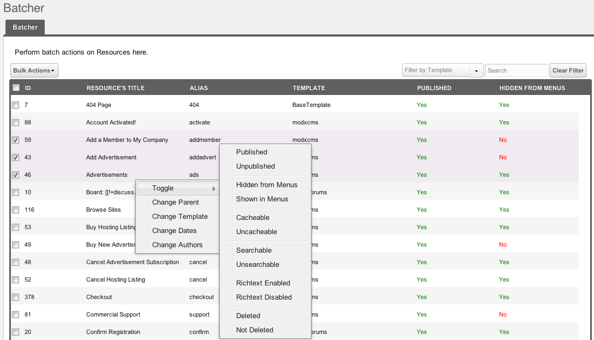

## Что такое Batcher?

`Batcher` - это компонент для пакетного редактирования MODX Revolution. Он позволяет выполнять основные действия(перенос, публикация, смена видимости и т.п.) с несколькими ресурсами одновременно.

## Требования

-   MODX Revolution 2.0.0-RC-2 или более поздняя версия
-   PHP5 или более поздняя версия

## История

`Batcher` был написан [Shaun McCormick](https://github.com/splittingred) в качестве простого поискового компонента и впервые выпущен 2 июня 2010 г.

В настоящее время он разрабатывается и поддерживается компанией Sterc в <https://github.com/Sterc/Batcher>

### Скачать

Его можно загрузить из менеджера через [Менеджер пакетов](building-sites/extras), или из оригинального MODX репозитория здесь: <https://modx.com/extras/package/upgrademodx>

### Разработка и отчеты об ошибках

`Batcher` хранится и разрабатывается в GitHub, и его можно найти здесь: <https://github.com/Sterc/Batcher>

Сообщения об ошибках можно отправлять сюда: <https://github.com/Sterc/Batcher/issues>

## Использование

После установки просто перезагрузите страницу, и пункт меню "Batcher" должен быть доступен через верхнее меню "Компоненты".
