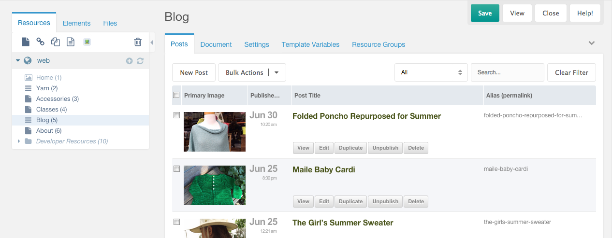
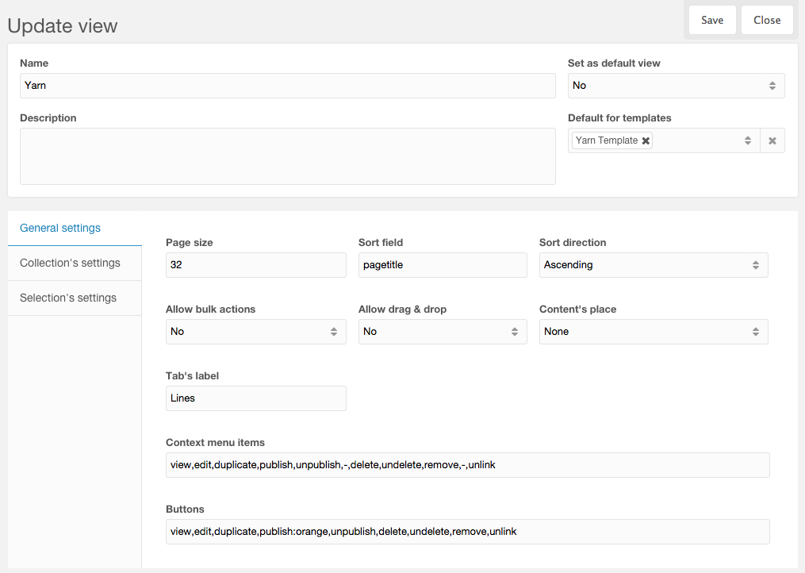
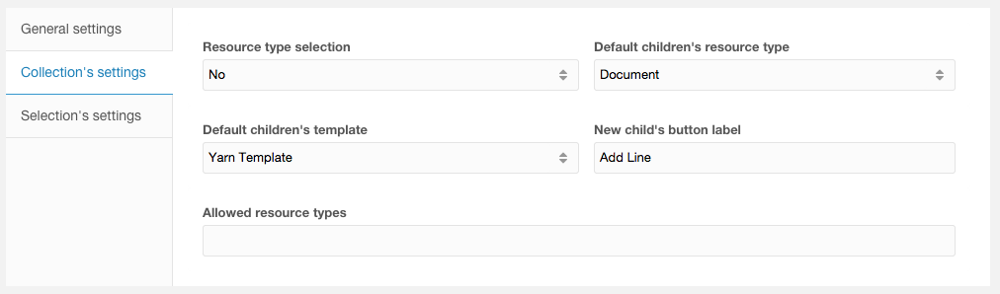
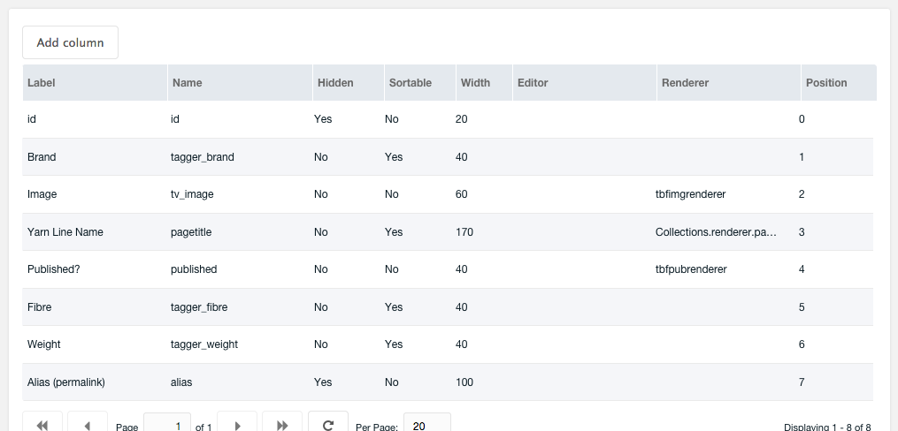
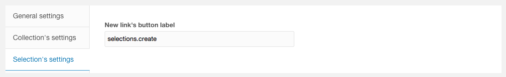

Collections ("Коллекции") - это Дополнение MODX Revolution, которое добавляет пользовательский класс ресурсов `CollectionContainer` со следующим поведением:

1. Любой прямой дочерний ресурс будет скрыт в дереве ресурсов в Менеджере и будет отображаться в виде таблицы (по аналогии с [Articles](extras/articles)) на специальной вкладке "Дочерние ресурсы".
2. Любые дочерние элементы, у которых есть собственные дочерние элементы, будут показаны в дереве для обычного управления.



### Подколлекции

Как и само дерево ресурсов MODX, Collections поддерживает вложение. Вы можете создать коллекцию внутри другой коллекции. Контейнеры вложенной коллекции будут отображаться в дереве ресурсов, а их дочерние элементы будут отображаться в виде таблицы.

### Перетаскивание

Вы можете перетащить ресурсы в контейнер Коллекций, и если у них нет собственных дочерних элементов, они будут перечислены в таблице. Если у них есть Дочерние ресурсы, они просто останутся в Дереве, как обычно.

## Шаблоны коллекций (новое с версии 2)

### Общие настройки



-   Задать как вид по умолчанию - Если «Да», этот Шаблон Представления Коллекций (ШПК) будет использоваться в качестве последнего запасного варианта.
-   По умолчанию для шаблонов - ШПК будет использован по умолчанию для ресурсов, использующих указанные шаблоны. Может быть переопределено для каждого ресурса на вертикальной вкладке "Коллекции" в настройках ресурса "Коллекции".
-   Размер страницы - количество дочерних элементов по умолчанию для отображения на каждой странице в таблице.
-   Поле сортировки - поле по умолчанию для сортировки (те же правила, что и для имени в определениях столбцов).
-   Направление сортировки - направление сортировки по умолчанию.
-   Разрешить массовые действия - включает флажки для выбора нескольких элементов и массовых действий с этими выборами.
-   Разрешить перетаскивание - включает сортировку перетаскиванием.
-   Место расположения контента - Положение стандартного поля контента `content` Ресурса.
-   Надпись вкладки - Настройте текст метки для вкладки «Дочерние ресурсы».
-   Пункты контекстного меню - Настройте элементы в контекстном меню (при щелчке правой кнопкой мыши в таблице на элементе Коллекции).
-   Кнопки - Настройте отображаемые кнопки при использовании средства визуализации, которое отображает кнопки. При желании добавьте классы к каждой кнопке с разделителем двоеточие ":".

#### Постоянная сортировка

Начиная с версии 3.2.0, в общие настройки были добавлены новые поля: **Фиксированная сортировка - До** и **Фиксированная сортировка - После**. Они позволяют добавлять дополнительные параметры сортировки в таблицу дочерних элементов, и они будут применяться вместе с параметром сортировки по умолчанию (а также с сортировкой после щелчка по заголовку столбца). **Фиксированная сортировка - до** используется перед сортировкой по умолчанию, **Фиксированная сортировка - после** используется после сортировки по умолчанию.

**Синтаксис для обоих полей:**

```plain
sort_field_condition=sort_field:sort_dir:sort_type,sort_field_condition2=sort_field2:sort_dir2:sort_type2<br>*=sort_field:sort_dir:sort_type,sort_field_condition2=sort_field2:sort_dir2:sort_type2<br>sort_field:sort_dir,sort_field_condition2=sort_field2
```

-   `sort_field_condition` - Параметры сортировки будут применяться только в том случае, если таблица отсортирована по этому полю, этот элемент является необязательным, если он отсутствует или установлен в **\*** сортировка будет применяться каждый раз
-   `sort_field` - Поле для фильтрации, **обязательно**
-   `sort_dir` - Направление сортировки, необязательно, если его нет, будет использовано направление сортировки из таблицы
-   `sort_type` - Разрешает приведение типа к полю, необязательно

### Пример

```plain
publishedon=published:asc
-- Такая настройка для "Постоянная сортировка - до" перетащит все неопубликованные ресурсы в верхнюю часть таблицы при сортировке по опубликованным. Поскольку sort_dir присутствует, не имеет значения, сортируете ли вы по убыванию или по возврастанию по опубликованным, неопубликованные ресурсы всегда будут наверху
```

### Настройки Коллекции



-   Выбор типа ресурса - Включите выбор типа ресурса при создании нового ресурса с помощью кнопки «Новый дочерний элемент»
-   Тип дочерних ресурсов по умолчанию - Установите тип ресурса по умолчанию для вновь созданных Дочерних ресурсов.
-   Шаблон дочерних ресурсов по умолчанию - Установите шаблон по умолчанию для вновь созданных дочерних ресурсов.
-   Надпись кнопки быстрого создания ресурсов - Настройте текст метки на кнопке «Новый дочерний элемент».
-   Разрешенные типы ресурсов - Ограничьте разрешенные типы ресурсов списком, разделенным запятыми, если включен выбор типа ресурса.

### Столбцы



-   Метка - строка или ключ Лексикона (вы можете добавить свои собственные словарные статьи в пространство имен коллекций в шаблоны тем), который будет использоваться в качестве метки столбца.
-   Название - Название поля, может быть любым полем из `modResource`, любым именем TV (с префиксом `tv_`, **имя TV НЕ должно содержать точки**) или любым `alias` псевдонимом группы [Tagger](extras/tagger) (с префиксом `tagger_`)
-   Скрытый - если указано "Да", столбец будет скрыт по умолчанию.
-   Сортировка - если указано "Да", пользователь сможет отсортировать сетку по значениям в этом столбце.
-   Ширина - Ширина столбца.
-   Редактор - (string) Xtype или (object) JSON действующего редактора.
-   Renderer - имя функции, которая будет использоваться в качестве средства визуализации.
-   Позиция - Порядок столбцов.

### Редакторы

В качестве редактора может использоваться любой действительный объект xtype (string) или JSON.

Примеры:

-   textfield
-   textarea
-   modx-combo-boolean
-   numberfield
-   `{"xtype":"numberfield","allowDecimals":false,"allowNegative":false}`

### Рендереры

В качестве Рендерера вы можете использовать любую [функцию](https://docs.sencha.com/extjs/3.4.0/#!/api/Ext.grid.Column-cfg-renderer) с корректными аргументами.

Доступные рендереры:

-   **this.rendYesNo** - Да/Нет (1/0) логические значения, окрашенные в зеленый и красный цвета соответственно
-   **Collections.renderer.qtip** - При наведении курсора отображается подсказка со значением (полезно для более длинных значений)
-   **Collections.renderer.pagetitleWithButtons** -Заголовок страницы (в элементе h2) со ссылкой на редактирование и кнопками для обновления, просмотра, удаления, публикации (а-ля в виде таблицы в [Articles](extras/articles))
-   **Collections.renderer.pagetitle** - Заголовок (в элементе h2) со ссылкой для редактирования
-   **Collections.renderer.pagetitleLink** - Заголовок страницы со ссылкой для редактирования (текст меньше, чем h2)
-   **Collections.renderer.datetimeTwoLines** - Дата в первой строке и время во второй строке. Форматы даты и времени настраиваются в Cистемных настройках.
-   **Collections.renderer.datetime** - Дата и время в одной строке. Форматы даты и времени настраиваются в Cистемных настройках.
-   **Collections.renderer.image** - миниатюра изображения

#### Пользовательские рендереры

Пользовательские рендереры можно легко добавить, создав файл JS (и файл CSS, если необходимо) и указав URL-адреса этих файлов в Системных настройках. Файлы JS могут содержать [функции](http://docs.sencha.com/extjs/3.4.0/#!/api/Ext.grid.Column-cfg-renderer) (см. [Образец](https://github.com/modxcms/Collections/blob/develop/assets/components/collections/js/mgr/extra/collections.renderers.js) здесь), которые затем можно использовать совместно.

## Подборки (новое с версии 3)

Selections are essentially links to other Resources in the same MODX site. You are not duplicating the original Resources when you add them to a Selections container, but simply creating another view from which to manage those Resources.

Подборки - это по сути ссылки на другие ресурсы на том же сайте MODX. Вы не дублируете исходные ресурсы, когда добавляете их в контейнер `Selections`, а просто создаете другое представление для управления этими ресурсами.

### Пример использования 1

Вы хотите создать меню со ссылками на ресурсы, которые находятся в разных частях Дерева ресурсов. Эти ресурсы фактически расположены там в Дереве ресурсов, где они и находятся в структуре контента сайта, поэтому до сих пор решение заключалось в создании контейнера `Resource` в дереве специально для этого меню и создании в нем ресурсов веб-ссылок. Но на самом деле веб-ссылки не добавляют никакой ценности, кроме того, что ими можно управлять в другом списке. Вместо этого добавьте эти ресурсы в контейнер `Selections`, который поддерживает свои собственные значения `menuindex` для каждого ресурса, и, используя Сниппет `getSelections`, вы можете перечислить ресурсы, отсортированные по этим специальным значениям `menuindex`.

### Пример использования 2

Вы хотите заполнить виджет ссылками на другие ресурсы на вашем сайте, но опять же, ресурсы поступают из различных разделов, или вы хотите вручную курировать содержимое виджета, а не автоматизировать его. `Selections` предоставляет альтернативу, например [MIGX](extras/migx), когда вам нужен пользовательский интерфейс управления для произвольных "выборок" ресурсов, независимо от того, где они существуют на сайте (даже если они находятся, например, в контейнере "Коллекции").

### Сниппет getSelections

```php
[[getSelections?
    &selections=`[[*id]]`
    &tpl=`myTplChunk`
]]
```

getSelections это сниппет-обёртка для `getResources`, поэтому он зависит от установленного `getResources`. Любые/все свойства `getResources`, доступные в установленной вами версии `getResources`, также будут доступны как свойства для `getSelections`. Кроме того, вот свойства, специфичные для `getSelections`:

-   &selections - ID Ресурса контейнера `Selections`
-   &getResourcesSnippet - при желании вы можете назвать другой Сниппет листинга для вызова с помощью `getSelections`, но это не было тщательно протестировано с другими Сниппетами и, вероятно, должно использоваться только в том случае, если вы можете устранить неполадки как `getSelections`, так и вызываемого Сниппета.

### Настройки подборок



-   Метка кнопки новой ссылки - Настройте текст метки на кнопке «Новая ссылка».

## Смотрите также

-   [Collections: Настраиваемые представления для типов контента](https://modx.com/blog/2014/09/30/collections-easily-customizable-admin-views-for-content-types/)
-   [Collections 3](https://www.bxr.cz/blog/collections-3/)
-   [Collections: Расширенная сортировка](https://www.bxr.cz/blog/collections-enhanced-sort/)
