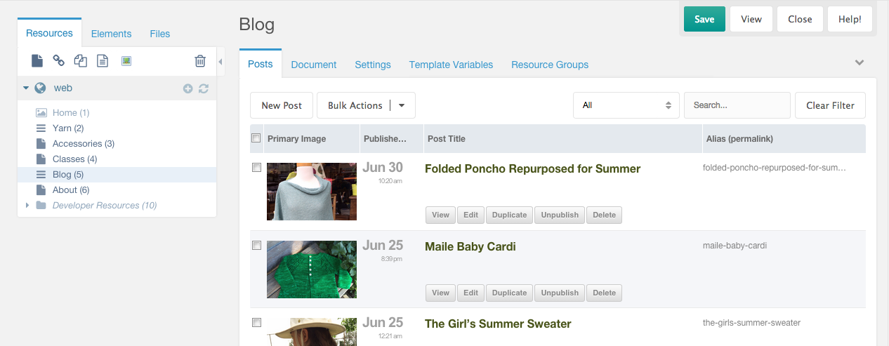
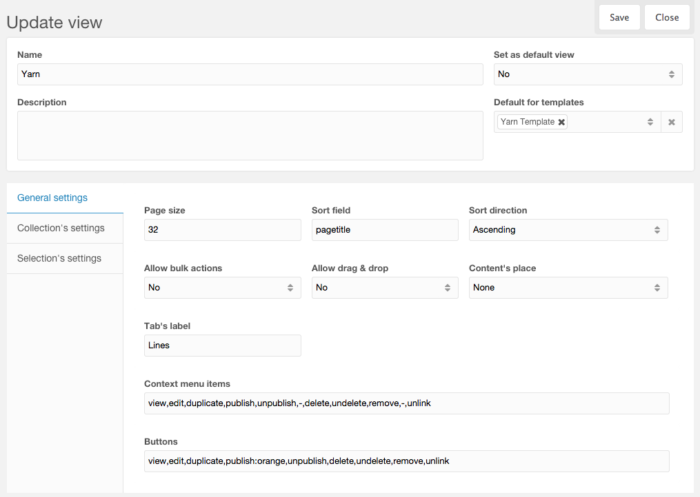
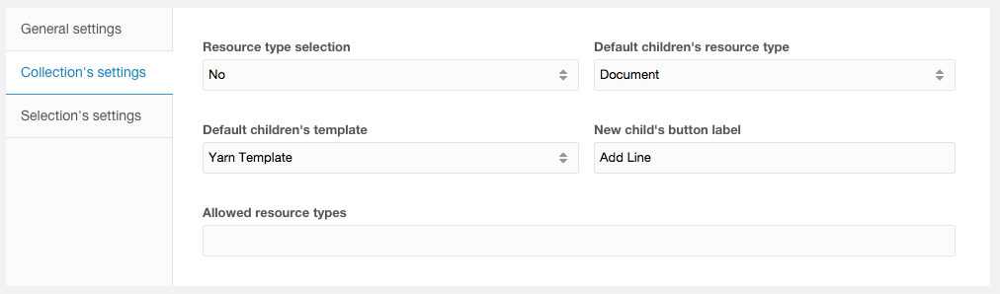
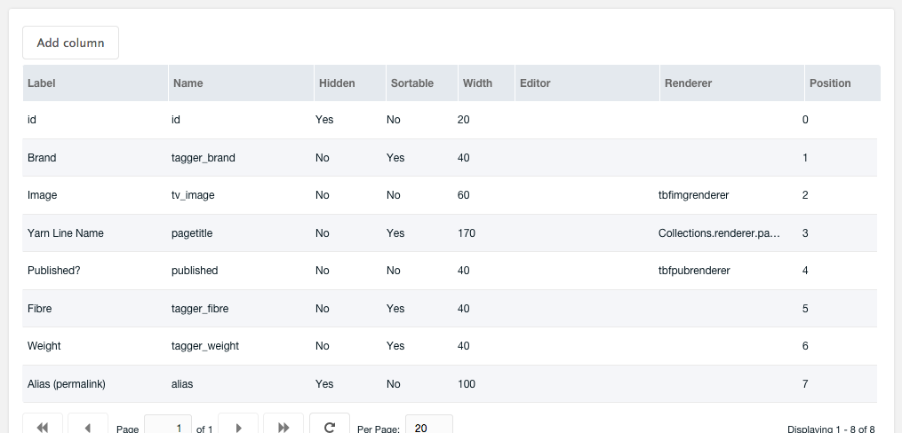
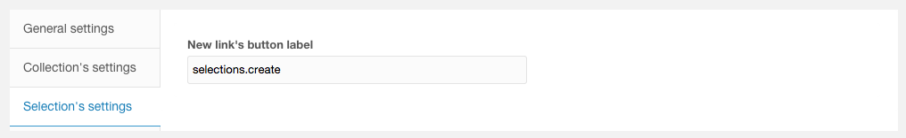

Collections («Коллекции») это дополнение MODX Revolution, которое добавляет пользовательский класс ресурсов `CollectionContainer` со следующим поведением:

1. Любой прямой дочерний ресурс скрывается в дереве ресурсов Менеджера и отображается в виде таблицы (как в Articles) на вкладке «Children».
2. Дочерние ресурсы, у которых есть собственные дочерние элементы, остаются в дереве для обычного управления.



### Подколлекции

Как и дерево ресурсов MODX, Collections поддерживает вложенность. Вы можете создать коллекцию внутри другой коллекции. Контейнеры подколлекций отображаются в дереве ресурсов, а их дочерние элементы выводятся в таблице.

### Перетаскивание

Перетащите ресурсы в контейнер Collections. Если у них нет собственных дочерних элементов, они попадут в таблицу. Если дочерние элементы есть, ресурс останется в дереве как обычно.

## Шаблоны Collections (новое в версии 2)

### Общие настройки



- Set as default view: при «Yes» этот шаблон представления Collections (CVT) используется как последний запасной вариант.
- Default for templates: CVT по умолчанию для ресурсов с указанными шаблонами MODX. Можно переопределить для каждого ресурса на вертикальной вкладке Collections в настройках ресурса Collections.
- Page size: число дочерних элементов на странице таблицы по умолчанию.
- Sort field: поле сортировки по умолчанию (те же правила, что для name в определениях столбцов).
- Sort dir: направление сортировки по умолчанию.
- Allow bulk actions: включает флажки для множественного выбора и массовые действия.
- Allow drag & drop: включает сортировку перетаскиванием.
- Content's place: расположение стандартного поля контента ресурса.
- Tab's label: текст вкладки «Children».
- Context menu items: пункты контекстного меню (правый клик в таблице).
- Buttons: кнопки при использовании renderer, который их выводит. Классы к кнопкам добавляйте через разделитель «:».

#### Постоянная сортировка

С версии 3.2.0 в общих настройках появились поля **Permanent sort - Before** и **Permanent sort - After**. Они добавляют параметры сортировки таблицы дочерних элементов вместе с сортировкой по умолчанию и после клика по заголовку столбца. **Before sort** применяется до сортировки по умолчанию, **After sort** после неё.

**Синтаксис для обоих полей:**

``` plain
sort_field_condition=sort_field:sort_dir:sort_type,sort_field_condition2=sort_field2:sort_dir2:sort_type2<br>*=sort_field:sort_dir:sort_type,sort_field_condition2=sort_field2:sort_dir2:sort_type2<br>sort_field:sort_dir,sort_field_condition2=sort_field2
```

- sort\_field\_condition: параметры применяются только если таблица отсортирована по этому полю. Элемент необязателен. Если его нет или указано **\***, сортировка применяется всегда
- sort\_field: поле для сортировки, **обязательно**
- sort\_dir: направление сортировки, необязательно. Без него берётся направление из таблицы
- sort\_type: приведение типа поля, необязательно

### Пример

``` plain
publishedon=published:asc
-- Setting above as Permanent sort - Before will pull all unpublished resources on top of the grid when sorting by published on. Because sort_dir is present, doesn't matter if you sorting asc/desc by published on, unpublished resources will always be on top.
```

### Настройки коллекции



- Resource type selection: выбор типа ресурса при создании дочернего ресурса кнопкой «New Child».
- Default children's resource type: тип ресурса по умолчанию для новых дочерних ресурсов.
- Default children's template: шаблон по умолчанию для новых дочерних ресурсов.
- New child's button label: текст кнопки «New Child».
- Allowed resource types: список разрешённых типов ресурсов через запятую, если включён выбор типа.

### Столбцы



- Label: строка или ключ лексикона (свои записи добавляйте в пространство имён collections, тема templates) для заголовка столбца.
- Name: имя поля. Любое поле modResource, имя TV (с префиксом tv\_, **имя TV не должно содержать точку**) или alias группы Tagger (с префиксом tagger\_)
- Hidden: при «Yes» столбец скрыт по умолчанию.
- Sortable: при «Yes» пользователь может сортировать таблицу по этому столбцу.
- Width: ширина столбца.
- Editor: (string) xtype или (object) JSON редактора.
- Renderer: имя функции renderer.
- Position: порядок столбцов.

### Редакторы

Редактором может быть любой допустимый xtype (string) или JSON-объект.

Примеры:

- textfield
- textarea
- modx-combo-boolean
- numberfield
- `{"xtype":"numberfield","allowDecimals":false,"allowNegative":false}`

### Renderers

Renderer это любая [функция](http://docs.sencha.com/extjs/3.4.0/#!/api/Ext.grid.Column-cfg-renderer) с корректными аргументами.

Доступные renderers:

- **this.rendYesNo**: логические значения Yes/No (1/0), зелёный и красный цвет
- **Collections.renderer.qtip**: при наведении qtip со значением (удобно для длинного текста)
- **Collections.renderer.pagetitleWithButtons**: pagetitle (элемент h2) со ссылкой на редактирование и кнопками update, view, delete, publish (как в таблице Articles)
- **Collections.renderer.pagetitle**: pagetitle (h2) со ссылкой на редактирование
- **Collections.renderer.pagetitleLink**: pagetitle со ссылкой на редактирование (текст меньше h2)
- **Collections.renderer.datetimeTwoLines**: дата на первой строке, время на второй. Форматы задаются системными настройками
- **Collections.renderer.datetime**: дата и время в одной строке. Форматы задаются системными настройками
- **Collections.renderer.image**: миниатюра изображения

#### Пользовательские renderers

Добавьте JS-файл (и CSS при необходимости) и укажите URL в системных настройках. JS может содержать [функции](http://docs.sencha.com/extjs/3.4.0/#!/api/Ext.grid.Column-cfg-renderer) (см. [пример](https://github.com/modxcms/Collections/blob/develop/assets/components/collections/js/mgr/extra/collections.renderers.js)), которые затем используются в renderers.

## Selections (новое в версии 3)

Selections это по сути ссылки на другие ресурсы того же сайта MODX. При добавлении в контейнер Selections вы не дублируете исходные ресурсы, а получаете отдельное представление для их управления.

### Пример использования 1

Вы хотите меню со ссылками на ресурсы из разных частей дерева. Ресурсы логично остаются на своих местах в структуре сайта, поэтому раньше создавали контейнер Resource и Weblink-ресурсы внутри. Weblink почти ничего не даёт, кроме отдельного списка. Вместо этого добавьте ресурсы в контейнер Selections: у него свои значения menuindex для каждого ресурса. Со сниппетом getSelections вы выведете ресурсы, отсортированные по этим menuindex.

### Пример использования 2

Вы наполняете виджет ссылками на ресурсы с разных разделов сайта или вручную отбираете содержимое вместо автоматизации. Selections это альтернатива, например, MIGX, когда нужен UI для произвольных «подборок» ресурсов независимо от их места на сайте (в том числе под контейнером Collections).

### Сниппет getSelections

``` php
[[getSelections?
    &selections=`[[*id]]`
    &tpl=`myTplChunk`
]]
```

getSelections это обёртка над getResources, поэтому нужен установленный getResources. Все свойства getResources вашей версии доступны и в getSelections. Дополнительно свойства getSelections:

- &selections: ID ресурса-контейнера Selections.
- &getResourcesSnippet: необязательное имя другого сниппета листинга для вызова из getSelections. С другими сниппетами это слабо протестировано. Используйте только если можете отладить и getSelections, и вызываемый сниппет.

### Настройки Selections



- New link's button label: текст кнопки «New Link».

### Использование с pdoResources

Вместо getResources можно вызвать сниппет pdoPage из дополнения pdoTools:

``` php
[[!pdoPage?
    &elementClass=`modSnippet`
    &element=`getSelections`
    &getResourcesSnippet=`pdoResources`
    &parents=`[[*id]]`
    &tpl=`myTplChunk`
]]
```

## Дополнительные ресурсы

- [Collections: Customizable Views for Content Types](https://modx.com/blog/2014/09/30/collections-easily-customizable-admin-views-for-content-types/)
- [Collections 3](http://www.bxr.cz/blog/collections-3/)
- [Collections: Enhanced sort](http://www.bxr.cz/blog/collections-enhanced-sort/)
