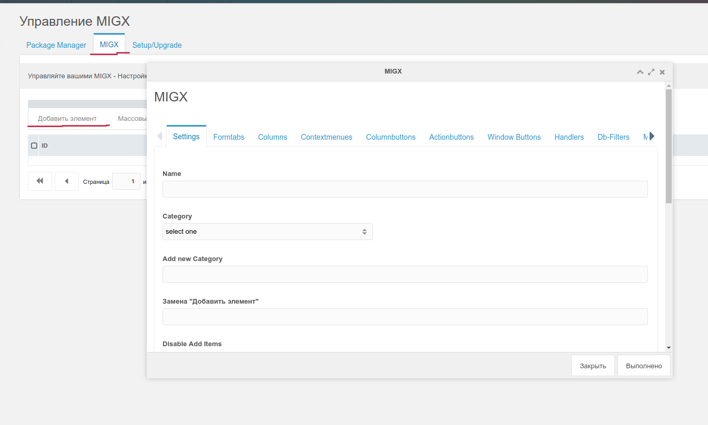
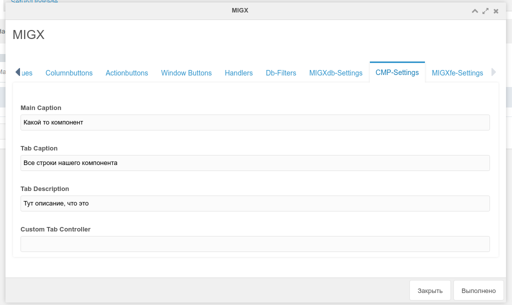
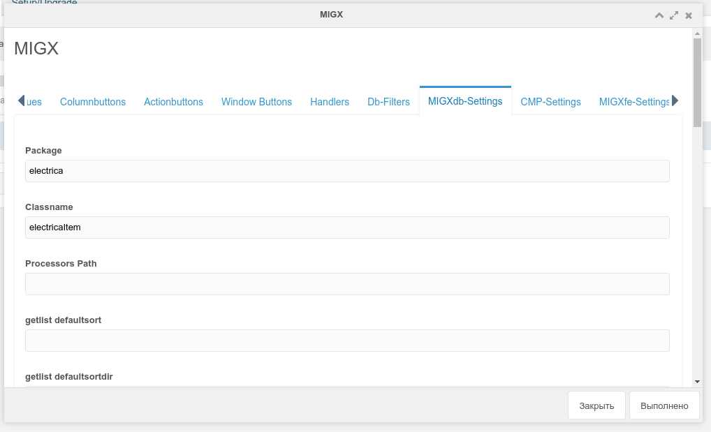
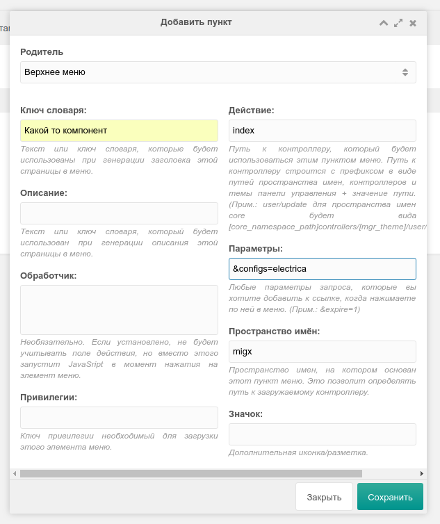
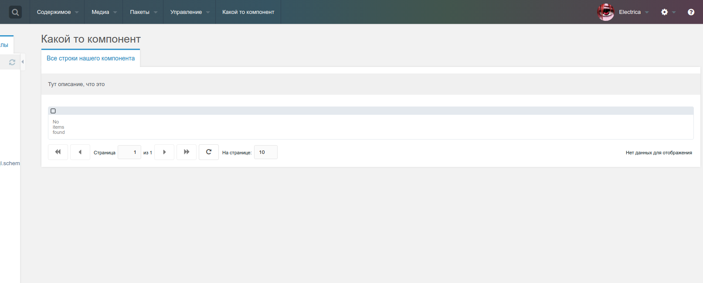
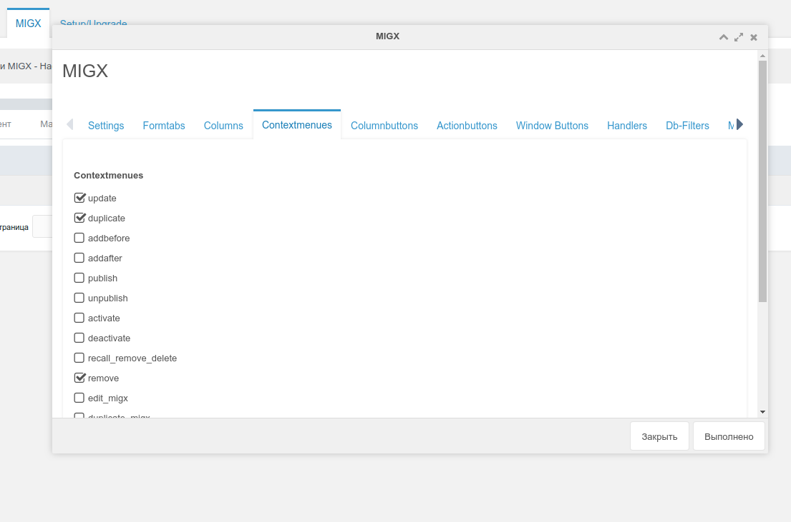
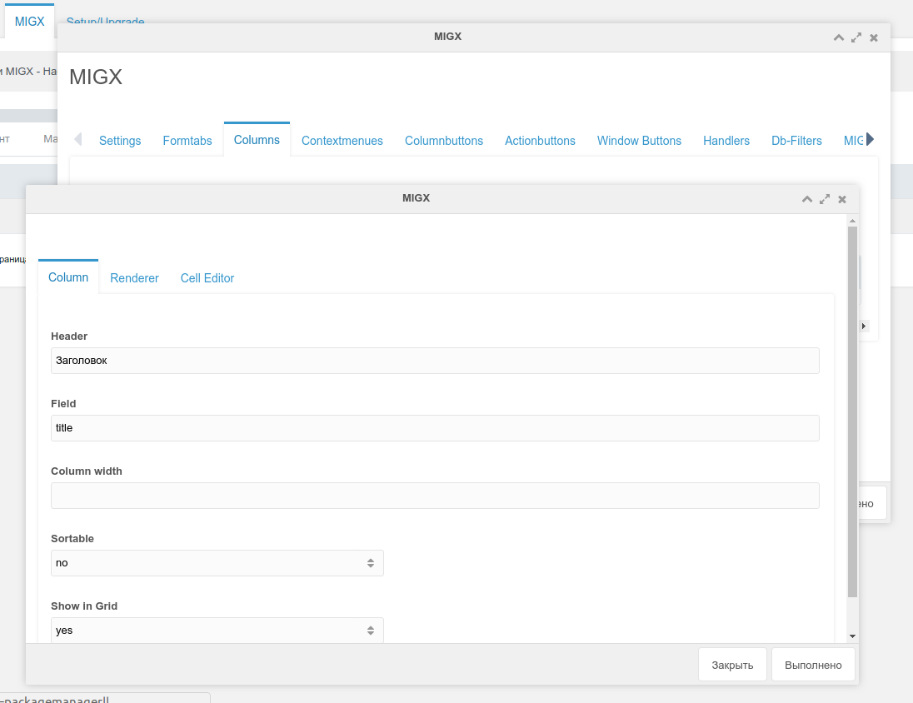
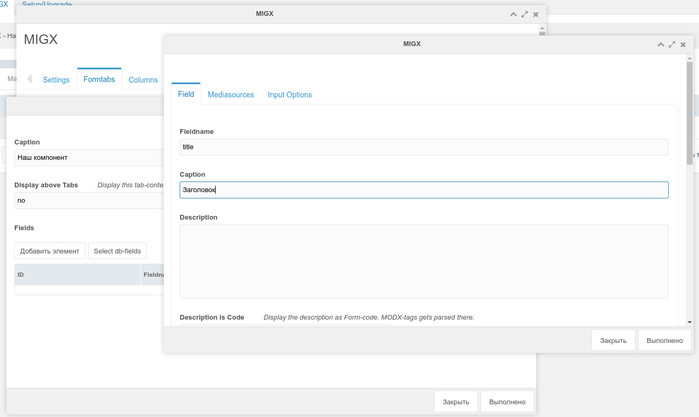
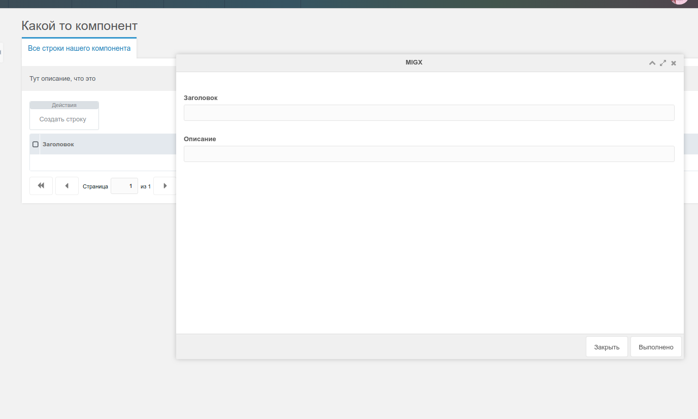
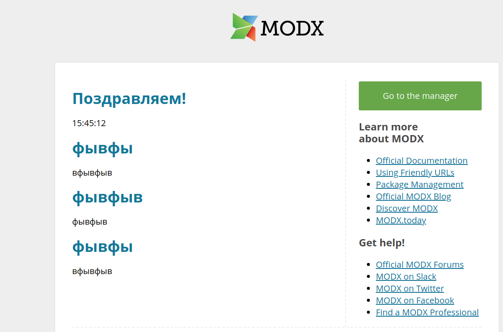

В прошлой статье я рассказал, как можно создавать свой компонент с помощью MIGX. Теперь я покажу, как можно создавать и редактировать данные в админке.

Кто не знает о чем речь, ссылка на [первую статью](extras/migx/migx.tutorials/creating-tables-through-migx).

На самом деле создание своей странички по сути не отличается от создания обычного MIGX ТВ.

Переходим во вкладку MIGX:



Заполняем:

**Name**: electrica
**Add item replacement**: Создать строку
**unique MIGX ID**: electrica

Затем открываем вкладку CMP-Settings и заполняем:



Затем идем во вкладку **MIGXdb-Settings** и заполняем **package** (название пакета с XML разметки) и **Classname**:



Нажимаем **Save**.

Затем идем в настройки — Меню. Создаем нашел меню:



В параметрах пишем свой настройку вашего компонента, как вы его назвали.

Ну вот и все, мы теперь можем его открыть:



Продолжаем выводить все наши поля.

Редактируем нашу настройку MIGX, добавляем contextmenus:



Во вкладке **Columns** заполняем наши поля:

**ВАЖНО!!!** В колонках нужно создать поле id, иначе вы не сможете редактировать данные



Во вкладке Formtabs заполняем наши поля:



That's all!



Ну а вывод на фронте уже описывал в [предыдущей статье](extras/migx/migx.tutorials/creating-tables-through-migx). Создаем сниппет и делаем нужную нам выборку или вборку.

Ну или можно воспользовать **сниппетом**:

```php
[[!migxLoopCollection?
    &packageName=`electrica`
    &classname=`electricaItem`
    &tpl=`testTPL`
]]
```

**Чанк**:

```php
<h1>[[+title]]</h1>
<p>[[+description]]</p>
```

И вот что мы получили:


