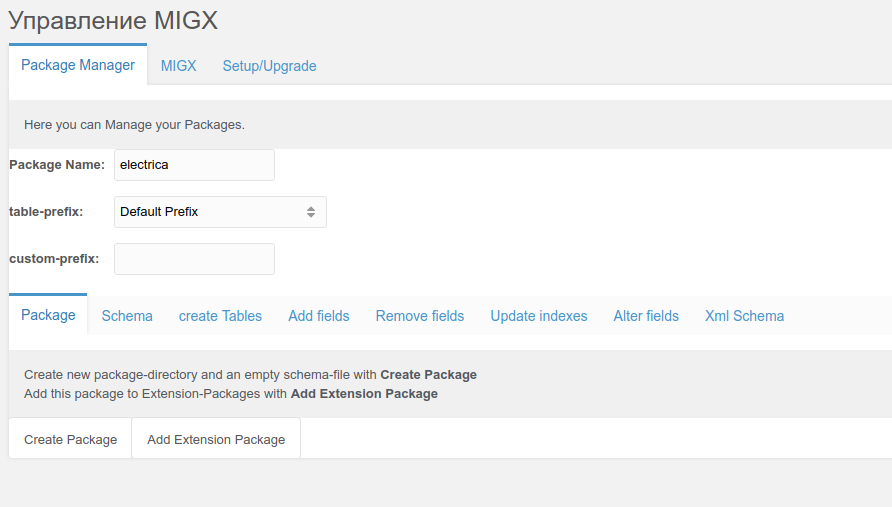
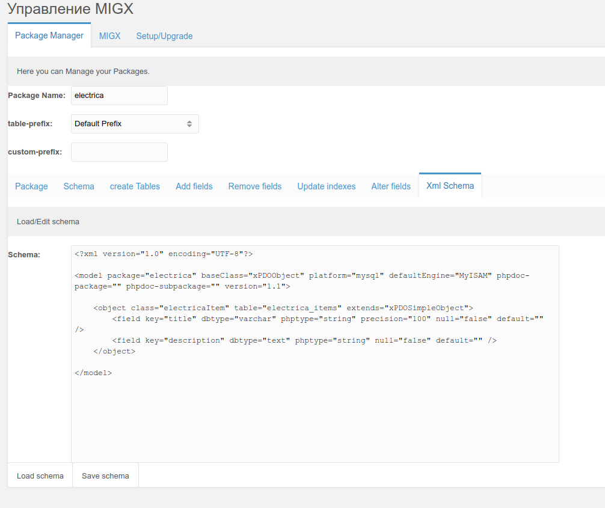
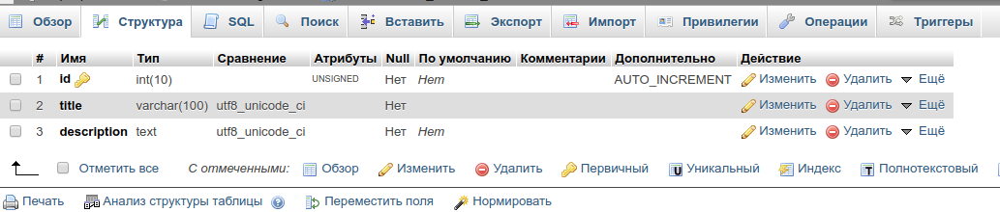

У новичков часто возникает вопрос, как можно быстро создать какую нибудь таблицу и начать с ней работать на пример из сниппета. Я раньше делал всегда через пакет modExtra, выпиливая из него то, что мне не нужно. Но это долго и не совсем удобно, если нужна одна — две таблички. MIGX решает эту проблему.

Итак, начнем с того, что мы установим MIGX и зайдем в него. Во вкладке Package Manager нам необходимо ввести Название пакета (Package Name):



И нажимаем кнопку Create Package. В директории `core/components/youpackagename` создались необходимые файлы.
Теперь, нам необходимо написать схему будущей таблицы или таблиц. Очень подробно об этом расписано на одном из курсов Василия. Так же есть официальная документация.

Мы создадим простую табличку для примера:

``` xml
<?xml version="1.0" encoding="UTF-8"?>
<model package="electrica" baseClass="xPDOObject" platform="mysql" defaultEngine="MyISAM" phpdoc-package="" phpdoc-subpackage="" version="1.1">

    <object class="electricaItem" table="electrica_items" extends="xPDOSimpleObject">
        <field key="title" dbtype="varchar" phptype="string" precision="100" null="false" default="" />
        <field key="description" dbtype="text" phptype="string" null="false" default="" />
    </object>
</model>
```

и вставим схему во вкладку Xml Scheme и нажимаем кнопку Save Scheme:



Все, схема готова. Теперь, переходим на вкладку Create Table и нажимаем Create Tables. Теперь в базе у нас есть наша табличка:



Все. Теперь мы можем работать с нашей таблицей.

``` php
<?php
//Добавляем пакет
if(!$modx->addPackage('electrica', MODX_CORE_PATH . 'components/electrica/model/')){
    return 'false';
}
// Создаем запись
$table = $modx->newObject('electricaItem');
$array = [
    'title' => 'Какой то заголовок',
    'description' => 'Какое то описание'
    ];

$table->fromArray($array);
$table->save();

//Делаем выборку
$response = $modx->getIterator('electricaItem');

foreach($response as $res){
    print_r($res->toArray());
}
```

Вот таким достаточно простым способом можно быстро создавать свои таблицы и работать с ними.
