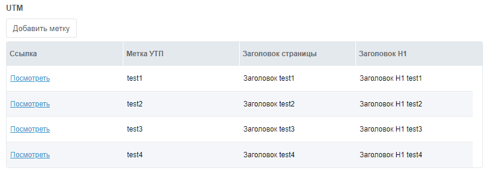

## Зачем нужны UTM метки

Допустим у вас задача сделать так, чтобы у вас на сайте выводился разный контент в зависимости от GET параметра.

Должно получится нечто подобное:



Этот способ хорош тем, что у нас будет возможность создавать сколько угодно полей.

## Как реализовать

Нам нужно перейти на страницу компонента MIGX и создать конфигурацию.

**Всё, что не указано мной, пропускайте!**

Вкладка **Settings**

**Name** — utm
**Замена «Добавить элемент»** — Добавить метку
**Form Caption** — Добавить/редактировать метку
**Window Title** — Добавить/редактировать метку

Вкладка **Formtabs**

Fields — Создаем 1 вкладку и в поле Fields создадим несколько полей

1. Сама метка
   - **Fieldname** — utm
   - **Caption** — UTM метка

2. Заголовок страницы
    - **Fieldname** — title
    - **Caption** — Заголовок страницы

3. Заголовок H1
    - **Fieldname** — pagetitle
    - **Caption** — Заголовок H1

Вкладка **Columns**

- Поле **Columns**

1 Ссылка (нужна будет для того, чтобы менеджер по клику мог увидеть как будет выглядеть страница, это удобно)

- Вкладка **Column**
  - **Header** — Ссылка
  - **Field** — link
- Вкладка **Renderer**
  - **Renderer** — this.renderChunk
  - **renderChunk template** — `<a href="[[~[[#GET.id]]]]?utm=[[+utm]]" target="_blank">Посмотреть</a>`

2 Метка

- Вкладка **Column**
  - **Header** — Метка УТП
  - **Field** — utm
- Вкладка **Cell Editor**
  - **Editor** — this.textEditor

3 Заголовок страницы

- Вкладка **Column**
  - **Header** — Заголовок страницы
  - **Field** — title
- Вкладка Cell Editor
**Editor** — this.textEditor

4 Заголовок H1

- Вкладка **Column**
  - **Header** — Заголовок H1
  - **Field** — pagetitle
- Вкладка Cell Editor
  - **Editor** — this.textEditor

Идём и создаем TV utm с типом ввода migx, в поле Конфигурации пишем название нашей конфигурации, т.е. utm, назначаем нужные шаблоны и открываем на редактирование ресурс, ну или же его создаем.

### Сниппет utm

Создайте сниппет и укажите название utm с таким кодом:

``` php
<?php
$utm_point = $modx->stripTags($_GET['utm']);
$migx = $modx->resource->getTVValue('utm');
$array = $modx->fromJSON($migx);

if(!empty($input)) {
    foreach($array as $utm) {
        if($utm['utm'] == $utm_point && !empty($utm[$input])) return $utm[$input];
    }
}
return;
```

### Как вывести?

Очень просто, вот примеры:

#### Синтаксис MODX

``` php
<head>
    <title>[[!utm:default=`Заголовок страницы по умолчанию`? &input=`title`]]</title>
</head>

<body>
    <h1>[[!utm:default=`Заголовок H1 по умолчанию`? &input=`pagetitle`]]</h1>
</body>
```

#### Fenom

``` php
<head>
    <title>{('title' | utm) ?: 'Заголовок страницы по умолчанию'}</title>
</head>

<body>
    <h1>{('pagetitle' | utm) ?: 'Заголовок H1 по умолчанию'}</h1>
</body>
```

Вот таким нехитрым способом можно добиться нашей цели. Если вы еще не поняли, то мы можем создать сколько угодно полей, изображения, целые контенты, описания и вообще всю страницу менять в зависимости от utm метки.
