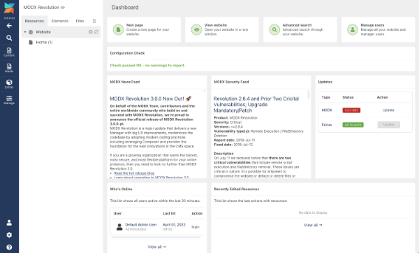

Войдите в панель управления, используя учётные данные, указанные при установке. Вы увидите:



## Базовая безопасность

Виджет «Проверка конфигурации» на панели Dashboard перечисляет, что нужно исправить для защиты установки; на чистой установке он может не показать ни одного предупреждения. Типичные предупреждения: осталась папка `setup` или она доступна по HTTP, папка `core` доступна извне (на Apache переименуйте `core/ht.access` в `.htaccess`), версия PHP, недоступные для записи `config.inc.php` или `core/cache/`, неопубликованные страницы ошибок и `allow_tags_in_post`. Подробнее: [укрепление конфигураций Apache и NGINX для MODX](getting-started/maintenance/securing-modx "Как защитить установку MODX").

## Редактирование ресурса по умолчанию

По умолчанию MODX создаёт стартовый ресурс «Главная» (псевдоним `index`) на вкладке «Ресурсы» и стартовый шаблон «BaseTemplate» в разделе «Элементы → Шаблоны». Чтобы открыть сайт, нажмите кнопку «Перейти на сайт» на панели Dashboard, щёлкните ресурс «Главная» правой кнопкой мыши и выберите «Просмотреть», нажмите кнопку «Просмотреть» на панели ресурса или `Ctrl+Alt+P` в редакторе ресурса.

Щёлкните ресурс на вкладке «Ресурсы» и отредактируйте его содержимое в поле «Содержимое». Отсюда также можно изменить заголовок страницы, описание, резюме, статус публикации и [псевдоним вида «дружественный URL»](getting-started/friendly-urls "Почитать о дружественных URL").

Нажмите кнопку «Сохранить» в правом верхнем углу или `Ctrl + S`, чтобы сохранить ресурс. После сохранения нажмите «Просмотреть», чтобы увидеть изменения.

## Редактирование шаблона по умолчанию

MODX также поставляется со стартовым шаблоном «BaseTemplate» в разделе «Элементы → Шаблоны». Щёлкните его, чтобы изменить имя, описание и содержимое шаблона — например:

```html
<!DOCTYPE html>
<html lang="en">
    <head>
        <meta charset="UTF-8" />
        <base href="[[!++site_url]]" />
        <title>[[*pagetitle]]</title>
        <!-- Continue to insert your css, scripts and other assets here -->
        <link
            rel="stylesheet"
            href="https://maxcdn.bootstrapcdn.com/bootstrap/4.0.0/css/bootstrap.min.css"
        />
    </head>
    <body>
        <main>
            [[*content]]
        </main>
    </body>
</html>
```

В примере выше несколько необычных строк заключены в квадратные скобки. Это теги MODX с конкретным назначением. Например, тег `content` подставляет сюда содержимое, которое вы редактировали в ресурсе по умолчанию, а тег `pagetitle` — заголовок страницы этого ресурса. Подробнее о [синтаксисе тегов MODX, их назначении и использовании](building-sites/tag-syntax "Узнать больше о синтаксисе тегов MODX").

После обновления шаблона нажмите «Сохранить» (или `Ctrl + S`) и откройте сайт, чтобы проверить изменения.

## Создание нового ресурса

Чтобы создать новый ресурс, откройте вкладку «Ресурсы» и найдите значок «+» рядом с текстом «Веб-сайт». Также можно щёлкнуть «Веб-сайт» правой кнопкой мыши и выбрать «Создать → Документ» или «Быстро создать → Документ». Дальше редактируйте ресурс, как описано выше.

## Создание нового шаблона

Чтобы создать новый шаблон, откройте вкладку «Элементы» и найдите значок «+» рядом с текстом «Шаблоны». Также можно щёлкнуть «Шаблоны» правой кнопкой мыши и выбрать «Создать шаблон» или «Быстро создать шаблон». Дальше редактируйте шаблон, как описано выше.

## Изменение пользовательского интерфейса и настройек безопасности

В MODX есть мощное управление пользователями и группами и альтернативные способы входа. Полезные темы:

-   [Управление пользователями и группами](building-sites/client-proofing/security/users)
-   [Настройка панели управления](building-sites/client-proofing/form-customization)
-   [Тема панели управления](building-sites/client-proofing/custom-manager-themes)
-   [Вход без пароля](building-sites/client-proofing/security/passwordless-login)
