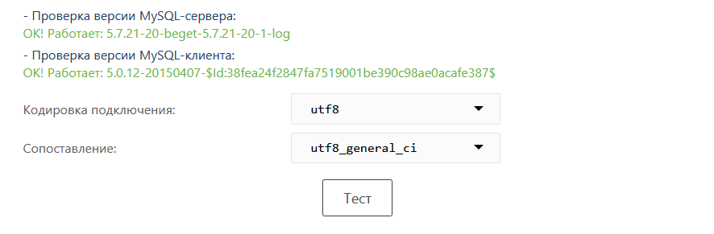
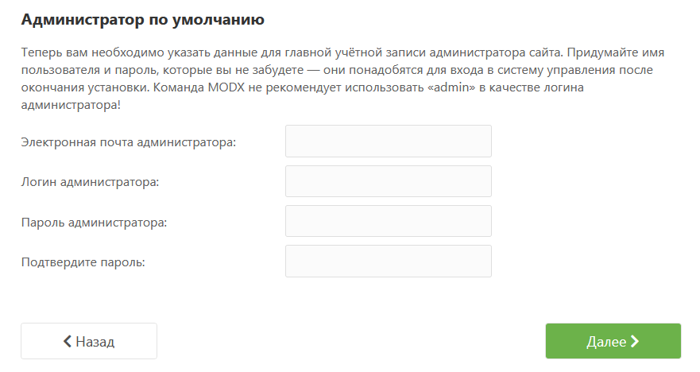
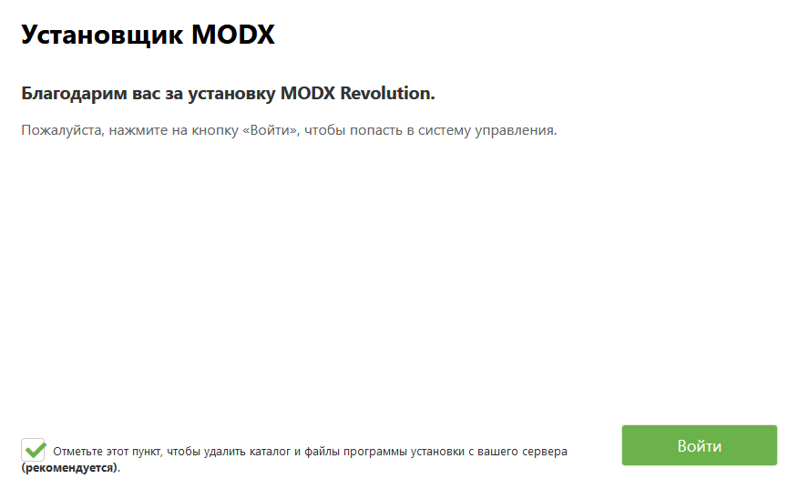

Это руководство по **advanced**-дистрибутиву MODX. Используйте его только если:

- Планируете переименовать каталоги `manager/` и/или `connectors/` при установке
- Есть доступ по SSH (или аналог) и можно сделать родительские каталоги доступными для записи

**Каталог core в MODX 3 нельзя перемещать или переименовывать.** Для обычной установки лучше [базовая установка](getting-started/installation/standard) с traditional-пакетом.

Сначала проверьте [требования к серверу](getting-started/server-requirements). При проблемах см. [устранение неполадок при установке](getting-started/installation/troubleshooting).

## Предварительные шаги

После [скачивания](getting-started/installation "Installation") advanced-дистрибутива MODX Revolution загрузите и распакуйте его на сервер. Должны остаться два каталога: `core/` и `setup/`. Если вы не собираетесь менять config key, откройте в браузере **setup/** и перейдите к разделу **Advanced Options** ниже.

### ~~Переименование или перемещение core~~

Каталог core больше нельзя перенести на произвольный путь или переименовать в 3.0.

Это связано с интеграцией Composer в процесс разработки ядра: управление зависимостями и autoloading. [#15476](https://github.com/modxcms/revolution/issues/15476)

### Изменение ключа конфигурации

Setup попросит выбрать язык, затем покажет приветствие и предложит сменить MODX Configuration Key. Это нужно для нескольких сайтов с общим ядром: у каждого сайта свой уникальный ключ.

Нажмите ссылку в установщике для смены config key. Появится текстовое поле:

Укажите свой уникальный ключ и нажмите Next.

## Advanced Options

Экран параметров установки похож на [базовую установку](getting-started/installation/standard "Basic Installation"), но внизу две дополнительные опции. Для новой установки доступен только **New Installation**: это то, что нужно. Ниже можно настроить права на новые файлы и каталоги. Значения по умолчанию обычно подходят. На более строгих серверах можно задать **0775/0664** для каталогов и файлов.

Ниже две опции с флажками:

При новой установке они неактивны. (При обновлении их тоже лучше снять.) Нажмите Next.

## Параметры базы данных

Форма с данными БД:

Укажите hostname БД: URL, по которому доступна база. У большинства это `localhost`. Для другого порта MySQL: `my.database.com;port=3307`, с `;port=` после IP или hostname.

При необходимости задайте другой префикс таблиц. MODX добавит его ко всем таблицам. Это полезно для нескольких установок в одной базе.

Нажмите **Test database server connection and view collations**. Ошибки появятся ниже. Проверьте логин и пароль. Если пользователь не может создать базу, создайте её вручную.

### Collation и charset

Откроется форма charset и collation:

Большинству пользователей подходят значения по умолчанию. Если меняете их, **charset и collation должны соответствовать друг другу**. Нажмите **Create or test selection of your database**, когда закончите.

### Создание администратора

Задайте имя администратора.

MODX **не рекомендует** `admin`: это частый логин, его проверяют первым.

Укажите email и пароль. Нажмите Next.

## Настройка контекста

Setup покажет экран настройки контекста: пути web-контекста (основного), а также каталогов `connectors/` и `manager/`. Пути web-контекста лучше не менять без веской причины.

Переименование `manager/` и `connectors/` может усилить безопасность. Измените path и URL в полях формы. Если меняете каталоги, родительские каталоги этих путей должны быть доступны для записи, чтобы MODX мог создать `manager/` и/или `connectors/`.

Меняйте **и** path, **и** URL.

Нажмите Next.

## Проверки перед установкой

Setup проверит готовность системы. При сбое следуйте подсказкам, чтобы окружение соответствовало [требованиям к серверу](getting-started/server-requirements "Server Requirements") и нужные каталоги были доступны для записи.

Когда все проверки пройдены, нажмите Install.

Если после Install: пустой экран или процесс не идёт дальше:

1. Каталоги `/[root]`, `/core/config`, `/core/packages`, `/core/cache` и `/core/export` должны быть доступны для записи. (`[root]`: каталог установки.)
2. В php.ini: `memory_limit` 128M, `max_execution_time` 120.
3. MODX должен создавать каталоги manager и connectors. Сделайте writable родителей этих путей.
4. Опишите проблему на [форуме Revolution](https://forums.modx.com/index.php/board,280.0.html). Укажите конфигурацию сервера и шаг установки.

## Итог после установки

Setup сообщит об ошибках и предложит переустановку, если они были.

После успеха нажмите Next. Появится финальный экран:

MODX рекомендует удалить каталог `setup/` после установки. Отметьте **Check this to DELETE the setup directory from the filesystem.**

Нажмите Login: откроется форма входа в Manager. Готово.

## Смотрите также

1. [Базовая установка](getting-started/installation/standard)
2. [Руководство Lighttpd](getting-started/friendly-urls/lighttpd)
3. [Установка на сервере с ModSecurity](getting-started/installation/troubleshooting/modsecurity)
4. [Конфигурация Nginx](getting-started/friendly-urls/nginx)
5. [Расширенная установка](getting-started/installation/advanced)
6. [Установка через Git](getting-started/installation/git)
7. [Установка из командной строки](getting-started/installation/cli)
8. [XML-файл конфигурации setup](getting-started/installation/cli/config.xml)
9. [Устранение неполадок при установке](getting-started/installation/troubleshooting)
10. [Установка прошла успешно, что дальше?](getting-started/getting-started)
