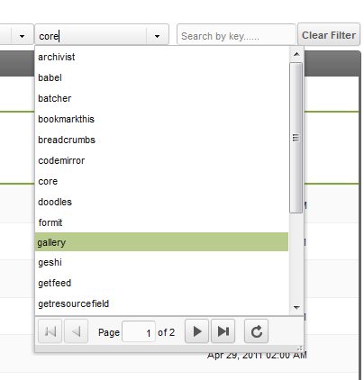
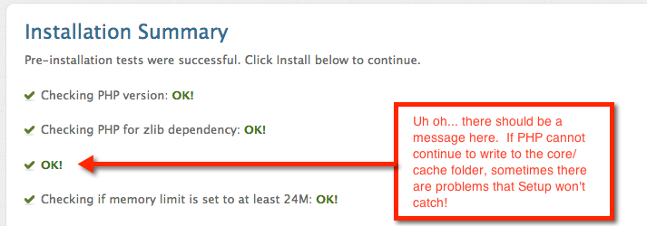
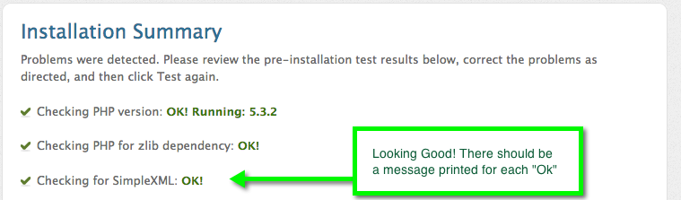

MODX Revolution - это веб-приложение под управлением базы данных, поэтому его перенос на новый сервер включает в себя обычно перенос как базы данных, так и всех файлов сайта. В Revolution это более или менее тот же процесс, но есть пара дополнительных лакомых кусочков, на которые следует обратить внимание из-за тщательных механизмов кэширования Revolution и того, как определенные данные, специфичные для сервера, хранятся в его базе данных.

Ниже приводится официальная документация как переместить ваш сайт в новое место. Обычно перенос осуществляется на новый сервер, но описанные здесь шаги также применимы, если вы перемещаете свой сайт в новую папку на текущем веб-сервере.

**Совет**

Это не обязательно, но рекомендуется отключить [дружественные URL-адреса (ЧПУ)](getting-started/glossary#druzhestvennye-url-adresa-druzhestvennye-psevdonimy) в Менеджере, если они у вас есть, и переименовать `.htaccess` в `ht.access` на вашем сайте перед выполнением любого из следующих шагов. Сделайте обратное в качестве последнего шага после того, как все заработает в новом месте (переименуйте `ht.access` в `.htaccess` и включите ЧПУ). Это устраняет большой потенциальный источник путаницы во время перехода.

## Зайдите в Менеджер: очистите кеш и сессии

Прежде чем делать что-либо еще, было бы разумно очистить все кэшируемое содержимое.

- Авторизуемся в [Менеджере](getting-started/glossary#menedzher), затем: `Управление` -> `Очистить кеш`
- Очистите [пользовательские сеансы](getting-started/glossary): `Управление` -> `Завершить все сеансы`.

Первое преимущество этого - меньший размер файла загрузки/выгрузки.

Самый безопасный и надежный способ очистить кеш - очистить его вручную. Сделайте это, удалив все содержимое, содержащееся в папке `core/cache`. Этот процесс обычно быстрее всего выполняется в файловом менеджере сервера / через SSH консоль, в отличие от FTP.

## Упаковка файлов

Каждый раз, когда вы запаковываете сайт и переезжаете, лучше всего упаковать файлы в "коробки" - когда вы выезжаете из квартиры, вы складываете все в коробки; то же самое относится и к файлам: упакуйте их. Если вы просто перетаскиваете файлы с одного сервера на другой, используя графический интерфейс, велика вероятность того, что графический интерфейс пропустит скрытые файлы, такие как жизненно важный файл `.htaccess`. Кроме того, передача сотен файлов через FTP может занять много времени, потому что каждый файл часто должен проходить какую-то аутентификацию; другими словами, копирование более сотни файлов размером 1 мегабайт занимает намного больше времени, чем копирование одного файла размером 100 мегабайт.

В UNIX системах вы можете создать файл-архив с помощью команды `tar`:

``` php
tar -czf /path/to/backups/modx_revo_site.tar.gz /path/to/modx_doc_root/
```

**Чтобы не забыть**
 Хорошая мнемоника для параметров "-czf" есть **С**оздай **Z**ip **Ф**айл.

Как только вы перейдете на другой сервер (другую папку), лучше всего поместить заархивированный файл в отдельный каталог, прежде чем извлекать его. Идея здесь в том, что если он "взорвется" (речь о распаковке), легче убрать беспорядок,  когда архив содержится в собственном каталоге.

В UNIX системах вы можете распаковать файл `.tar.gz`, используя следующие команды из командной строки:

``` php
gunzip modx_revo_site.tar.gz
tar xvf modx_revo_site.tar
```

После того, как вы извлекли файлы, вы можете переместить весь каталог в нужное место. Опять же, будьте осторожны при массовом перемещении файлов: вы можете случайно забыть скопировать скрытые файлы. Вместо этого лучше переименовать или переместить содержащийся каталог.

## Изменить владельца файлов

Иногда права собственности на группу и пользователя меняются при переходе с одного хоста на другой. Убедитесь, что файлы принадлежат и доступны веб-серверу. Вам нужно будет проверить конфигурацию сервера, чтобы убедиться в правильности настроек, или просто спросить подробности у хостера. Более простой метод может заключаться в том, чтобы просто посмотреть, кому принадлежит файл `tar.gz` при его загрузке на сервер. FTP файловый менеджер почти всегда устанавливает надлежащие права доступа на загруженный файл.

## Возможность записи: 777 или 755?

Некоторые каталоги могут быть доступны для записи. В зависимости от конфигурации настроек безопасности это может быть 755 или 777. Файл `tar.gz` должен сохранять старые разрешения сервера, но они могут не работать на новом сервере.

## Резервное копирование вашей базы данных

_Обратите внимание, что MODX может работать с несколькими драйверами баз данных, в настоящее время это `MySQL` и `sqlsrv`. Следующий раздел относится к MySQL, однако вы должны иметь возможность делать то же самое с аналогичными командами для `sqlsrv`._

Вы можете копировать свою базу данных MySQL с помощью какого-либо инструмента с графическим интерфейсом, такого как `phpMyAdmin`, или запустить утилиту командной строки `mysqldump`.

``` php
mysqldump -u username -p your_revo_db > /path/to/backups/my_revo_db.sql
```

Если вы используете `mysqldump`, убедитесь, что вы используете имя пользователя с разрешениями `SELECT` и `LOCK` для всех таблиц базы данных MODX Revolution - обычно лучше просто использовать те же имя пользователя и пароль, которые определены в вашем файле конфигурации (`/core/config/config.inc.php`). Помните, что `mysqldump` предложит вам ввести пароль после того, как вы выполните эту команду: когда вы введете его (или вставите), вы ничего не увидите в окне терминала.

На новом сервере вы можете просто использовать команду `mysql`, чтобы вставить файл дампа в новую целевую базу данных:

``` php
mysql -u username -p target_db < my_revo_db.sql
```

Вы также можете использовать `phpMyAdmin`, но помните, что веб-инструменты, подобные этому, имеют те же ограничения памяти, что и PHP, поэтому вам обычно лучше использовать инструмент командной строки, если это возможно. 

[Копирование базы данных с помощью phpMyAdmin](https://docs.phpmyadmin.net/en/latest/faq.html#how-can-i-backup-my-database-or-table)

Многие панели управления сервером также предлагают инструменты для резервного копирования и сжатия баз данных.

## Обновление файлов конфигурации

После того, как вы развернули файлы на новом сервере, вам необходимо обновить основной файл конфигурации: `core/config/config.inc.php`. Вам необходимо обновить пути к **6** различным ресурсам. Откройте файл и обновите значения следующих переменных, выполняя поиск и замену:

``` php
/* ПУТИ */
$modx_core_path= '/path/to/modx_doc_root/core/';
$modx_processors_path= '/path/to/modx_doc_root/core/model/modx/processors/';
$modx_connectors_path= '/path/to/modx_doc_root/connectors/';
$modx_manager_path= '/path/to/modx_doc_root/manager/';
$modx_base_path= '/path/to/modx_doc_root/';
$modx_assets_path= '/path/to/modx_doc_root/assets/';

/* ХОСТ (используется для командной строки PHP) */
$http_host='yoursite.com';
```

Если вы также перемещаете свой сайт в подпапку или из нее, обязательно обновите такие переменные, как `$modx_connectors_url`, `$modx_manager_url`, и `$modx_base_url`. Как правило, они должны заканчиваться косой чертой (например, `$modx_base_url = '/'` для сайта не во вложенной папке).

**Разрешения**
Прежде чем вы сможете редактировать файл конфигурации, вам может потребоваться ослабить разрешения. После редактирования убедитесь, что вы восстановили права доступа только для чтения к файлу.

Также есть 3 дополнительных файла конфигурации, которые содержат две константы PHP:

``` php
define('MODX_CORE_PATH', '/path/to/modx_doc_root/core/');
define('MODX_CONFIG_KEY', 'config');
```

- /config.core.php
- /connectors/config.core.php
- /manager/config.core.php

Убедитесь, что вы также обновили пути в этих файлах.

Если вы работаете с **~временной папкой** на своем сервере, URL-адрес для разработки часто предшествует **~путь_к_корню** в адресе. Указанные выше файлы конфигурации будут включать этот временный путь при установке для разработки. Обязательно проверьте все указанные выше 4 файла на наличие этого временного пути и измените указанные выше настройки для производственных корневых установок.


## Обновление базы данных

**Не забывайте о базе данных**
MODX хранит некоторые данные о путях в своей базе данных! При перемещении серверов вам может потребоваться обновить `workspace` таблицу, в противном случае на странице Менеджера может отображаться белая страница.

_Обратите внимание, что MODX может работать с несколькими драйверами баз данных, в настоящее время `MySQL` и `sqlsrv`. Следующий раздел относится к `MySQL`, однако вы должны иметь возможность делать то же самое с аналогичными командами для `sqlsrv`._

Иногда разработчики структурируют свои серверы разработки и производства так, чтобы использовать _точную_ информацию о пути, но часто информация о пути к файлу изменяется, когда мы перемещаем наш MODX веб-сайт на новый сервер.

Чтобы увидеть информацию о пути, которая хранится в базе данных MODX, введите следующий запрос в `phpMyAdmin`, командную строку `MySQL` или любое другое приложение, которое позволяет выполнять запросы в вашей базе данных:

``` php
SELECT `path` FROM `your_revo_db`.`workspaces`;
```

Измените `your_revo_db` на имя вашей базы данных и при необходимости добавьте соответствующий префикс в таблицу `workspaces`, например `modx_workspaces`.

Если путь на новом сервере отличается от пути на старом сервере, вам необходимо обновить эту запись. Вы можете отредактировать его с помощью GUI редактора (например, `SQL-Yog` или `phpMyAdmin`) или выполнить следующую команду (опять же, вам необходимо настроить запрос в зависимости от вашей базы данных, префикса и пути к вашим данным):

``` php
UPDATE `your_revo_db`.`workspaces` SET path='/path/to/modx_doc_root/core/' WHERE id='1';
```

## Обновление .htaccess

Когда вы меняете серверы, вы часто меняете доменные имена. Убедитесь, что вы обновили все ссылки на доменное имя в ваших файлах `.htaccess`. 

## На новом сервере

Войдите в Менеджер на новом сервере, чтобы убедиться, что он работает. При входе вы можете увидеть следующее: 

``` php
Не удалось найти файл действия в: /path/to/manager/controllers/default/welcome.php
```

Это потому, что старый путь все еще кэшируется; MODX Revolution кэширует много информации в базе данных и в файловой системе, поэтому после того, как вы передали файлы и базу данных на новый сервер, убедитесь, что вы еще раз очистили кеш вашего сайта и вручную обновили кеш страницы Менеджера в браузере.

Если кеш и информация о сеансе не были очищены перед перемещением, вам нужно будет это сделать, если вы столкнетесь с ошибками в Менеджере после перемещения сайта.

Иногда очистка кеша сайта в Менеджере не решает всех проблем с путями, и необходимо удалить все папки / файлы внутри папки `core/cache` с помощью FTP/SSH/командной строки или редактора Панели управления хостингом. 

## Перезапуск установки

Каждый раз, когда на сайте MODX Revolution вносятся изменения в отношении установки, обновления или изменения местоположения, важно повторно запустить скрипт `site.ru/setup`. Это должно помочь укрепить процесс перемещения из-за действий, предпринятых во время его выполнения.

- Убедитесь, что вы используете установочную версию той же версии MODX Revolution, которую вы будете использовать.
- Добейтесь работоспособности перенесенного сайта перед попыткой обновления любой версии.

[Загрузить предыдущие версии MODX Revolution](https://modx.com/download/previous-releases/)

Если MODX не найдет файл `config.inc.php` во время установки, он не предложит вам возможность выполнить установку обновления. Не продолжайте, пока не установите флажок `Установить обновление`. Если файл `config.inc.php` присутствует, но MODX его не находит, проверьте путь, указанный в файлах `config.core.php`, описанных выше в разделе "Обновление файлов конфигурации". MODX использует этот путь для поиска файла `config.inc.php`.

## Обновление настроек Компонентов



Некоторые дополнения, такие как [Gallery](extras/gallery), хранят информацию о том, где можно найти определенные файлы, в их собственных настройках. Gallery хранить путь к `assets`, `core`, файлам и папкам `phpthumb` в файловой системе. В зависимости от ваших настроек они будут меняться при перемещении, и для того, чтобы продолжать использовать эти дополнения, вам необходимо обновить эти пути. Хотя каждый Компонент может сам решить, где хранить пути, обычно одно из популярных мест это Системные настройки.

Перейдите в `Система` -> `Системные настройки` в вашем Менеджере и найдите раскрывающееся меню пространств имен, как показано на изображении справа. Откройте его и найдите дополнительную информацию по вашему выбору, например, Gallery. Не все дополнения определяют системные настройки, но большинство из них все равно будут отображаться в списке. Теперь, когда вы нашли, где хранятся эти пути, вы можете обновить их, чтобы отразить новое местоположение.

**Если вы используете MODX Revolution 2.2**, вам также может потребоваться проверить системную настройку `extension_packages` (находится в области «Система и сервер» в Cистемных настройках). Этот параметр используется для настраиваемых классов ресурсов (таких как [Articles](extras/articles)) и определяет путь к его модели - возможно, потребуется обновить его после перемещения вашего сайта.

## Устранение неполадок / Ошибки

В процессе ... пытаемся задокументировать проблемы и решения ...

### Ошибки установки

Вы можете столкнуться с проблемами при повторном запуске программы установки на новом сервере. Иногда повторный запуск установки не удается, но копирование файлов и базы данных приводит к созданию рабочего сайта. Помните: повторный запуск настройки необходим только в том случае, если у вас есть кое-что, что сломалось во время передачи.

#### Класс xPDODriver_ не найден

Это проявляется в виде следующего сообщения об ошибке:

``` php
Фатальная ошибка: класс 'xPDODriver_' не найден в /path/to/webroot/core/xpdo/xpdo.class.php on line 1823
```

Обычно это признак того, что ваш файл конфигурации был поврежден. Снова откройте файл `core/config/config.inc.php` и убедитесь, что его содержимое на месте. Искаженный файл конфигурации содержит заполнители вместо значений.

``` php
$database_type = '{database_type}';
$database_server = '{database_server}';
$database_user = '{database_user}';
$database_password = '{database_password}';
$database_connection_charset = '{database_connection_charset}';
$dbase = '{dbase}';
$table_prefix = '{table_prefix}';
$database_dsn = '{database_dsn}';
$config_options = {config_options};
$driver_options = {driver_options};
```

#### В сведениях по установке показаны незавершенные элементы

Это может быть плохим предзнаменованием: на странице "Сведения об установке" сообщения не описаны. Это может быть признаком того, что разрешения где-то неверны.



Когда эта страница работает правильно, вы должны увидеть "Успешно" сообщения рядом с каждой операцией:



#### Проверка кодировки своей базы данных

Это может быть очень проблематично, если ваша база данных на одном сервере не использует ту же кодировку, что и новый сервер. Такие вещи, как одинарные кавычки и т. д., будут нарушены, а в некоторых случаях вы можете даже получить 500-ю ошибку при попытке просмотреть свой сайт.

## Завершающие размышления

Было бы разумно хранить резервные копии со старого сервера до тех пор, пока новый сайт не подвергнется нескольким поколениям резервных копирований и все не будет проверено.

Если у вас возникнут проблемы после успешного запуска программы установки, попробуйте вручную удалить все файлы в каталоге `core/cache` и очистить кеш браузера и cookie-файлы.

Теперь ваш сайт должен работать на новом месте!

**Финальная проверка**
Во время миграции сайта часто возникают проблемы. Существует скрипт, который будет запускать тесты на вашем сайте MODX, чтобы убедиться, что файл конфигурации настроен правильно. См. `test_config.php`, доступный как один из сценариев компонента MODX здесь: [https://github.com/craftsmancoding/modx_utils](https://github.com/craftsmancoding/modx_utils). Он довольно старый, и начиная с версии MODX 2.5.x некоторые коннекторы больше не существуют. Если вам нужна более качественная проверка, вы можете попробовать плантный компонент [SiteCheck](http://bobsguides.com/sitecheck-tutorial.html).
