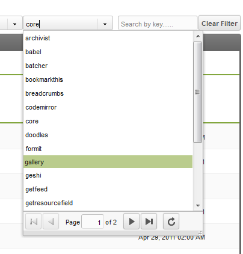
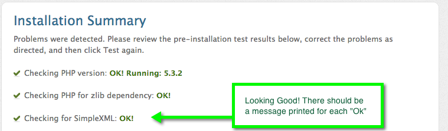

Перенесите базу данных и все файлы сайта. Те же шаги подходят, если сайт переезжает только в новую папку на текущем сервере.

**Совет** Перед работой отключите [дружественные URL-адреса (ЧПУ)](getting-started/glossary#druzhestvennye-url-adresa-druzhestvennye-psevdonimy) в Менеджере (если они включены) и переименуйте `.htaccess` в `ht.access`. Верните всё обратно последним шагом, когда сайт заработает на новом месте. Это убирает главный источник путаницы во время переезда.

## Зайдите в Менеджер: очистите кэш и сеансы

- авторизуйтесь в [Менеджере](getting-started/glossary#menedzher), затем в главном меню: `Содержимое` -> `Очистить кэш`
- очистите [пользовательские сеансы](getting-started/glossary): меню пользователя (справа сверху) -> `Доступ` -> `Завершить все сеансы` (нужно разрешение `flush_sessions`).

Надёжнее всего очистить кэш вручную: удалите всё содержимое папки `core/cache`. В файловом менеджере сервера или через SSH это выполняется гораздо быстрее, чем по FTP, а очищенный кэш уменьшает архив, который вы загрузите.

## Упаковка файлов

Соберите сайт в один архив, а не переносите файлы по одному. Графический интерфейс молча пропускает скрытые файлы вроде `.htaccess`, а сотни небольших передач по FTP проходят медленнее одного архива: каждый файл отдельно проходит аутентификацию.

В UNIX-системах создайте архив командой `tar`:

``` bash
tar -czf /path/to/backups/modx_revo_site.tar.gz /path/to/modx_doc_root/
```

На целевом сервере распакуйте архив в отдельный каталог: если распаковка сорвётся, убирать будет только его:

``` bash
gunzip modx_revo_site.tar.gz
tar xvf modx_revo_site.tar
```

Затем перенесите на место содержащий каталог, а не копируйте файлы пачками, иначе скрытые файлы останутся позади.

## Изменить владельца файлов

При переезде с одного хоста на другой часто меняются владелец и группа: файлы должны принадлежать веб-серверу и быть ему доступны. Проверьте конфигурацию сервера или спросите у хостера. Владелец, проставленный на загруженном `tar.gz`, обычно верный: FTP-клиент задаёт его при загрузке.

## Возможность записи: 777 или 755?

Некоторым каталогам нужна запись: в зависимости от конфигурации безопасности это 755 или 777. Файл `tar.gz` сохраняет разрешения старого сервера, и на новом они могут не работать.

## Резервное копирование базы данных

_Учтите: MODX 3 поддерживает только MySQL/MariaDB (драйвер `sqlsrv` из 2.x убрали в 3.0). Раздел ниже относится к MySQL._

Выгрузите базу данных инструментом с графическим интерфейсом вроде `phpMyAdmin` или утилитой командной строки `mysqldump`:

``` bash
mysqldump -u username -p your_revo_db > /path/to/backups/my_revo_db.sql
```

У имени пользователя должны быть разрешения SELECT и LOCK на все таблицы MODX Revolution. Обычно берут те же имя и пароль, что указаны в конфигурационном файле (`/core/config/config.inc.php`). `mysqldump` спросит пароль после команды: введённый или вставленный текст не отображается в терминале.

На новом сервере загрузите дамп в целевую базу командой `mysql`:

``` bash
mysql -u username -p target_db < my_revo_db.sql
```

Подойдёт и `phpMyAdmin`, но веб-инструменты делят ограничения памяти PHP, поэтому для полной базы надёжнее командная строка. См. [вопрос о резервном копировании в phpMyAdmin](https://docs.phpmyadmin.net/en/latest/faq.html#how-can-i-backup-my-database-or-table); многие панели управления тоже умеют резервное копирование и сжатие баз.

## Обновление файлов конфигурации

После развёртывания файлов на новом сервере обновите основной конфигурационный файл `core/config/config.inc.php`: в нём шесть путей. Найдите и замените значения этих переменных:

``` php
/* ПУТИ */
$modx_core_path= '/path/to/modx_doc_root/core/';
$modx_processors_path= '/path/to/modx_doc_root/core/src/Revolution/Processors/';
$modx_connectors_path= '/path/to/modx_doc_root/connectors/';
$modx_manager_path= '/path/to/modx_doc_root/manager/';
$modx_base_path= '/path/to/modx_doc_root/';
$modx_assets_path= '/path/to/modx_doc_root/assets/';

/* ХОСТ (используется только для командной строки PHP) */
$http_host='yoursite.com';
```

Обратите внимание: в веб-запросах MODX сам определяет хост по `$_SERVER['HTTP_HOST']`, сохранённое в конфиге `$http_host` используется только при запуске из CLI (см. `core/docs/config.inc.tpl`).

Если сайт переезжает в подпапку или из неё, обновите также `$modx_connectors_url`, `$modx_manager_url` и `$modx_base_url`. Они должны заканчиваться косой чертой (например, `$modx_base_url = '/'` для сайта в корне).

**Разрешения**
Перед редактированием файла конфигурации может понадобиться ослабить разрешения. После правки верните файлу права только для чтения.

Ещё три файла конфигурации содержат те же две константы PHP; обновите пути и в них:

``` php
define('MODX_CORE_PATH', '/path/to/modx_doc_root/core/');
define('MODX_CONFIG_KEY', 'config');
```

- /config.core.php
- /connectors/config.core.php
- /manager/config.core.php

\*Если сайт лежит в **~временной папке** сервера, адрес для разработки содержит **~путь_к_домашней_папке**. Все четыре файла выше будут содержать этот временный путь на установке для разработки; замените его на производственные пути для установки в корне.

## Обновление базы данных

**Не забывайте о базе данных.** MODX хранит в ней данные о путях: если в таблице `workspaces` остался старый путь, страница Менеджера может стать белой.

Чтобы увидеть сохранённый путь, выполните запрос в `phpMyAdmin`, командной строке MySQL или любом другом инструменте с запросами:

``` sql
SELECT `path` FROM `your_revo_db`.`workspaces`;
```

Замените `your_revo_db` на имя вашей базы данных и добавьте префикс таблиц к `workspaces`, если он есть, например `modx_workspaces`.

Если путь на новом сервере отличается от старого, обновите запись: отредактируйте её в графическом редакторе (`SQL-Yog`, `phpMyAdmin`) или выполните запрос (подстройте его под базу, префикс и путь к данным):

``` sql
UPDATE `your_revo_db`.`workspaces` SET path='/path/to/modx_doc_root/core/' WHERE id='1';
```

## Обновление .htaccess

Переезд часто совпадает со сменой доменного имени: обновите все упоминания старого домена в файлах `.htaccess`.

## На новом сервере

Войдите в Менеджер, чтобы убедиться, что он работает. При входе может отобразиться пустая страница или фатальная об отсутствии контроллера менеджера, например `manager/controllers/default/welcome.class.php` (контроллеры в 3.x имеют расширение `*.class.php`).

Старый путь ещё закэширован в базе данных и в файловой системе: после переноса снова очистите кэш сайта и обновите страницу Менеджера. Очистки из Менеджера не всегда хватает: удалите все папки и файлы внутри `core/cache` по FTP, через SSH, командную строку или файловый менеджер панели управления хостингом. Если кэш и сеансы не очищали перед переездом, сделайте это сейчас, когда в Менеджере появились ошибки.

## Перезапуск установки

После любого изменения установки, версии или расположения сайта MODX Revolution повторно запустите скрипт `site.ru/setup`.

- Запускайте установщик той же версии MODX Revolution, которую будете использовать.
- Сначала добейтесь работоспособности перенесённого сайта, и только потом обновляйте версию.

[Загрузить предыдущие версии MODX Revolution](https://modx.com/download/previous-releases/)

Если MODX не найдёт файл `config.inc.php` во время setup, он не предложит установку обновления. Не продолжайте, пока не сможете установить флажок «Установка обновления». Если файл `config.inc.php` на месте, но MODX его не видит, проверьте путь в файлах `config.core.php` из раздела «Обновление файлов конфигурации»: MODX ищет `config.inc.php` именно по нему.

## Обновление настроек дополнений



Некоторые дополнения, такие как [Gallery](extras/gallery), хранят пути к файлам в собственных настройках: Gallery держит пути к папкам assets, core, files и phpthumb. При переезде они меняются, и чаще всего лежат в системных настройках.

В Менеджере откройте `Админ` -> `Системные настройки` и найдите раскрывающийся список пространств имён, как на изображении справа (нажмите, чтобы увеличить). Выберите нужное дополнение, например Gallery: большинство есть в списке. Обновите пути под новое расположение.

**Если вы используете MODX Revolution 2.2**, проверьте также системную настройку `extension_packages` (область «Система и сервер» в системных настройках). Она используется для настраиваемых классов ресурсов (например, дополнения [Articles](extras/articles)) и задаёт путь к их модели, который после переезда может потребовать обновления.

## Устранение неполадок

### Ошибки установки

Повторный запуск setup на новом сервере может не удаться, даже если скопированные файлы и база уже работают. Запускайте его только чтобы починить то, что сломалось при переносе.

#### Класс xPDODriver_ не найден

``` text
Фатальная ошибка: класс 'xPDODriver_' не найден в /path/to/webroot/core/xpdo/xpdo.class.php on line 1823
```

Файл конфигурации повреждён. Снова откройте `core/config/config.inc.php` и убедитесь, что содержимое на месте: в повреждённом файле вместо значений лежат заполнители.

``` php
$database_type = '{database_type}';
$database_server = '{database_server}';
$database_user = '{database_user}';
$database_password = '{database_password}';
$database_connection_charset = '{database_connection_charset}';
$dbase = '{dbase}';
$table_prefix = '{table_prefix}';
$database_dsn = '{database_dsn}';
$config_options = {config_options};
$driver_options = {driver_options};
```

#### Сведения об установке показывают незавершённые элементы

Если на странице «Сведения об установке» вообще нет сообщений, где-то неверно настроены разрешения.


При корректной работе рядом с каждой операцией «Успешно» появляется сообщение:



#### Проверка кодировки базы данных

Если база на новом сервере использует другую кодировку, ломаются одинарные кавычки и подобные вещи, а в некоторых случаях сайт отдаёт ошибку 500.

## Завершающие проверки

Храните резервные копии со старого сервера, пока новый сайт не переживёт несколько циклов копий и всё не будет проверено.

Если проблемы остались после успешного setup, вручную удалите все файлы в каталоге `core/cache` и очистите кэш браузера вместе с cookie-файлами.

**Финальная проверка**
 Скрипт `test_config.php` из компонента [modx_utils](https://github.com/craftsmancoding/modx_utils) подтверждает, что конфигурационный файл настроен верно, но он старый: начиная с MODX 2.5.x часть коннекторов в нём больше не существует. Для поддерживаемой проверки подойдёт платный компонент [SiteCheck](http://bobsguides.com/sitecheck-tutorial.html).
