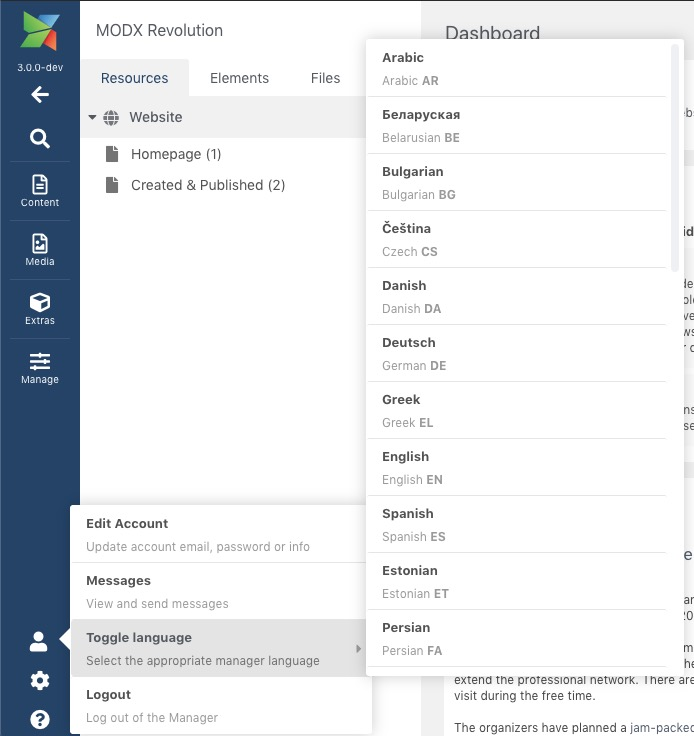

В MODX 2.x, язык менеджера управлялся с помощью системного параметра `manager_language` (и необязательно переопределялся на уровне контекста или пользователя). В MODX 3 этот параметр был удален, и язык диспетчера вместо этого сохраняется в сеансе пользователя.

При посещении менеджера он автоматически выберет наиболее вероятный желаемый язык на основе языка браузера. В нижней части экрана входа в систему можно выбрать другой язык.

Для динамического изменения языка при входе в систему используйте меню Пользователь > Переключить язык из меню менеджер.

