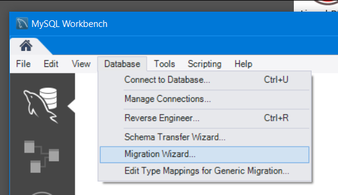

С MODX 3.0 sqlsrv (Microsoft SQL Server) больше не поддерживается. Если вы использовали sqlsrv в MODX 2.x, перед обновлением до MODX 3 перенесите базу в MySQL.

Утилиты миграции в MODX пока нет. В сети есть сторонние инструменты.

## Перед началом

Миграцию типа БД лучше гонять на development или staging, а не на production. Копирование и перенос данных могут занять время.

## Шаг 1: миграция в MySQL

Сначала **перенесите базу sqlsrv в новую MySQL** сторонним инструментом. Один вариант: MySQL Workbench, [скачать можно здесь](https://dev.mysql.com/downloads/workbench/).

В верхнем меню выберите **Database → Migration wizard**.

Внизу нажмите **Start migration** и пройдите шаги мастера, пока данные не окажутся в чистой базе.

## Шаг 2: чистая установка MODX на MySQL

Создайте чистую установку MODX **той же версии, что сейчас стоит на sqlsrv**.

Сначала нужна чистая установка, потому что мигратор угадывает типы данных и может слегка разойтись со схемами MODX для MySQL.

[Следуйте стандартной установке](getting-started/installation) для чистой копии MODX.

## Шаг 3: данные из миграции в чистую установку

Инструментом MySQL (MySQL Workbench или PHPMyAdmin) экспортируйте **только данные** из мигрированной базы в файл. **Структуру не экспортируйте.** Включите опцию «truncate before insert»: структура нужна от чистой установки, а не её данные.

Импортируйте дамп в чистую установку.

## Шаг 4: файлы и проверка

Перенесите нужные файлы сайта: components, assets и остальное. **Не** перезаписывайте `core/config/config.inc.php`.

Проверьте сайт на MySQL и убедитесь, что всё работает как ожидаете.
